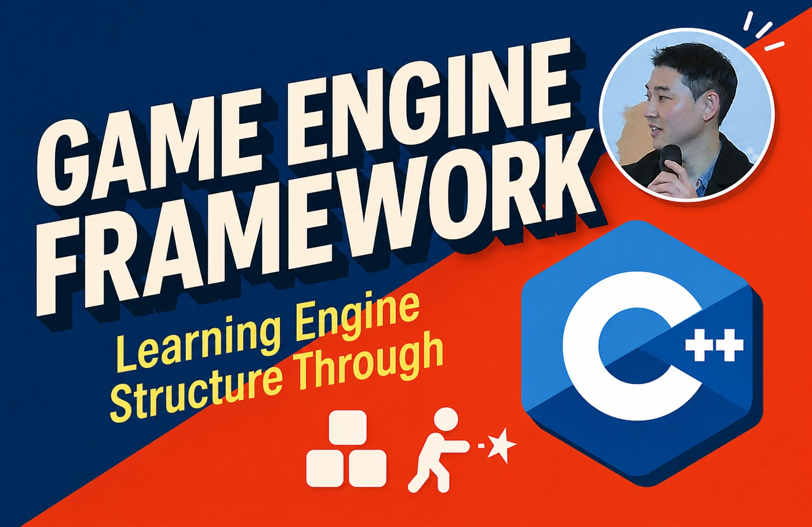

# CraftEngine 콘솔 게임 프로젝트

[C++로 만드는 게임 엔진 프레임워크](https://www.inflearn.com/course/c-game-engine-framew?cid=341168) 강의를 수강하여 Win32 콘솔을 렌더 타겟으로 하는 C++ 기반 미니 엔진 **CraftEngine**을 제작하고 확장합니다.

CraftEngine은 게임 루프, Actor/Component 모델, 입력, Win32 콘솔을 타겟으로 한 렌더링, 충돌, 타일맵과 XAudio2 기반 사운드 시스템을 제공합니다. 이 엔진 위에 ShootingGame, SokobanGame, Z1 콘텐츠가 구동되고, Z1 위에서 멀티플레이 환경을 제공하기 위해 공용 Sockets DLL과 IOCP 서버가 추가되었습니다.

## 솔루션 구성

| 경로 | 종류 | 역할 |
| --- | --- | --- |
| `SoundSystem/` | DLL | XAudio2 기반 사운드 시스템 |
| `CraftEngine/` | DLL | 게임 루프, Level/Actor/Component, 입력, 콘솔 렌더링, 충돌, 타일맵 등 |
| `Sockets/` | DLL | WinSock API 일부(SOCKET, SOCKADDR_IN 등)를 래핑한 클래스 제공 |
| `ShootingGame/` | EXE | 실시간 비행 슈팅 콘텐츠 |
| `SokobanGame/` | EXE | 스테이지 파일 기반 소코반 콘텐츠 |
| `Z1/` | EXE | NES로 출시된 초대 젤다의 전설을 작게 모작한 싱글플레이 콘텐츠 |
| `Z1Server/` | EXE | Z1용 IOCP 서버와 권위형 시뮬레이션 |
| `Z1Shared/` | 헤더 | Z1 클라이언트와 서버가 공유하는 패킷 종류 및 직렬화 함수들 |

게임 에셋은 `Content/`, 엔진 로드에 필요한 세팅 파일은 `Config/`에 저장됩니다. `Includes/`는 DLL 프로젝트들의 헤더 파일이 복사되는 폴더, `Libraries/`, `Binaries/`, `Intermediate/`는 빌드 시 생성되는 결과물이 저장되는 폴더입니다.

## 환경

Windows x64, C++20, MSVC toolset `v145`. 

DLL 프로젝트들을 우선 빌드한 뒤, EXE 파일들을 실행합니다.
1. `SoundSystem`
2. `CraftEngine`
3. `Sockets`
4. 작업 대상 EXE

## 문서

### 전체 솔루션

- [저장소 작업 규칙](AGENTS.md)
- [솔루션 아키텍처](docs/ARCHITECTURE.md)
- [개발](docs/DEVELOPMENT.md)

### 프로젝트별

- [Z1 문서 안내](docs/z1/README.md): Z1과 연관된 프로젝트들은 해당 문서들을 추가로 확인할 수 있습니다.
