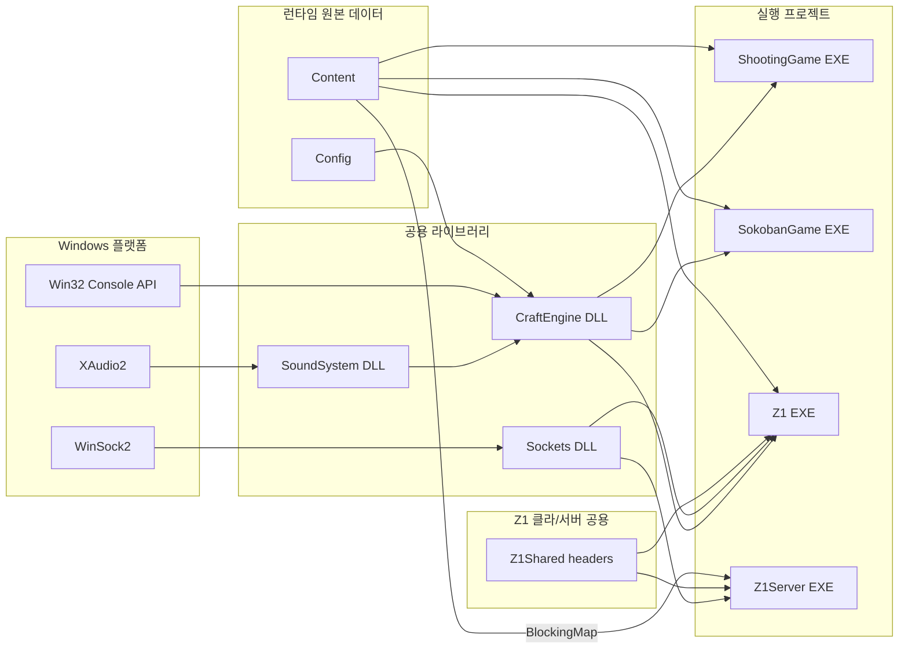
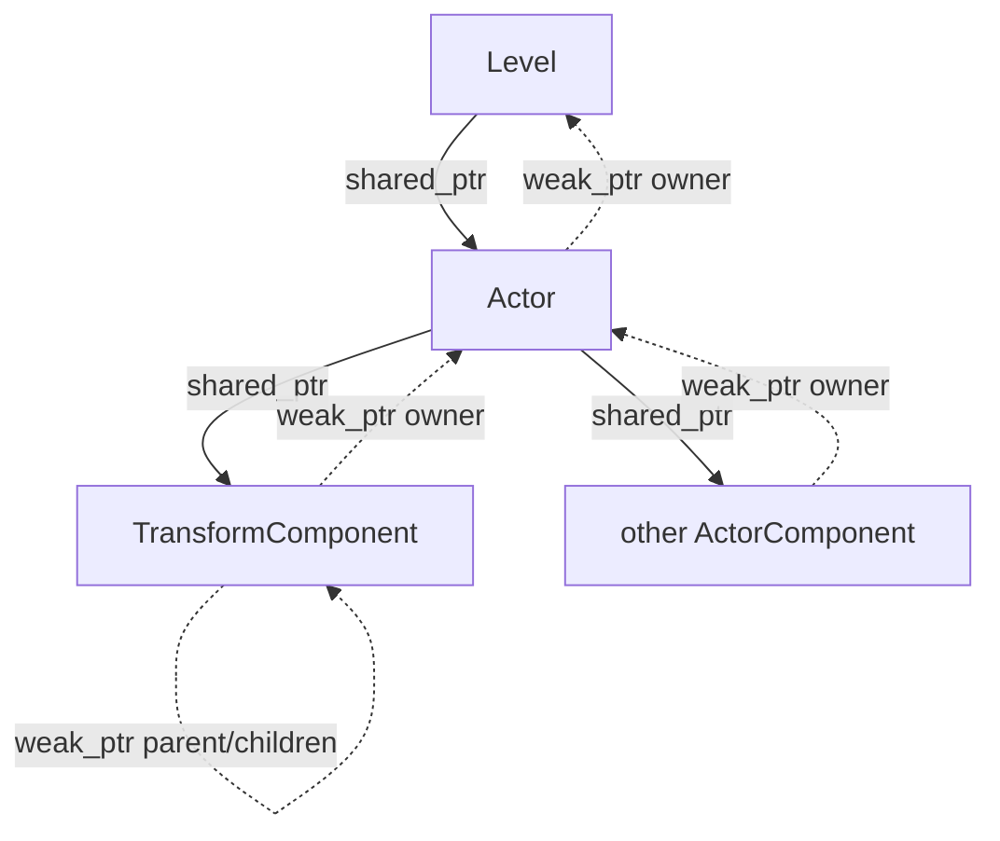

# 솔루션 아키텍처

## 문서 범위

이 문서는 CraftEngine 저장소 전체의 현재 구조와 프로젝트 사이의 계약을 설명한다. 특정 게임의 Room, 전투, 맵 포맷이나 수동 동선은 프로젝트별 문서에서 다룬다. Z1 세부 구조는 [Z1 아키텍처](z1/ARCHITECTURE.md)를 참고한다.

## 전체 구성

화살표는 왼쪽의 기능이나 데이터가 오른쪽 소비자에게 제공된다는 뜻이다.
`Z1Server`에는 `CraftEngine`으로 향하는 연결이 없다. 서버는 렌더링과 Actor 없이 `Content`의 통행 데이터만 읽고 권위형 월드를 계산한다.

| 구성 요소 | 산출물 | 책임 |
| --- | --- | --- |
| `SoundSystem` | DLL/import library | COM·XAudio2 초기화, WAV 캐시, 원샷과 반복 BGM voice 수명 |
| `CraftEngine` | DLL/import library | 루프, Level/Actor/Component, 입력, 렌더링, 충돌, 타일맵, 수학, RTTI와 사운드 파사드 |
| `Sockets` | DLL/import library | WinSock 런타임, 주소 변환, 이동 전용 소켓과 기본 소켓 연산 |
| `ShootingGame` | EXE | 실시간 슈팅 규칙과 Actor/Level |
| `SokobanGame` | EXE | 스테이지 로드, 이동·박스·승리 판정과 메뉴 전환 |
| `Z1` | EXE | Zelda형 콘텐츠, 싱글플레이 규칙과 네트워크 클라이언트 표현 |
| `Z1Server` | EXE | IOCP Session, 고정 Tick과 Z1 권위형 상태 |
| `Z1Shared` | header-only | Z1 packet header, protocol enum, 직렬화와 framing 계약 |

`CraftEngine`은 네트워크에 의존하지 않고 `Sockets`는 게임 규칙에 의존하지 않는다. Z1의 wire 계약은 범용 엔진 API가 아니라 Z1과 Z1Server 사이의 제품별 계약으로 유지한다.

## 소스와 빌드 산출물

- 소스와 원본 데이터: `CraftEngine/`, `SoundSystem/`, `Sockets/`, `ShootingGame/`, `SokobanGame/`, `Z1/`, `Z1Server/`, `Z1Shared/`, `Content/`, `Config/`
- 생성·복사 산출물: `Includes/`, `Libraries/`, `Binaries/`, `Intermediate/`
- DLL 프로젝트는 공개 헤더, import library와 DLL을 중간 staging 경로에 복사한다.
- 콘텐츠 프로젝트는 필요한 DLL과 `Content`를 실행 경로 주변에 복사한다.
- CraftEngine 빌드는 `Config/Setting.txt`를 출력 루트의 `Config`로 복사한다.

`Includes`와 `Libraries`는 저장소 내부의 빌드 경계를 연결하기 위한 staging 영역이지 편집 대상 소스가 아니다.

## 엔진 시작과 프레임 흐름

`Engine` 생성자는 설정을 읽고 난수, `Input`, `Renderer`, `CollisionSystem`, `Sound`를 초기화한다. 한 번의 갱신 프레임은 다음 순서로 진행된다.

1. 목표 프레임 간격까지 대기하고 `deltaTime`을 계산한다.
2. 콘솔 입력 버퍼의 키·포커스 이벤트를 소비해 256개 가상 키의 `pressed`, `held`, `released` 상태를 갱신한다.
3. 현재 Level의 `OnInitialized`를 최초 한 번 호출한다.
4. 아직 시작하지 않은 활성 Actor의 `BeginPlay`를 호출한다.
5. Level과 활성 Actor/Component의 `Tick`을 호출한다.
6. 활성 Actor 쌍의 충돌을 수집하고 콜백을 보낸다.
7. Actor/Component가 렌더 명령을 제출하고 Renderer가 콘솔 화면을 갱신한다.
8. 예약된 Level이 있으면 현재 Level을 교체한다.
9. Component 추가, Actor 제거, Actor 추가 요청을 차례로 반영한다.
10. 현재 Actor의 월드 위치를 다음 프레임의 이전 상태로 저장한다.

`SpawnActor`는 Actor를 즉시 반환하지만 프레임 순회에는 요청 반영 뒤부터 참여한다. 같은 프레임에 Tick이나 Draw될 것이라고 가정하지 않는다.

## 객체 모델과 소유권

- Level은 활성 Actor와 추가 대기 Actor를 강하게 소유한다.
- Actor는 Level을 약하게 참조하고 Transform 하나와 나머지 Component를 강하게 소유한다.
- Component는 소유 Actor를 약하게 참조한다.
- Transform의 부모·자식 링크는 모두 약한 참조라서 Scene Graph 자체가 객체 수명을 연장하지 않는다.
- `CObject` 계열은 `TYPE_DECLARATIONS`가 만든 `CClass` 메타데이터로 `IsA`, `Cast`, `TSubclassOf`를 제공한다.

`Destroy`는 즉시 Actor를 비활성화하고 자식에도 파괴를 전파한다. Level 목록 제거는 프레임 끝에 수행되며 실제 메모리 해제 시점은 남은 `shared_ptr`에 따라 결정된다.

## Component와 Scene Graph

모든 Actor는 생성 시 Transform 하나를 자동으로 가진다. 나머지 Component는 `AddComponent`로 요청한다.

| Component | 책임 |
| --- | --- |
| `TransformComponent` | 로컬/이전 월드 좌표, 부모·자식 링크, 월드 좌표 계산과 attach/detach |
| `SpriteRendererComponent` | immutable Sprite와 sorting order를 보관하고 월드 좌표로 렌더 명령 제출 |
| `BoxComponent` | `size`와 `offset`을 가진 월드 공간 2D AABB |

`Actor::GetPosition`과 `SetPosition`은 로컬 좌표 API다. `AttachTo(parent, true)`는 월드 위치를, `AttachTo(parent, false)`는 로컬 오프셋을 보존한다. 순환 계층은 거부하며 detach는 기본적으로 월드 위치를 보존한다.

## 엔진 하위 시스템

### 입력

`Input`은 `STD_INPUT_HANDLE`의 Win32 콘솔 입력 버퍼에서 `KEY_EVENT_RECORD`와 `FOCUS_EVENT`를 논블로킹으로 소비하고 `GetKey`, `GetKeyDown`, `GetKeyUp`을 제공한다. 키 상태는 `pressed`, `held`, `released`로 나누어 auto-repeat에서 눌림 edge가 반복되지 않게 하고, 한 프레임 안의 빠른 press/release도 모두 보존한다. 콘솔이 포커스를 잃으면 held 상태를 release로 전환하므로 같은 PC에서 여러 게임 프로세스를 실행해도 포커스된 콘솔의 입력만 처리한다.

### 렌더링

Actor의 Draw는 Component까지 전달되고 SpriteRenderer가 immutable Sprite, 월드 위치와 sorting order를 제출한다. Renderer는 `CHAR_INFO`와 sorting order 버퍼를 합성해 `WriteConsoleOutputA`로 한 프레임을 출력한다. `Submit`은 화면 좌표, `SubmitWorld`는 View 변환이 적용되는 월드 좌표에 사용한다.

### 충돌

CollisionSystem은 BoxComponent가 있는 활성 Actor 조합을 전수 검사한다. 각 Box의 크기·offset과 이전/현재 월드 위치를 사용한 swept AABB가 겹치면, 충돌 쌍을 모두 모은 뒤 콜백을 전달한다. 한 변이 0 이하인 Box는 충돌하지 않는다.

### 타일맵

`Tilemap`은 논리 타일 배열과 타일별 immutable Sprite·blocked 상태를 보관한다. 셀/월드 좌표 변환, 월드 Box의 점유 가능성 검사와 지정 구간 Sprite 합성을 제공한다. 파일 포맷과 TileId 해석은 콘텐츠 책임이다.

### 사운드

SoundSystem은 WAV를 경로별로 캐시하고 원샷 source voice와 하나의 반복 BGM voice를 관리한다. CraftEngine은 파일명 기반 `PlayOneShot`, `PlayBGM`, `StopBGM` 파사드를 제공한다.

## 콘텐츠 요약

- `ShootingGame`: Player, 총구·엔진 이펙트 Scene Graph, EnemySpawner와 GameManager를 조합한 실시간 슈팅 게임이다.
- `SokobanGame`: `Content/Stages`의 문자 맵을 Actor로 변환하고 Level이 이동·박스 밀기·승리 판정을 담당한다.
- `Z1`: 고정 Room 방식의 오버월드, 동굴, 던전과 전투를 제공하며 네트워크 클라이언트 실험을 포함한다. 자세한 내용은 [Z1 아키텍처](z1/ARCHITECTURE.md)를 따른다.

## 현재 경계와 확장 시점

- 게임 루프는 fixed-step accumulator가 아니라 목표 프레임 간격까지 대기하는 방식이다. 결정적 고정 물리가 필요할 때 별도 루프 모델을 검토한다.
- 충돌은 broad phase 없이 전수 검사한다. 측정된 병목이 생길 때 공간 분할을 도입한다.
- Transform은 정수 이동만 표현하며 회전·크기·행렬 계층은 없다.
- Level 전환 방식이 콘텐츠별로 다르다. 공통 요구가 확인되기 전에는 큰 전환 프레임워크를 만들지 않는다.
- 네트워크 복제는 아직 Z1 전용이다. 다른 콘텐츠가 같은 계약을 실제로 요구할 때만 공용 엔진 승격을 검토한다.
