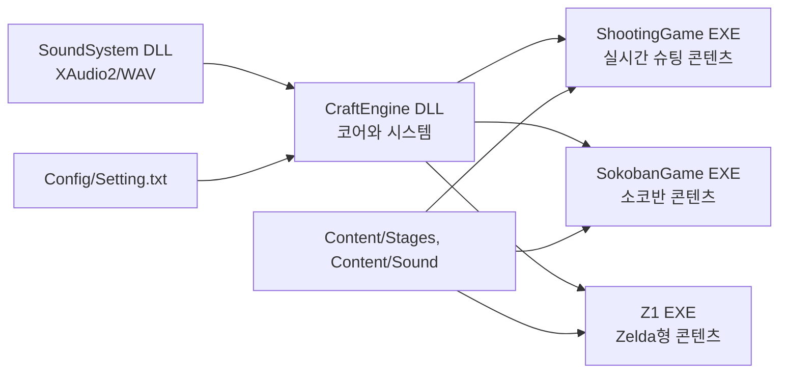
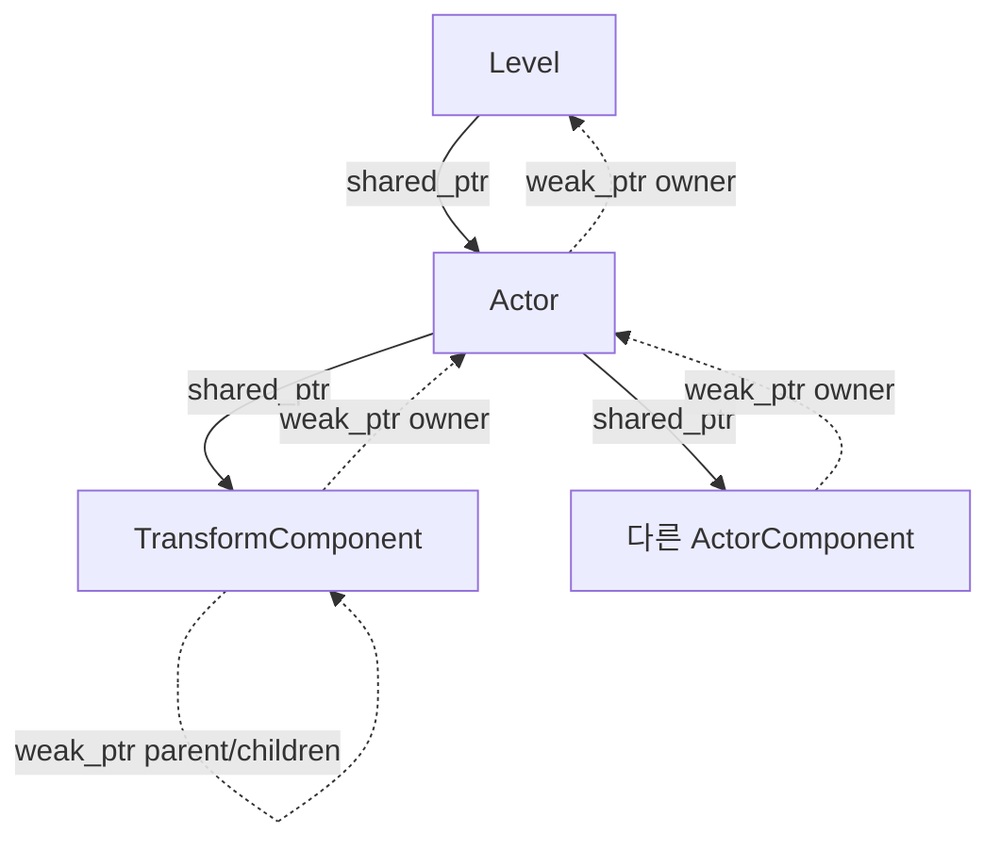

# CraftEngine 구조

## 문서 범위

이 프로젝트는 인프런의 [C++로 만드는 게임 엔진 프레임워크](https://www.inflearn.com/course/c-game-engine-framew?cid=341168)를 수강하며 만든 학습용 Windows 콘솔 게임 엔진이다. Level과 Actor, 고정 목표 프레임 루프, 입력·렌더링·충돌, DLL 분리, 커스텀 RTTI와 Component화라는 큰 흐름은 강의를 따른다.

현재 저장소가 강의와 구분되는 핵심은 Scene Graph다. 부모/자식 목록과 좌표 계산을 Actor에 두지 않고 `TransformComponent`로 일원화했다. 이 문서는 강의의 일반 구조가 아니라 현재 코드가 실제로 동작하는 방식을 기준으로 한다.

## 전체 구성

| 프로젝트 | 산출물 | 책임 |
| --- | --- | --- |
| `SoundSystem` | DLL/import library | COM·XAudio2 초기화, WAV 파싱과 캐시, 원샷 및 반복 BGM 보이스 관리 |
| `CraftEngine` | DLL/import library | 루프, Level/Actor/Component, 입력, 렌더링, 충돌, 타일맵, 수학, RTTI, SoundSystem 파사드 |
| `ShootingGame` | EXE | 플레이어·총구·엔진 이펙트 계층, 적 스폰, 탄환, 점수와 게임 오버 |
| `SokobanGame` | EXE | 맵 로드, 이동·박스 밀기, 클리어 판정, 게임/메뉴 Level 전환 |
| `Z1` | EXE | Zelda형 오버월드·동굴·Dungeon 1, 플레이어/적 전투와 보스 클리어 콘텐츠 |

콘텐츠는 `CraftEngine.lib`에 링크하고 CraftEngine이 다시 `SoundSystem.lib`에 링크한다. 실행 시에는 두 DLL이 각 게임 EXE 옆에 있어야 한다.

## 소스와 빌드 산출물

- 원본: `CraftEngine/`, `SoundSystem/`, `ShootingGame/`, `SokobanGame/`, `Z1/`, `Content/`, `Config/`
- 생성·복사본: `Includes/`, `Libraries/`, `Binaries/`, `Intermediate/`
- `SoundSystem` 빌드 전 이벤트가 공개 헤더를 `Includes/SoundSystem`으로 복사한다.
- `CraftEngine` 빌드 전 이벤트가 `pch.h`를 제외한 헤더 트리를 `Includes/CraftEngine`으로 복사한다.
- 각 DLL 빌드 후 import library와 DLL을 `Libraries/<프로젝트>/<구성>`으로 복사한다.
- 콘텐츠 빌드는 Content를 출력 루트에 복사하고, 두 DLL을 EXE 출력 디렉터리에 복사한다.
- CraftEngine 빌드는 `Setting.txt`를 출력 루트의 `Config`로 복사한다.

따라서 `Includes`와 `Libraries`는 배포 경계를 연습하기 위한 staging 영역이며 편집 대상이 아니다.

## 엔진 시작과 프레임 흐름

`Engine` 생성자는 설정을 읽고 난수, `Input`, `Renderer`, `CollisionSystem`, `Sound`를 초기화한다. `ShootingGame`은 `AddNewLevel<T>()`로 다음 Level을 예약하고, Z1의 파생 `Game`은 미리 생성한 Level 목록에서 상태에 맞는 Level을 `SetSubLevel`로 예약한다. `SokobanGame`의 파생 `Game`은 gameplay/menu Level을 만들어 `mainLevel`을 직접 선택한다.

한 번의 갱신 프레임 순서는 다음과 같다.

1. 고해상도 타이머가 목표 간격(`1 / framerate`) 이상인지 확인한다.
2. 256개 가상 키를 폴링한다.
3. 현재 Level의 `OnInitialized`를 최초 한 번 호출한다.
4. 아직 시작하지 않은 활성 Actor의 `BeginPlay`를 호출한다.
5. Level과 Actor/Component의 `Tick(deltaTime)`을 호출한다.
6. 모든 활성 Actor 쌍의 충돌을 계산하고 양쪽에 이벤트를 보낸다.
7. Actor/Component가 렌더 명령을 제출하고 Renderer가 화면을 갱신한다.
8. 예약된 `subLevel`이 있으면 현재 `mainLevel`을 교체한다.
9. Component 추가 요청, Actor 제거 요청, Actor 추가 요청 순으로 반영한다.
10. 활성 Actor의 현재 월드 위치와 현재 키 상태를 다음 프레임의 이전 상태로 저장한다.

Actor와 Component 추가가 지연되는 점이 중요하다. `SpawnActor` 결과는 즉시 돌려받을 수 있고 pending Component도 `GetComponent`로 찾을 수 있지만, Level 순회와 Component 이벤트 전달에 참여하는 시점은 프레임 경계를 지난 뒤다. 생성 직후 같은 프레임에 그려지거나 Tick된다고 가정하면 안 된다.

## 객체 모델과 소유권

- `Level`은 활성 및 추가 대기 Actor를 강하게 소유한다.
- Actor는 Level을 약하게 참조한다.
- Actor는 Transform 하나와 나머지 Component를 강하게 소유한다.
- Component는 소유 Actor를 약하게 참조한다.
- Transform 계층 링크는 양방향 모두 약한 참조라 Scene Graph 자체는 수명을 연장하지 않는다.
- `CObject` 계층은 `TYPE_DECLARATIONS`가 만든 `CClass` 메타데이터로 `IsA`, `Cast`, `TSubclassOf`를 제공한다.

`Destroy()`는 즉시 `hasExpired`를 설정해 이후 Tick, Draw, 충돌에서 제외한다. Level은 프레임 끝에 만료 Actor를 제거한다. Actor 파괴 시 현재 Transform의 자식 Actor에도 `Destroy()`를 전파하지만, 실제 메모리 해제는 Level이나 콘텐츠가 가진 다른 `shared_ptr` 유무에 따라 결정된다.

## Component와 Scene Graph

모든 Actor는 생성자에서 Transform을 자동 생성한다. 나머지 Component는 `AddComponent`로 요청한다.

| Component | 데이터와 책임 |
| --- | --- |
| `TransformComponent` | 로컬 좌표, 이전 월드 좌표, 부모/자식 Transform 링크, 월드 좌표 계산, attach/detach |
| `SpriteRendererComponent` | immutable Sprite와 sorting order를 보관하고 월드 좌표로 RenderCommand 제출 |
| `BoxComponent` | `size`와 `offset`을 가진 셀 단위 2D AABB |

`Actor::GetPosition()`과 `SetPosition()`은 기존 콘텐츠 API를 유지하는 Transform 로컬 좌표 파사드다. 부모가 없는 Actor에서는 로컬과 월드가 같지만 계층에 들어간 Actor에서는 다르다.

Attach 동작은 다음 계약을 가진다.

- `keepWorldPosition = true`: 연결 전 월드 좌표가 유지되도록 새 로컬 좌표를 계산한다.
- `keepWorldPosition = false`: 연결 전 로컬 좌표를 새 부모 기준 오프셋으로 그대로 사용한다.
- 기존 부모에서는 먼저 분리하며 중복 자식 링크를 만들지 않는다.
- 새 부모의 조상을 따라가 자신이 나오면 순환이므로 연결을 거부한다.
- detach 기본값은 월드 위치를 보존한다.

실제 사용 예는 ShootingGame의 `Player`다. 두 `PlayerGun`은 `(1, -1)`, `(3, -1)`, `PlayerEngineEffect`는 `(0, 1)`의 로컬 오프셋으로 생성한 뒤 `AttachTo(player, false)`로 연결한다. 플레이어가 움직이면 자식의 월드 좌표가 자동으로 따라가며, 총알은 총구의 월드 좌표에서 독립 Actor로 생성된다.

## 엔진 하위 시스템

### 입력

`Input` 싱글톤은 Win32 `GetAsyncKeyState`로 0~255 가상 키를 매 프레임 폴링한다. 현재/이전 상태 조합으로 `GetKey`, `GetKeyDown`, `GetKeyUp`을 제공한다.

### 렌더링

Actor의 `Draw`는 Component까지 전달되고 SpriteRenderer가 Sprite 단위 명령을 제출한다. `RenderCommand`는 immutable Sprite 포인터, 위치, sorting order만 보관하며, Renderer는 화면 크기의 `CHAR_INFO`와 sorting order 배열에 이를 합성한다. 문자열도 먼저 Sprite로 변환하므로 Renderer 내부에는 별도 문자열 payload가 없다. Sprite는 저장된 콘솔 셀 크기 그대로 1:1로 출력하며, 투명 셀은 기존 백버퍼 셀을 보존하고 X/Y 양축 부분 클리핑을 적용한다. 같은 셀에서는 높은 sorting order가 우선하며, Win32 콘솔 screen buffer 두 개를 번갈아 활성화해 깜박임을 줄인다. 매 프레임 전체 영역을 `WriteConsoleOutputA`로 덮으므로 프레임 중 ScreenBuffer의 별도 Clear는 호출하지 않는다.

`Submit`은 화면 좌표를 그대로 사용하고 HUD와 메뉴에 적합하다. `SubmitWorld`는 현재 View의 `worldOrigin`을 빼고 `screenOrigin`을 더해 월드 좌표를 화면 좌표로 바꾼다. `SpriteRendererComponent`는 Actor의 월드 위치를 `SubmitWorld`로 제출한다. View는 이를 사용하는 Level이 Actor 제출 전에 설정하며, Renderer는 한 프레임을 출력한 뒤 원점을 `(0, 0)`으로 초기화한다.

### 충돌

CollisionSystem은 활성 Actor의 모든 조합을 검사하는 `O(n²)` 방식이다. 양쪽에 `BoxComponent`가 있을 때만 검사하며, 각 Box의 `size`와 `offset`, 이전/현재 월드 위치로 이동 구간을 포함하는 `Box2D`를 계산한다. `Box2D`는 좌상단 위치와 2차원 크기를 보관하고 양 끝을 포함하는 AABB 겹침·접촉·포함 판정을 공용으로 제공한다. 한 변이 0 이하인 Box는 충돌하지 않는다. 모든 충돌 쌍을 먼저 모은 뒤 콜백을 보내 컬렉션과 활성 상태 변화의 영향을 줄인다.

### 타일맵

`Tilemap`은 별도 Grid·Renderer·Collider 계층을 두지 않은 최소 공용 타일맵이다. 논리 타일 개수와 각 셀의 월드/콘솔 크기, 셀별 `Tile` 배열을 보관한다. `Tile`은 immutable Sprite 포인터와 `blocked` 여부만 가지며 파일 형식이나 콘텐츠 식별자는 알지 못한다. `GetTile`/`SetTile`, 논리 셀과 월드 좌표 변환, 셀 `Box2D`, 월드 Box가 막힌 타일과 겹치는지 검사하는 `CanPlaceBox`, 지정한 논리 타일 구간의 Sprite를 합성하는 `BuildSprite`를 제공한다.

TileId나 문자 원본 파싱, 원본 값을 Sprite와 blocked 상태로 해석하는 규칙은 콘텐츠 책임이다. 따라서 Z1의 Map 타입은 원본 데이터를 보관하면서 `Tilemap`을 합성으로 소유하고, Level은 현재 Room 선택과 동적 게임 상태만 관리한다.

### 사운드

SoundSystem의 전역 `Sound` 클래스는 WAV를 경로별로 캐시한다. 원샷은 호출마다 source voice를 만들어 중첩 재생하고, BGM은 하나의 반복 voice를 유지한다. CraftEngine은 `PlayOneShot`, `PlayBGM`, `StopBGM`만 노출하고 파일명 앞에 `../Content/Sound/`를 붙인다.

## 콘텐츠별 흐름

### ShootingGame

`GameLevel`이 Player, EnemySpawner, GameManager를 생성한다. Player는 Scene Graph 자식으로 총구와 엔진 이펙트를 만들며, EnemySpawner는 주기적으로 Enemy를 만든다. Player/Enemy 탄환과 BoxComponent 충돌이 파괴·점수·사운드로 이어진다. Player가 죽으면 GameManager 콜백이 Level 상태를 GameOver로 바꾸고 잠시 후 엔진을 종료한다.

### SokobanGame

`Game`은 gameplay와 menu Level을 보존한 채 현재 Level 포인터를 전환한다. GameLevel은 `Content/Stages/Stage1.txt`의 문자(`#`, `.`, `p`, `b`, `t`)를 Actor로 변환한다. 이동 가능 여부와 박스 밀기, 목표 일치 판정은 Level이 담당하며 Player는 `ICanPlayerMove` 인터페이스를 통해 묻는다. 이 게임의 Actor는 계층을 사용하지 않아 로컬 좌표와 월드 좌표가 사실상 같다.

### Z1

Z1의 `Game`은 `Title`, `Overworld`, `SwordCave`, `Dungeon1`, `Clear`, `GameOver`, `Development` 상태를 보유한다. 실제 진행은 타이틀에서 `Enter` 키로 새 게임을 시작해 오버월드에서 검을 얻고 Dungeon 1을 클리어하는 흐름이다. 새 게임 시작 시 오버월드·동굴·던전 Level을 다시 만들어 HP 20과 검 미소지 상태로 초기화한다. Level 전환 전후에는 `Game`이 플레이어 HP와 검 보유 여부를 보관·복원한다. `Development`는 별도 수동 확인용 장면으로 남아 있다.

`OverworldMap`은 `Content/Z1/Maps/Overworld`의 256×88 TileId·Blocking 맵을 각각 검증한다. 입구 등 Z1 규칙에 필요한 TileId 원본은 별도 배열에 유지하고, 두 파일의 값을 Z1 전용 10×5 Tile Sprite와 blocked 상태로 해석해 내부 `Tilemap`에 설정한다. 별도 Room 객체는 없으며 Room은 전체 Map에서 현재 화면에 표시할 16×11 논리 타일 구간을 뜻한다. `OverworldLevel`은 현재 Room의 논리 원점만 계산하고 `OverworldMap::BuildRoomSprite`에 배경 합성을 위임한다. Actor는 각자 Sprite 크기와 Box를 가지므로 Map 타일 크기에 종속되지 않는다. Player·Octorok·Moblin·Tektite는 좌우 공통 여백을 제거한 8×5 Sprite와 같은 크기의 Box를 사용한다.

Player Transform은 전체 Map 기준 월드 셀 좌표를 보관한다. 이동 후보의 Box는 `OverworldMap::CanPlaceBox`를 거쳐 내부 Tilemap의 blocked 타일과 Map 경계를 검사하고, 앞쪽 Box 경계가 다른 Room에 들어가면 현재 Room 배경 캐시와 Renderer View 원점을 바꾼다. 이때 Player Box가 새 Room 안에 온전히 들어가도록 이동 방향의 Room 경계에 위치를 보정한다. 현재 접근 가능한 Room은 `(7,7) → (7,6) → (8,6) → (8,5) → (8,4) → (8,3) → (7,3)` 경로로 제한한다. 시작 Room `(7, 7)`의 `(4, 1)` 입구는 `SwordCave`로, Room `(7, 3)`의 `(7, 4)` 입구는 검 보유 시에만 `Dungeon1`으로 전환한다. 입구는 blocked 타일이므로 일반 지형 이동 검사보다 먼저 판정한다.

`CaveMap`은 16×11 문자 원본을 보관하고 벽·바닥·검·출구 문자를 기본 지형 Sprite와 blocked 상태로 해석해 내부 Tilemap을 구성한다. `CaveLevel`은 원본 문자에서 검과 출구 위치를 찾고, 검은 배경과 분리된 캐시 Sprite로 조건부 렌더링한다. Player Box가 검 타일 영역과 겹치면 `Game`과 Player에 검 보유 상태를 기록하며 이후 Draw에서 검을 제출하지 않는다. 출구를 통해 오버월드로 돌아갈 수 있다.

`Pawn`은 Player와 Enemy가 공유하는 HP, facing, 셀 단위 이동 누산, 피해·사망, 넉백과 피격 무적 상태를 담당한다. Player는 방향키로 이동하며 마지막 방향을 유지한다. 검 보유 후 `A` 키를 누르면 Player에 attach한 짧은 수명의 `SwordAttack`을 만들고, HP가 가득 차 있으면 같은 방향으로 검기도 발사한다. 피해를 입은 Pawn은 공격 반대 방향으로 밀려나고 짧은 무적 시간 동안 깜빡인다. HP가 0이면 오버월드와 던전은 잠시 뒤 `GameOver`로 전환한다.

적은 `Enemy`를 기반으로 한다. 오버월드의 일반 적은 Octorok, Moblin, Tektite다. Octorok은 일정 주기로 방향을 바꾸고 바라보는 방향으로 돌을 발사하며, Moblin은 더 느리게 Player를 추적하다 창을 던진다. Tektite는 투사체 없이 잠시 멈춘 뒤 Player 방향으로 대각선 도약하며, 오버월드의 BlockingMap 지형은 넘을 수 있지만 현재 Room 경계는 넘지 못한다. Tektite만 Player와 겹쳐 접촉 피해를 줄 수 있으며, 피격된 Player는 그 겹침에서 빠져나오는 넉백 이동을 허용한다. 던전의 일반 적은 Octorok이다. Player는 공격 중이 아닐 때 돌·창·화염구에 대해 바라보는 방향이 맞으면 방패 판정을 적용한다. 투사체는 발사자의 Box 가장자리에서 생성되고 지형·현재 Room 경계에 닿거나 유효 대상에 피해를 주면 파괴된다. 피격과 사망 시에는 `CombatEffect`가 잠시 표시된다.

`EnemySpawner`는 시작 Room `(7, 7)`을 제외한 오버월드 Room 좌표와 월드 시드로 결정적인 스폰 계획을 만든다. Room을 나가면 기존 Enemy와 투사체를 파괴하고 새 Room의 통행 가능한 위치에 다시 생성한다. Player와 Octorok·Moblin은 서로 겹칠 수 없지만 Tektite는 접촉 피해를 위해 Player와 겹칠 수 있고, Enemy끼리는 서로 통과한다.

`DungeonMap`은 `Content/Z1/Maps/Dungeons/Level1.txt`의 5×1 Room 문자 원본을 보관하고 내부 Tilemap을 구성한다. `B`, `H`, `T`는 보스와 보상 위치를 찾는 Z1 표식으로 유지하되 Tilemap에는 기본 바닥 Sprite로 설정한다. `DungeonLevel`은 Room 전환 시 Tilemap에서 해당 16×11 배경을 합성하고 Player Box가 새 Room 안에 온전히 들어가도록 경계 위치를 보정한다. 앞의 세 Room에는 Octorok을 임의 배치하고, 보스 Room에는 자체 SpriteRenderer를 가진 Aquamentus Actor를 하나 생성한다. Aquamentus는 수평 이동이 막히면 방향을 바꾸며 Player 쪽으로 세 갈래 화염구를 발사한다. 보스 처치 뒤 하트와 트라이포스는 캐시된 별도 Sprite로 조건부 렌더링되고, 획득하면 제출을 중단해 아래의 바닥이 보인다. 하트는 HP를 전부 회복한다. 트라이포스 획득 시 Zelda Is Rescued 팬파레를 재생하고 플레이어 입력을 잠시 멈춘 뒤 `Clear`로 전환하며, Clear 화면에서는 Ending Theme을 재생한다. 던전 입구 출구로 오버월드에 되돌아갈 수도 있다.

`DevelopmentLevel`은 Sprite·2D Box 충돌을 수동으로 확인하는 별도 장면이다.

## 현재 경계와 확장 시점

- 루프는 목표 프레임 간격이 될 때까지 대기하며 누적 시간을 보정하는 fixed-step accumulator는 아니다. 정밀한 고정 물리가 필요할 때 루프 모델을 재검토한다.
- 충돌은 broad phase 없이 전수 검사한다. Actor 수가 실제 병목이 될 때 공간 분할을 고려한다.
- Tilemap은 단일 레이어의 Sprite와 blocked 여부만 제공한다. 별도 Grid, 렌더러, Collider, 다중 레이어나 one-way·경사 지형이 실제로 필요해질 때 역할 분리와 충돌 속성 확장을 검토한다.
- Transform은 이동만 표현하며 회전·크기·행렬은 없다. 콘솔 2D 요구가 바뀔 때 확장한다.
- Level 전환에는 `subLevel` 예약 방식과 Sokoban의 직접 포인터 전환 방식이 함께 존재한다. 공통 전환 정책이 필요해질 때 하나로 통합한다.
- 빌드 의존성은 라이브러리 경로와 복사 이벤트에 일부 의존한다. 재현 가능한 클린 빌드가 중요해지면 프로젝트 참조/솔루션 의존성을 명시한다.

## 계획된 네트워크 확장

Z1을 서버 권위형 멀티플레이로 확장하는 목표 구조와 단계별 계획은 [`Z1_MULTIPLAYER_IOCP_PLAN.md`](Z1_MULTIPLAYER_IOCP_PLAN.md)에 기록한다. 현재 `Sockets` DLL, `Z1Server` EXE, `Z1Shared` wire layer와 Z1의 `NetworkClient` transport가 구현되어 있고, 다음 작업은 클라이언트 입력 전송과 복제 Actor 표현이다. CraftEngine은 네트워크에 의존하지 않는 클라이언트 엔진 경계를 유지한다.
