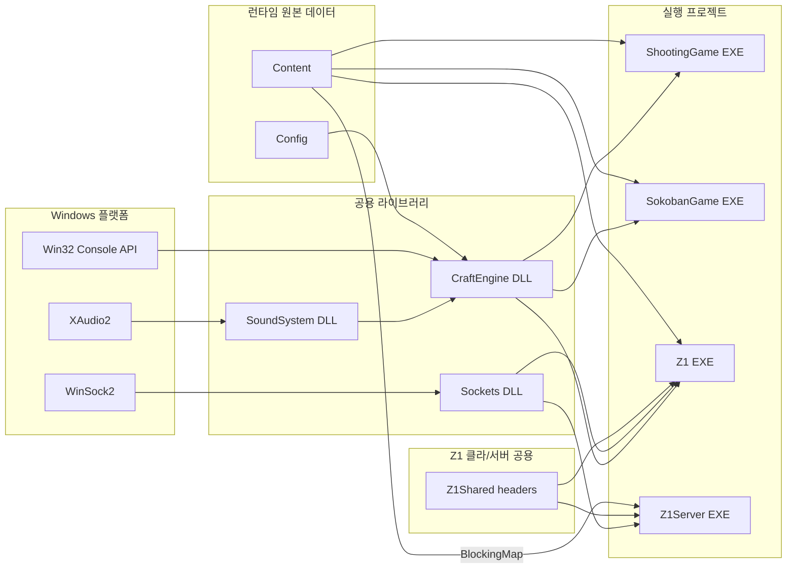
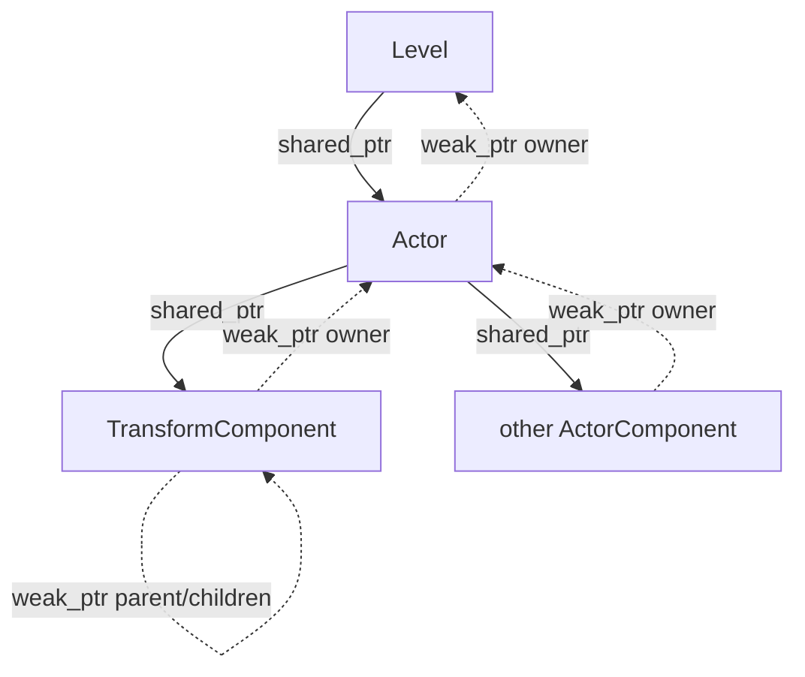

# 솔루션 아키텍처

## 문서 범위

CraftEngine 솔루션을 구성하는 프로젝트 구조를 나타냅니다.

## 전체 구성

| 구성 요소 | 산출물 | 책임 |
| --- | --- | --- |
| `SoundSystem` | DLL/import library | COM·XAudio2 초기화, WAV 캐시, 1회성/반복 사운드 재생 객체 수명 관리 |
| `CraftEngine` | DLL/import library | 게임 루프, Level/Actor/Component, 입력, 렌더링, 충돌, 타일맵, 수학, RTTI와 사운드 파사드 |
| `Sockets` | DLL/import library | WinSock 런타임, 주소, 이동 전용 소켓과 기본 소켓 API |
| `ShootingGame` | EXE | 실시간 슈팅 게임 컨텐츠 |
| `SokobanGame` | EXE | 스테이지 기반 소코반 퍼즐 컨텐츠 |
| `Z1` | EXE | NES Legend of Zelda 스타일 컨텐츠 |
| `Z1Server` | EXE | IOCP 기반 서버, 클라이언트를 대변하는 Session, Z1 컨텐츠의 일부를 서버에서 시뮬레이션 |
| `Z1Shared` | 헤더 파일 모음 | Z1 서버-클라이언트 간 사용되는 패킷 종류와 헤더, 직렬화 등 |

## 소스와 빌드 산출물

- 소스와 원본 데이터: `CraftEngine/`, `SoundSystem/`, `Sockets/`, `ShootingGame/`, `SokobanGame/`, `Z1/`, `Z1Server/`, `Z1Shared/`, `Content/`, `Config/`
- 생성·복사 산출물: `Includes/`, `Libraries/`, `Binaries/`, `Intermediate/`
- DLL 프로젝트는 공개 헤더, import library와 DLL을 중간 staging 경로에 복사합니다.
- 콘텐츠 프로젝트는 필요한 DLL과 `Content`를 실행 경로 주변에 복사합니다.
- CraftEngine 빌드는 `Config/Setting.txt`를 출력 루트의 `Config`로 복사합니다.

## 엔진 시작과 프레임 흐름

`Engine` 생성자는 설정 파일을 읽고 난수, `Input`, `Renderer`, `CollisionSystem`, `Sound`를 초기화합니다. 이후 매 프레임 아래 로직을 처리합니다.

1. 목표 프레임 간격(초당 120 프레임)마다 `deltaTime`을 계산합니다.
2. ConsoleInputBuffer의 키 입력 및 창 포커스 이벤트를 소비해 256개 가상 키의 `pressed`, `held`, `released` 상태를 갱신합니다.
3. 현재 Level의 `OnInitialized`를 1회에 한해 호출합니다.
4. 아직 시작하지 않은, Active 상태 Actor들의 `BeginPlay`를 호출합니다.
5. Level과 Active Actor/Component들의 `Tick`을 호출합니다.
6. Active Actor들을 대상으로 충돌을 검사한 뒤, 충돌이 발생한 액터의 OnCollision()을 호출합니다.
7. Actor/Component들이 제출한 렌더 요청과 Level들이 제출한 렌더 요청을 Renderer가 콘솔 화면에 반영합니다.
8. 다른 Level로의 전환을 위해 예약된 Level이 있으면, 현재 Level과 교체합니다.
9. Component 추가, Actor 제거, Actor 추가 요청을 차례로 반영합니다.
10. 현재 프레임의 Actor 월드 위치를 기록합니다. 이 값은 충돌 판정에서 사용됩니다.

참고로 `SpawnActor`는 Actor를 즉시 반환하지만 각종 연산은 다음 프레임부터 반영됩니다.

## 객체 모델과 소유권

## Component와 Scene Graph

모든 Actor는 생성 시 Transform 하나를 소유합니다. 나머지 Component는 `AddComponent`를 통해 추가합니다.

| Component | 책임 |
| --- | --- |
| `TransformComponent` | 로컬/이전 월드 좌표, 부모·자식 관계, 월드 좌표 계산과 attach/detach |
| `SpriteRendererComponent` | Sprite와 sorting order를 보관하고 월드 좌표로 렌더 명령 제출 |
| `BoxComponent` | `size`와 `offset`을 가진 월드 공간 2D AABB |

## 엔진 하위 시스템

### 입력

`STD_INPUT_HANDLE`을 통해 Win32 콘솔 입력 버퍼로부터 `KEY_EVENT_RECORD`와 `FOCUS_EVENT`를 가져옵니다. 해당 정보를 기반으로 `GetKey`, `GetKeyDown`, `GetKeyUp` API를 제공합니다. 키 상태는 `pressed`(이번 프레임에 키가 눌렸는지), `held`(키가 눌린 상태인지), `released`(이번 프레임에 키가 떼졌는지)로 표현됩니다.

### 렌더링

SpriteRenderer가 Sprite, 월드 좌표 정보와 sorting order를 제출합니다. Renderer는 이 정보를 `CHAR_INFO`와 sorting order 버퍼로 합성해 `WriteConsoleOutputA`로 한 프레임을 출력합니다. `Submit`은 화면 좌표, `SubmitWorld`는 View 변환이 적용되는 월드 좌표에 사용합니다.

### 충돌

CollisionSystem은 BoxComponent가 있는 Actor들을 모두 검사합니다. 각 Box 콜라이더 크기와 오프셋을 기반으로, 이전/현재 월드 위치를 통해 해당 프레임을 '휩쓴' 영역 AABB를 구해, 겹친 충돌 쌍들의 OnCollision() 콜백을 호출합니다.

### 타일맵

`Tilemap`은 Sprite와 이동 가능 유무로 표현되는 **논리 타일** 배열과 전체 타일맵 크기, 타일 하나 당 픽셀 크기를 소유합니다. 픽셀과 월드 좌표 간 변환, 특정 영역을 표현하는 Box의 타일 배치 가능성, 지정한 구간(좌상단 좌표부터 가로/세로 길이만큼)을 Sprite로 만들어주는 API를 제공합니다.

### 사운드

SoundSystem은 WAV 파일을 읽어 파싱 후 경로 단위로 캐싱해두고, 1회 재생 API와 반복 재생 API를 제공합니다. CraftEngine은 해당 시스템을 소유해 동명 API를 래핑한 채로 제공해 컨텐츠 단에서 사운드 시스템을 이용할 수 있도록 합니다.
