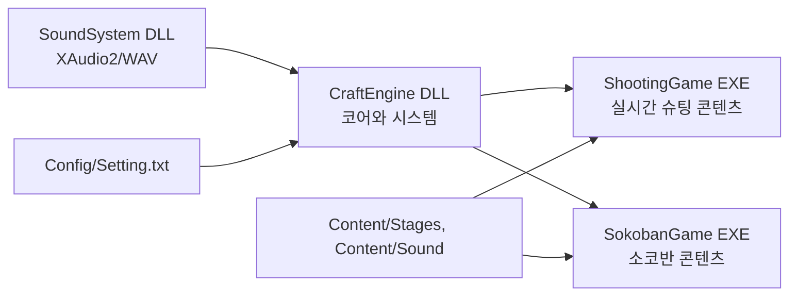
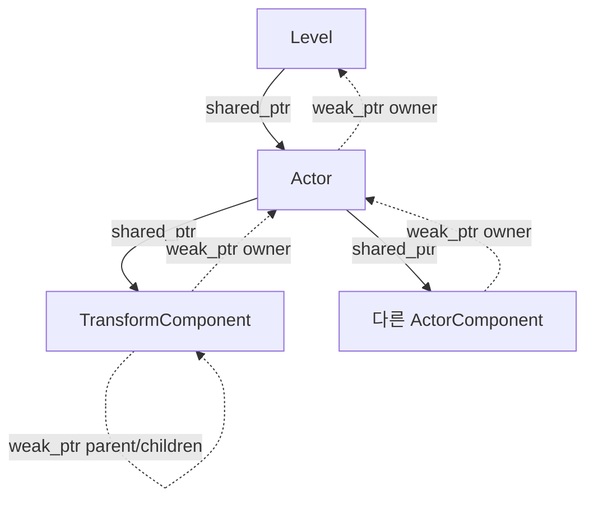

# CraftEngine 구조

## 문서 범위

이 프로젝트는 인프런의 [C++로 만드는 게임 엔진 프레임워크](https://www.inflearn.com/course/c-game-engine-framew?cid=341168)를 수강하며 만든 학습용 Windows 콘솔 게임 엔진이다. Level과 Actor, 고정 목표 프레임 루프, 입력·렌더링·충돌, DLL 분리, 커스텀 RTTI와 Component화라는 큰 흐름은 강의를 따른다.

현재 저장소가 강의와 구분되는 핵심은 Scene Graph다. 부모/자식 목록과 좌표 계산을 Actor에 두지 않고 `TransformComponent`로 일원화했다. 이 문서는 강의의 일반 구조가 아니라 현재 코드가 실제로 동작하는 방식을 기준으로 한다.

## 전체 구성

| 프로젝트 | 산출물 | 책임 |
| --- | --- | --- |
| `SoundSystem` | DLL/import library | COM·XAudio2 초기화, WAV 파싱과 캐시, 원샷 및 반복 BGM 보이스 관리 |
| `CraftEngine` | DLL/import library | 루프, Level/Actor/Component, 입력, 렌더링, 충돌, 수학, RTTI, SoundSystem 파사드 |
| `ShootingGame` | EXE | 플레이어·총구·엔진 이펙트 계층, 적 스폰, 탄환, 점수와 게임 오버 |
| `SokobanGame` | EXE | 맵 로드, 이동·박스 밀기, 클리어 판정, 게임/메뉴 Level 전환 |

콘텐츠는 `CraftEngine.lib`에 링크하고 CraftEngine이 다시 `SoundSystem.lib`에 링크한다. 실행 시에는 두 DLL이 각 게임 EXE 옆에 있어야 한다.

## 소스와 빌드 산출물

- 원본: `CraftEngine/`, `SoundSystem/`, `ShootingGame/`, `SokobanGame/`, `Content/`, `Config/`
- 생성·복사본: `Includes/`, `Libraries/`, `Binaries/`, `Intermediate/`
- `SoundSystem` 빌드 전 이벤트가 공개 헤더를 `Includes/SoundSystem`으로 복사한다.
- `CraftEngine` 빌드 전 이벤트가 `pch.h`를 제외한 헤더 트리를 `Includes/CraftEngine`으로 복사한다.
- 각 DLL 빌드 후 import library와 DLL을 `Libraries/<프로젝트>/<구성>`으로 복사한다.
- 콘텐츠 빌드는 Content를 출력 루트에 복사하고, 두 DLL을 EXE 출력 디렉터리에 복사한다.
- CraftEngine 빌드는 `Setting.txt`를 출력 루트의 `Config`로 복사한다.

따라서 `Includes`와 `Libraries`는 배포 경계를 연습하기 위한 staging 영역이며 편집 대상이 아니다.

## 엔진 시작과 프레임 흐름

`Engine` 생성자는 설정을 읽고 난수, `Input`, `Renderer`, `CollisionSystem`, `Sound`를 초기화한다. `ShootingGame`은 `AddNewLevel<GameLevel>()`로 다음 Level을 예약하고, `SokobanGame`의 파생 `Game`은 gameplay/menu Level을 만들어 `mainLevel`을 직접 선택한다.

한 번의 갱신 프레임 순서는 다음과 같다.

1. 고해상도 타이머가 목표 간격(`1 / framerate`) 이상인지 확인한다.
2. 256개 가상 키를 폴링한다.
3. 현재 Level의 `OnInitialized`를 최초 한 번 호출한다.
4. 아직 시작하지 않은 활성 Actor의 `BeginPlay`를 호출한다.
5. Level과 Actor/Component의 `Tick(deltaTime)`을 호출한다.
6. 모든 활성 Actor 쌍의 충돌을 계산하고 양쪽에 이벤트를 보낸다.
7. Actor/Component가 렌더 명령을 제출하고 Renderer가 화면을 갱신한다.
8. 예약된 `subLevel`이 있으면 현재 `mainLevel`을 교체한다.
9. Component 추가 요청, Actor 제거 요청, Actor 추가 요청 순으로 반영한다.
10. 활성 Actor의 현재 월드 위치와 현재 키 상태를 다음 프레임의 이전 상태로 저장한다.

Actor와 Component 추가가 지연되는 점이 중요하다. `SpawnActor` 결과는 즉시 돌려받을 수 있고 pending Component도 `GetComponent`로 찾을 수 있지만, Level 순회와 Component 이벤트 전달에 참여하는 시점은 프레임 경계를 지난 뒤다. 생성 직후 같은 프레임에 그려지거나 Tick된다고 가정하면 안 된다.

## 객체 모델과 소유권

- `Level`은 활성 및 추가 대기 Actor를 강하게 소유한다.
- Actor는 Level을 약하게 참조한다.
- Actor는 Transform 하나와 나머지 Component를 강하게 소유한다.
- Component는 소유 Actor를 약하게 참조한다.
- Transform 계층 링크는 양방향 모두 약한 참조라 Scene Graph 자체는 수명을 연장하지 않는다.
- `CObject` 계층은 `TYPE_DECLARATIONS`가 만든 `CClass` 메타데이터로 `IsA`, `Cast`, `TSubclassOf`를 제공한다.

`Destroy()`는 즉시 `hasExpired`를 설정해 이후 Tick, Draw, 충돌에서 제외한다. Level은 프레임 끝에 만료 Actor를 제거한다. Actor 파괴 시 현재 Transform의 자식 Actor에도 `Destroy()`를 전파하지만, 실제 메모리 해제는 Level이나 콘텐츠가 가진 다른 `shared_ptr` 유무에 따라 결정된다.

## Component와 Scene Graph

모든 Actor는 생성자에서 Transform을 자동 생성한다. 나머지 Component는 `AddComponent`로 요청한다.

| Component | 데이터와 책임 |
| --- | --- |
| `TransformComponent` | 로컬 좌표, 이전 월드 좌표, 부모/자식 Transform 링크, 월드 좌표 계산, attach/detach |
| `SpriteRendererComponent` | 문자열 이미지, 색상, sorting order를 보관하고 월드 좌표로 RenderCommand 제출 |
| `BoxComponent` | AABB 충돌에 사용할 가로 폭 제공. 세로 높이는 현재 한 칸으로 간주 |

`Actor::GetPosition()`과 `SetPosition()`은 기존 콘텐츠 API를 유지하는 Transform 로컬 좌표 파사드다. 부모가 없는 Actor에서는 로컬과 월드가 같지만 계층에 들어간 Actor에서는 다르다.

Attach 동작은 다음 계약을 가진다.

- `keepWorldPosition = true`: 연결 전 월드 좌표가 유지되도록 새 로컬 좌표를 계산한다.
- `keepWorldPosition = false`: 연결 전 로컬 좌표를 새 부모 기준 오프셋으로 그대로 사용한다.
- 기존 부모에서는 먼저 분리하며 중복 자식 링크를 만들지 않는다.
- 새 부모의 조상을 따라가 자신이 나오면 순환이므로 연결을 거부한다.
- detach 기본값은 월드 위치를 보존한다.

실제 사용 예는 ShootingGame의 `Player`다. 두 `PlayerGun`은 `(1, -1)`, `(3, -1)`, `PlayerEngineEffect`는 `(0, 1)`의 로컬 오프셋으로 생성한 뒤 `AttachTo(player, false)`로 연결한다. 플레이어가 움직이면 자식의 월드 좌표가 자동으로 따라가며, 총알은 총구의 월드 좌표에서 독립 Actor로 생성된다.

## 엔진 하위 시스템

### 입력

`Input` 싱글톤은 Win32 `GetAsyncKeyState`로 0~255 가상 키를 매 프레임 폴링한다. 현재/이전 상태 조합으로 `GetKey`, `GetKeyDown`, `GetKeyUp`을 제공한다.

### 렌더링

Actor의 `Draw`는 Component까지 전달되고 SpriteRenderer가 문자열 단위 명령을 제출한다. Renderer는 화면 크기의 `CHAR_INFO`와 sorting order 배열에 명령을 합성한다. 같은 셀에서는 높은 sorting order가 우선하며, Win32 콘솔 screen buffer 두 개를 번갈아 활성화해 깜박임을 줄인다.

### 충돌

CollisionSystem은 활성 Actor의 모든 조합을 검사하는 `O(n²)` 방식이다. 양쪽에 `BoxComponent`가 있을 때만 검사하며, 이전 월드 위치와 현재 월드 위치를 함께 감싸는 swept AABB로 빠른 이동 중 통과를 완화한다. 현재 충돌 크기는 문자열 폭에 대응하는 X축 너비와 한 칸의 Y축 높이만 지원한다. 모든 충돌 쌍을 먼저 모은 뒤 콜백을 보내 컬렉션과 활성 상태 변화의 영향을 줄인다.

### 사운드

SoundSystem의 전역 `Sound` 클래스는 WAV를 경로별로 캐시한다. 원샷은 호출마다 source voice를 만들어 중첩 재생하고, BGM은 하나의 반복 voice를 유지한다. CraftEngine은 `PlayOneShot`, `PlayBGM`, `StopBGM`만 노출하고 파일명 앞에 `../Content/Sound/`를 붙인다.

## 콘텐츠별 흐름

### ShootingGame

`GameLevel`이 Player, EnemySpawner, GameManager를 생성한다. Player는 Scene Graph 자식으로 총구와 엔진 이펙트를 만들며, EnemySpawner는 주기적으로 Enemy를 만든다. Player/Enemy 탄환과 BoxComponent 충돌이 파괴·점수·사운드로 이어진다. Player가 죽으면 GameManager 콜백이 Level 상태를 GameOver로 바꾸고 잠시 후 엔진을 종료한다.

### SokobanGame

`Game`은 gameplay와 menu Level을 보존한 채 현재 Level 포인터를 전환한다. GameLevel은 `Content/Stages/Stage1.txt`의 문자(`#`, `.`, `p`, `b`, `t`)를 Actor로 변환한다. 이동 가능 여부와 박스 밀기, 목표 일치 판정은 Level이 담당하며 Player는 `ICanPlayerMove` 인터페이스를 통해 묻는다. 이 게임의 Actor는 계층을 사용하지 않아 로컬 좌표와 월드 좌표가 사실상 같다.

## 현재 경계와 확장 시점

- 루프는 목표 프레임 간격이 될 때까지 대기하며 누적 시간을 보정하는 fixed-step accumulator는 아니다. 정밀한 고정 물리가 필요할 때 루프 모델을 재검토한다.
- 충돌은 broad phase 없이 전수 검사한다. Actor 수가 실제 병목이 될 때 공간 분할을 고려한다.
- Transform은 이동만 표현하며 회전·크기·행렬은 없다. 콘솔 2D 요구가 바뀔 때 확장한다.
- Level 전환에는 `subLevel` 예약 방식과 Sokoban의 직접 포인터 전환 방식이 함께 존재한다. 공통 전환 정책이 필요해질 때 하나로 통합한다.
- 빌드 의존성은 라이브러리 경로와 복사 이벤트에 일부 의존한다. 재현 가능한 클린 빌드가 중요해지면 프로젝트 참조/솔루션 의존성을 명시한다.
