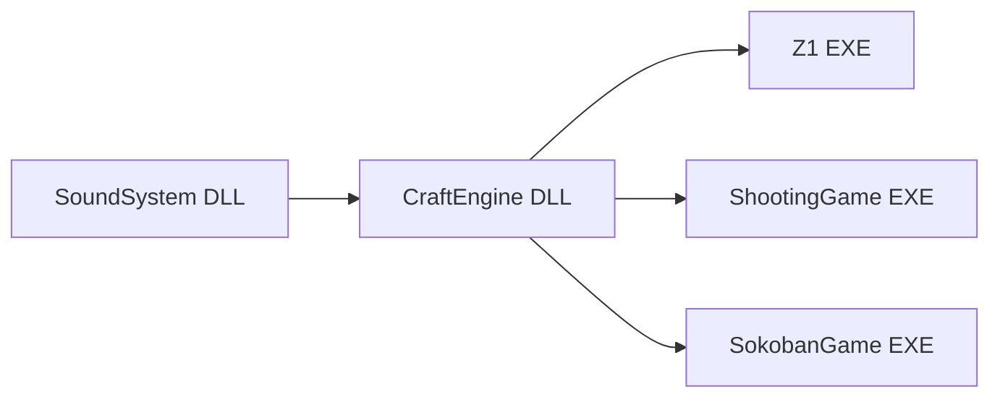
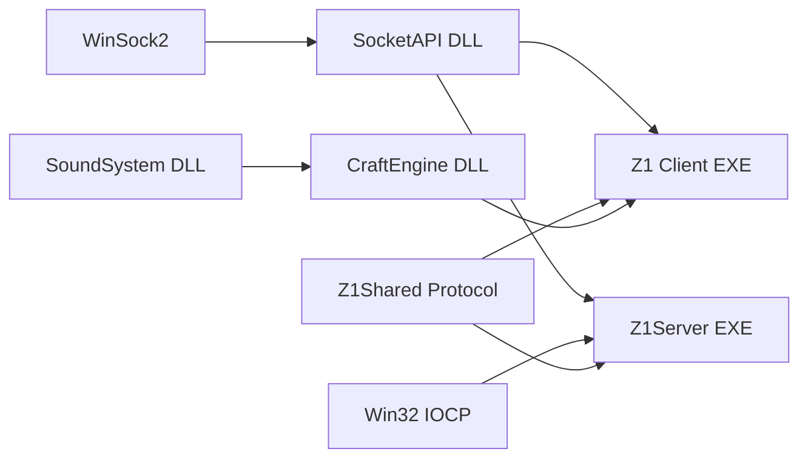
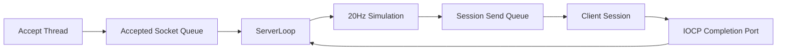

# Z1 멀티플레이와 미니 IOCP 서버 확장 계획

## 문서 목적과 상태

이 문서는 현재 싱글플레이 Z1을 Windows Socket 기반 멀티플레이로 확장하기 위한 설계 기준과 단계별 구현 계획을 기록한다. 저장소를 처음 보는 개발자가 다음 내용을 한 문서에서 파악하는 것을 목표로 한다.

- 현재 CraftEngine과 Z1의 실행·데이터 구조
- 새 `SocketAPI` DLL과 `Z1Server` EXE의 책임
- 클라이언트와 서버가 공유할 프로토콜 경계
- IOCP 비동기 작업과 객체 수명 규칙
- 서버 권위형 시뮬레이션으로 옮기는 순서
- 첫 구현에서 의도적으로 제외할 기능과 확장 조건

이 문서는 목표 설계와 실제 진행 상태를 함께 기록한다. 설계상 `SocketAPI` 경계의 실제 프로젝트 이름은 현재 `Sockets`이다. Z1에는 `select` 기반 `NetworkClient` transport와 연결 HUD까지 구현되어 있으나, 입력 전송과 복제 Actor 표현은 아직 구현하지 않았다. 구현 도중 계약이 달라지면 코드와 이 문서를 같은 변경에서 갱신한다.

## 현재 구현 진행 상황 (2026-08-28)

이 절은 목표 구조가 아니라 현재 작업 트리와 실제 확인 결과를 기준으로 한다. 다음 에이전트나 모델은 이 절과 코드의 차이가 있으면 코드를 우선 확인하고, 작업을 이어갈 때 이 절을 갱신한다.

### 완료·확인된 범위

- Z1, SokobanGame, ShootingGame의 기존 싱글플레이 상태는 유지되고, 사용자가 Debug|x64 빌드·실행 정상임을 확인했다.
- 설계상 `SocketAPI` 역할을 담당하는 실제 Visual Studio 프로젝트 `Sockets`를 추가했다. `Sockets.dll`/`Sockets.lib`를 만들고 공개 헤더와 DLL·import library를 `Includes/Sockets`, `Libraries/Sockets/<Configuration>`으로 staging하는 빌드 이벤트를 설정했다.
- `Sockets`에는 `Net::Runtime`, `Net::Endpoint`, 이동 전용 `Net::Socket`이 있다.
  - `Runtime`: 프로세스의 `WSAStartup`/`WSACleanup` 수명 관리
  - `Endpoint`: 공개 API에서 `SOCKADDR_IN`을 숨기고 `Any`, `Loopback`, IPv4 파싱 제공
  - `Socket`: `CreateTcp`, `Bind`, `Listen`, `Accept`, `Connect`, `SetNonBlocking`, `SetNoDelay`, `Send`, `Recv`, `Close`, `ReleaseNativeSocket`와 유효성·이동 의미 제공
- `Sockets`는 필요한 WinSock 링크(`Ws2_32.lib`)를 갖는다. `SetNoDelay`은 내부의 최소 `setsockopt` helper로 제공하며, 일반 `getsockopt`/`setsockopt` 공개 API는 아직 필요하지 않다.
- `Z1Server` 콘솔 프로젝트를 추가하고 `Sockets`와 WinSock에 링크했다. `Server`가 listen socket과 raw IOCP `HANDLE`을 직접 소유하는 최소 구조이며, IOCP를 `SocketAPI` 공개 API로 올리지는 않았다.
- `Z1Shared/Protocol.h`, `Z1Shared/Serialization.h`를 실제 공유 헤더 디렉터리로 추가했다. 고정 길이 정수는 network byte order(`htons`/`htonl`, `ntohs`/`ntohl`)로 직렬화하며, raw struct/`bool` 메모리를 그대로 전송하지 않는다.
- `Server::Start`는 TCP socket 생성 → `Bind` → `Listen` → completion port 생성 순으로 동작하고, blocking `AcceptLoop`와 IOCP `IOLoop`을 각각 스레드로 시작한다.
- 서버를 실행해 `Bind`/`Listen` 후 대기하는 상태를 확인했고, 별도 PowerShell에서 다음 명령으로 접속 경로를 검증했다.

  ```powershell
  Test-NetConnection 127.0.0.1 -Port 7777
  ```

  결과는 `TcpTestSucceeded : True`였고 서버에 `Client Connected!`가 출력됐다. 이후 아래의 payload 왕복·snapshot 검증까지 완료했으므로, 이 명령은 현재도 listen/accept smoke check 용도로만 사용한다.

### 현재 구현된 서버 vertical slice

- `Session`은 복사를 금지하고, accepted `Net::Socket`, recv/send 각각의 `OVERLAPPED`, `WSABUF`, recv 누적 buffer, 완성 packet queue, send queue를 소유한다.
  - recv: 4096바이트 임시 buffer에서 누적 buffer로 옮긴 뒤 `[size:uint16][type:uint16][payload]` framing을 처리한다. 불완전 header/payload는 다음 recv까지 보관하고, 잘못된 전체 크기와 알 수 없는 packet type은 세션 오류로 처리한다.
  - send: Session마다 한 개의 `WSASend`만 pending 상태로 둔다. partial send는 남은 구간으로 다시 등록하고, 완료 전에는 send buffer를 가진 queue 항목을 제거하지 않는다.
  - send queue는 최대 64 packet이다. 20Hz snapshot 때문에 느린 클라이언트의 queue가 무한히 늘어나는 것을 막으며, 상한을 넘긴 `Send`는 실패하고 서버가 해당 세션을 닫는다.
- `AcceptLoop`는 `Net::Socket`을 mutex 보호 `std::deque`에 넣기만 한다. `IOLoop`가 loop 시작 시 queue를 비우고 Session 생성, IOCP 연결, 첫 `WSARecv` 등록, `_sessions` 등록을 모두 수행한다. 따라서 Session registry와 `OverworldSimulation`은 I/O thread 하나만 변경한다.
- `IOLoop`는 completion 처리와 고정 simulation tick을 함께 수행한다. `steady_clock` 기준 50ms(20Hz)마다 `Tick()`을 호출하며, 늦어진 tick은 한 loop에서 최대 5회까지만 catch-up하고 과도하게 밀린 시간은 현재 시각 기준으로 재정렬한다.
- `C2S_Enter`/`S2C_Enter` 왕복을 구현했다.
  - `C2S_Enter` payload: `protocolVersion:uint16`.
  - `S2C_Enter` payload: `protocolVersion:uint16`, 서버 발급 `playerId:uint32`.
  - 첫 Player ID의 전체 응답은 `00 0A 00 65 00 01 00 00 00 01`이며, 전체 크기 10, type 101, version 1, playerId 1을 뜻한다.
- `C2S_Input`을 구현했다. payload는 `sequence:uint32`, `MoveDirection:uint8` (`None/Up/Down/Left/Right`), `actionFlags:uint8`이다. 서버는 세션의 playerId로만 상태를 찾고, 방향/flag 범위와 payload 전체 소비를 검증한다. 오래되었거나 중복된 sequence는 연결을 끊지 않고 무시한다.
- headless `OverworldSimulation`을 추가했다. `CraftEngine`, Z1 Actor, Renderer, Sprite를 링크하지 않으며, 현재는 Player 상태만 소유한다.
  - Player는 서버 월드 좌표 `x/y`, facing, HP 20, dead, 최신 input, 마지막 input sequence를 가진다.
  - 시작 위치는 기존 Overworld의 StartRoom `(7, 7)`과 local tile `(7, 2)`에서 계산한 `(1190, 395)`다.
  - 20Hz에서 Player는 tick당 1 console-cell, 즉 초당 20셀 이동한다. 현재는 전체 Overworld 사각형 경계만 검사하며, blocking tile, Room, Player 간 충돌은 아직 적용하지 않았다.
- `S2C_WorldSnapshot`을 매 서버 tick마다 entered Session 전체에 broadcast한다. 현재 payload는 다음과 같다.

  ```text
  [serverTick:uint32]
  [playerCount:uint16]
  반복 playerCount회:
    [playerId:uint32][x:int32][y:int32]
    [facing:uint8][hp:int32][flags:uint8]
  [enemyCount:uint16 = 0]
  [projectileCount:uint16 = 0]
  ```

  Player 상태는 playerId 순으로 정렬해 snapshot에 기록한다. `serverTick`은 서버 시작 뒤 누적된 simulation tick 번호이며, 현재 클라이언트는 아직 없지만 이후 최신 snapshot 판별·디버깅·행동 sequence의 시간축으로 사용한다.
- `CloseSession`은 entered Session의 Player를 `OverworldSimulation`에서 제거한다. Snapshot broadcast 검증에서 두 번째 Player가 연결된 동안에는 `players=2`, 연결 종료 뒤에는 다음 tick부터 `players=1`이 되는 것을 확인했다.
- `tools/test-z1-enter.ps1`은 PowerShell dummy client다.
  - 기본 실행: `C2S_Enter`/`S2C_Enter` framing과 응답 검증
  - `-SplitSend`: Enter packet을 2바이트와 4바이트로 나누어 header fragmentation 처리 확인
  - `-SendInput [-InputDirection Up|Down|Left|Right|None] [-HoldMilliseconds N]`: 입력과 정지 입력 전송
  - `-ReadSnapshots N`: Snapshot N개를 파싱해 Player/Enemy/Projectile count와 Player 상태 출력

### 현재 구현된 Z1 클라이언트 transport

- `Z1`은 `Sockets` DLL/lib와 `Z1Shared` 헤더를 참조하고, 실행 파일 옆에 `Sockets.dll`을 staging한다. Z1 PCH는 `Windows.h`보다 먼저 `WinSock2.h`를 포함해 WinSock 재정의 충돌을 막는다.
- `NetworkClient`는 `Game`의 직접 멤버이며 `Net::Runtime`과 단일 TCP socket을 소유한다. `Game::StartNewGame`은 현재 개발용 loopback `127.0.0.1:7777`에 접속을 한 번 시도한다. 서버가 없으면 접속만 실패하고 기존 싱글플레이 흐름은 계속된다.
- 연결 성공 뒤 `NetworkClient`는 `TCP_NODELAY`와 non-blocking을 설정하고, protocol version만 담은 `C2S_Enter`를 outgoing queue에 넣은 뒤 network thread를 시작한다.
- network thread는 `select`(50ms timeout)로 read/write readiness를 기다린다.
  - 게임 main thread는 직렬화된 packet만 mutex 보호 outgoing queue에 넣는다.
  - network thread는 이를 전용 pending-send queue로 옮기고 partial send offset을 유지해 `Send`한다.
  - 수신 byte는 누적 buffer에서 `[size][type][payload]` framing을 거쳐 `S2C_Enter`와 `S2C_WorldSnapshot`으로 역직렬화한다.
  - 역직렬화한 `EnterMessage`/`WorldSnapshot`은 mutex 보호 incoming queue로만 넘긴다. 두 queue의 현재 상한은 각 64 packet/message다.
- `NetworkClient::Stop`은 종료 요청 후 network thread를 join한다. socket close와 `_connected = false` 전환은 network thread가 loop를 빠져나오는 한 곳에서 수행하므로 main thread와 socket handle을 동시에 조작하지 않는다.
- `OverworldLevel::Tick`의 시작에서 main thread가 `Game::PumpNetwork`으로 incoming queue를 비운다. 현재는 Enter의 `playerId`와 최신 `WorldSnapshot`만 `Game`에 저장하며 Actor/Transform을 직접 갱신하지 않는다.
- `OverworldLevel::Draw`는 기존 Renderer HUD 경로로 연결 상태를 표시한다. 표시 순서는 `[OFFLINE]` → `[Connecting...]` → `[ONLINE] Player <id>` → `[ONLINE] Player <id> Tick <tick> Num <count>`이다. network thread는 Renderer를 호출하지 않는다.

### 실제 확인 결과

- Enter packet을 한 번에 보내거나 header/body를 나누어 보내도 서버가 `Client Connected! → C2S_Enter received → Client Disconnected` 순으로 처리했다.
- PowerShell dummy client가 `S2C_Enter`의 10바이트 응답과 protocol version/playerId를 검증했다.
- `Up(sequence=1) → 300ms 유지 → None(sequence=2)` 입력에서 서버가 입력을 저장하고 Player y가 `395 → 388`로 이동한 것을 확인했다. 이 차이는 50ms tick 간격 동안 7회 실행된 결과다.
- Snapshot 수신에서 새 Player의 기본 상태 `position=(1190,395)`, `facing=Up(1)`, `hp=20`, `flags=0`, `Enemies=0`, `Projectiles=0`을 확인했다.
- PowerShell dummy client 두 개를 겹쳐 실행해 양쪽 snapshot에 `playerId=1,2`, `players=2`가 기록되고, 두 번째 연결 종료 뒤 남은 클라이언트 snapshot이 `players=1`로 돌아오는 것을 확인했다.
- 실제 Z1과 Z1Server를 함께 실행해 서버의 `Client Connected!`, `C2S_Enter received` 로그와 Z1 Overworld HUD의 `[ONLINE] Player 1 Tick 640 Num 1` 표시를 확인했다. 즉 실제 EXE에서도 connect → Enter → snapshot 수신 → main-thread HUD 반영 경로가 동작한다.

### 7일 플랜 기준 현재 위치

일주일 범위를 확정한 `25c3733` 이후 서버 payload vertical slice를 만든 뒤, 8월 28일 다음 네 커밋으로 실제 Z1 transport와 HUD 확인까지 연결했다.

```text
72bff3c  recv 누적 buffer와 TCP framing
77dd66c  S2C_Enter와 비동기 send queue
5b1a7bb  20Hz fixed tick
d53f8a0  C2S_Input과 ServerPlayerState
925304a  서버 권위형 Player 이동
d42e0a9  S2C_WorldSnapshot과 accepted socket queue
33de0e1  Socket Send/Recv와 TCP_NODELAY
8528b22  Z1 select 기반 NetworkClient
948f40f  Game의 NetworkClient 소유와 main-thread queue 소비
7bc882f  실제 Z1 접속 smoke test와 HUD
```

현재 진척은 기능 축에 따라 다음처럼 판단한다. 수치는 일정 관리를 위한 대략적인 값이며 완료 판정은 각 묶음의 실제 완료 기준을 우선한다.

| 작업 묶음 | 현재 상태 | 대략적 진척 |
| --- | --- | ---: |
| Socket payload 경로 | framing, Enter 왕복, partial send, send queue, 다중 dummy client 확인 완료. 안전한 종료 drain과 Session 제거 미완료 | 80~85% |
| 서버 OverworldSimulation | Player 상태·입력·기본 이동·Snapshot 완료. blocking map, Room, Enemy, Projectile, 전투 미완료 | 20~25% |
| Z1 NetworkClient와 Actor 표현 | select transport, Enter/Snapshot parsing, thread queue, Game 저장, HUD 확인 완료. 입력 송신과 replicated Actor는 미착수 | 40~45% |
| 통합·검증 | PowerShell 다중 client와 실제 Z1 1개 접속·HUD를 확인. 실제 Z1 2개와 위치 표현 검증은 미착수 | 15~20% |

전체 MVP의 관찰 가능한 기능 기준으로는 약 35~40% 지점이다. 서버 기준으로는 단계 4의 이동/Snapshot 기반을 만들었고, end-to-end 기준으로도 단계 3의 transport·HUD 확인까지 끝났다. 다음 병목은 C2S input 전송과 서버 snapshot을 표현 Actor에 반영하는 경로이며, 그 뒤 Overworld collision/Room, Enemy/Projectile과 전투가 남는다.

### 남아 있는 제약과 다음 재개 지점

- Z1 transport는 연결·Enter·Snapshot 수신까지만 사용한다. 기존 로컬 `Player`와 Overworld의 입력·이동·공격·적 AI는 그대로 실행되며 `C2S_Input`을 보내지 않는다. 따라서 현재 HUD의 snapshot 좌표는 화면 Player에 반영되지 않는다.
- `NetworkPlayer`, `MyPlayer`, playerId→Actor map은 아직 없다. snapshot에 새 Player가 나타나거나 사라져도 Z1 Actor를 만들거나 제거하지 않는다.
- `NetworkClient`의 incoming queue가 가득 차면 현재는 연결을 끊는다. snapshot을 최신 하나로 합치는 정책은 실제 복제 표현이 동작한 뒤 필요할 때만 추가한다.
- Snapshot의 Enemy/Projectile 배열은 예약된 빈 배열이며, 공격 flag는 입력 검증만 한다. 공격·피격·HP 변화·사망·Enemy/Projectile simulation은 아직 없다.
- 서버 이동은 전체 Map 사각형 경계만 검사한다. `OverworldCollisionMap`의 blocking tile, Room 판정과 Room lifecycle은 아직 없다.
- `Session`은 닫힌 뒤 `_sessions` vector에서 아직 제거하지 않고 `playerId`도 유지한다. 따라서 이후 snapshot broadcast가 닫힌 entered Session에 다시 `Send`를 시도하고 `CloseSession`을 반복할 수 있으며, 장시간 실행하면 registry가 계속 커진다.
- closing 상태, outstanding I/O count, cancellation, pending completion drain, completion-port handle close를 갖춘 안전한 서버 종료 수명은 아직 구현하지 않았다. 현재 종료 경로를 최종 완료로 간주하지 않는다.
- `CompletionPort.h/.cpp`는 빈 stub이고 사용하지 않는다. 현재 `Server`가 raw completion-port `HANDLE`을 직접 소유한다.
- `S2C_Disconnect`는 packet type만 선언했고 아직 보내지 않는다.
- 계약에 적은 `MaxPlayers`, `MaxEnemies`, `MaxProjectiles`와 snapshot count 상한은 아직 구현하지 않았다. 현재 Player count는 `players.size()`를 `uint16_t`로 변환한다.
- 네트워크 작업 전 Z1, SokobanGame, ShootingGame의 Debug|x64 빌드·실행 기준선은 확인했다. 8월 28일 변경 뒤에는 Z1Server+Z1 실제 접속 smoke test를 확인했으나, 세 게임 전체 회귀 빌드·실행 기록은 아직 없다.
- 다음 재개 단위는 **C2S_Input 전송**이다. `NetworkClient`에 main thread용 input packet 생성 API를 추가하고, local Player의 방향/공격 input을 sequence와 함께 queue에 넣는다. 우선 서버 콘솔과 dummy client snapshot에서 서버 Player 위치가 변하는지 확인한 뒤 `MyPlayer`/`NetworkPlayer` 표현으로 진행한다.

## 일주일 MVP 합의 범위 (2026-08-27)

현재 일정의 목표는 Z1의 모든 콘텐츠를 무제한으로 멀티플레이화하는 것이 아니라, 다음에 적은 **Overworld 전투 vertical slice**를 일주일 안에 실제로 실행 가능한 상태로 만드는 것이다. 아래 범위가 현재 작업의 우선 기준이며, 문서 뒤쪽의 단계 3~6은 이 MVP를 완성하는 구현 순서다. 단계 7은 MVP에 필요한 안정화 항목을 우선하고 나머지는 후속 범위로 둔다.

### 포함할 기능

- 시작 시 모든 플레이어가 검을 보유한다. 무기 획득과 Cave/Dungeon 전환은 이번 MVP에서 다루지 않는다.
- `Game::ChangeLevel`을 통한 Level 전환 없이 `OverworldLevel` 하나에서 진행한다.
- 두 개 이상의 Z1 클라이언트가 하나의 `Z1Server`에 접속한다.
- 서버가 플레이어의 이동, 공격 시작, 피격, HP, 사망 상태를 권위적으로 결정한다.
- 서버가 Enemy의 이동·공격, Projectile, 피격, HP 감소, 사망·처리를 결정한다.
- 클라이언트는 서버 snapshot을 받아 Player·Enemy·Projectile의 표현을 갱신한다.
- 다른 클라이언트에서 다음 결과가 동일하게 보인다.
  - 플레이어 이동
  - 검 공격과 공격 방향
  - 플레이어 피격과 HP 감소
  - 플레이어 사망
  - 몬스터 피격 및 처치
- 기존 네트워크 비활성 싱글플레이는 변경 전과 같이 실행된다.

`Game::ChangeLevel`을 통한 Level 전환은 제외하지만 Overworld 내부의 Room 전환은 포함한다. Player 위치의 원본은 서버의 전체 Map 기준 월드 좌표이며, 서버가 이동 뒤 소속 Room과 접근 가능 여부를 결정한다. 클라이언트는 로컬 Player의 서버 확정 좌표로 현재 Room과 Renderer View를 갱신하고 같은 Room의 객체만 표시한다.

서버는 Player가 한 명 이상 있는 Room만 active Room으로 관리한다. 서로 다른 Room에 Player가 있으면 각 Room을 독립적으로 Tick한다. 마지막 Player가 나간 Room의 Enemy와 Projectile은 현재 싱글플레이처럼 제거하고, 다시 입장하면 서버가 다시 생성한다. 객체 수가 작으므로 첫 구현은 모든 active Room의 전체 snapshot을 각 클라이언트에 보내고, Room별 관심 영역 packet 분리는 만들지 않는다.

현재 `OverworldLevel::SpawnRoomEnemies`는 `StartRoom`에서 Enemy 생성을 건너뛴다. 전투 검증을 위해서는 네트워크 시작 Room을 Enemy가 생성되는 Room으로 정하거나, 네트워크 모드에서만 시작 Room의 고정 Spawn을 추가해야 한다.

### 서버와 클라이언트의 책임

```text
Z1Server
  └─ headless OverworldSimulation
       ├─ ServerPlayerState
       ├─ ServerEnemyState
       ├─ ServerProjectileState
       ├─ 이동·충돌·공격·피격·사망
       └─ WorldSnapshot 송신

Z1 client
  └─ OverworldLevel
       ├─ 기존 Map Sprite 렌더링
       ├─ MyPlayer 표현과 입력 전송
       ├─ NetworkPlayer 표현
       └─ 서버 상태를 Actor 표현으로 반영
```

`Z1Server`는 `CraftEngine`, `Renderer`, `Input`, `Sound`, Z1의 `Actor`를 링크하거나 실행하지 않는다. 서버에는 Sprite가 없는 순수 상태와 최소 충돌 데이터만 둔다. `Box2D`를 서버에서 사용하기 위해 CraftEngine 전체를 링크하지 않고, 필요하면 서버 또는 공유 헤더에 작은 AABB/grid 판정만 둔다.

서버 상태의 최소 필드는 다음과 같다.

```text
Player: playerId, x, y, facing, hp, dead, sword, input, attack state, attack sequence, cooldown
Enemy: networkId, kind, x, y, facing, hp, dead, AI/action state, action sequence
Projectile: networkId, type, ownerId, x, y, direction, damage, lifetime
```

MVP의 Overworld Enemy 종류는 현재 구현된 `Octorok`, `Tektite`, `Moblin`으로 고정한다. `Aquamentus`는 Dungeon boss이므로 Level 전환을 제외한 이번 범위에는 포함하지 않는다. 서버에서 세 Enemy의 기존 관찰 가능한 행동을 단순한 상태와 Tick 함수로 옮기며 Z1 Actor를 실행하지 않는다.

Moblin A*는 기본 추적·공격 동기화가 완료된 뒤 확장한다. 도입할 때는 현재 Room의 `16×11` 논리 Tile grid와 BlockingMap만 사용하고, Player가 Tile을 바꿀 때 경로를 다시 계산한다. 동적 Actor를 탐색 graph에 넣거나 범용 navigation system을 만들지 않는다.

### NetworkPlayer와 MyPlayer

클라이언트에는 공통 네트워크 표현과 로컬 입력 책임을 분리하기 위해 다음 역할을 둔다.

```text
기존 Player                 오프라인 싱글플레이 전용

NetworkPlayer              서버 snapshot 표현
└─ MyPlayer                로컬 입력 전송 추가
```

- `NetworkPlayer`는 입력을 읽지 않고 Snapshot의 위치·방향·HP·공격·사망 상태만 표현한다.
- `MyPlayer`는 `NetworkPlayer`를 상속하고 입력을 `C2S_Input`으로 전송한다.
- `MyPlayer`도 로컬 이동·공격·피격을 확정하지 않고 서버 Snapshot을 최종 상태로 사용한다.
- `S2C_Enter`로 받은 `localPlayerId`에 해당하는 Actor만 `MyPlayer`로 생성하고 나머지는 `NetworkPlayer`로 생성한다.
- 공격과 피격 판정은 두 타입 모두 로컬에서 수행하지 않는다.
- 서버에는 `NetworkPlayer`나 `MyPlayer`가 존재하지 않고 `ServerPlayerState`만 존재한다.

기존 `Player::Tick`은 전역 `Input`을 읽으므로 `NetworkPlayer`는 기존 `Player`를 상속하지 않고 `Pawn` 또는 표현 전용 Actor에서 시작한다. 기존 `OverworldLevel`이 읽는 공격 입력도 네트워크 경로에서는 실행하지 않으며, `MyPlayer` 또는 하나의 네트워크 입력 controller만 이동·공격 입력을 읽는다.

기존 `Enemy`, `Projectile`, `SwordAttack`도 로컬 AI·이동·충돌·피해 판정을 포함하므로 네트워크 복제 표현으로 재사용하지 않는다. MVP에는 다음과 같은 최소 표현 Actor를 두고 서버 상태만 적용한다.

```text
NetworkEnemy          Sprite, Transform, HP/행동 표현
NetworkProjectile     Sprite, Transform 표현
NetworkSwordEffect    공격 방향과 표시 수명만 표현, 충돌 없음
```

기존 오프라인 `Player`와 Dungeon/Cave 코드는 이번 MVP에서 유지한다. `NetworkPlayer`/`MyPlayer`는 네트워크 Overworld 경로에만 적용한다.

### 초기 protocol 방향

일주일 MVP부터 고정 `PacketHeader`와 `PacketType`을 사용하는 binary packet protocol로 구현한다. 별도 echo 기능이나 줄바꿈 기반 text protocol은 만들지 않는다. dummy client의 `C2S_Enter`/`S2C_Enter` 왕복으로 framing, dispatch, recv/send completion을 함께 검증한 뒤 입력과 snapshot으로 확장한다.

초기 packet 종류는 다음으로 제한한다.

```text
C2S_Enter
S2C_Enter
C2S_Input
S2C_WorldSnapshot
S2C_Disconnect
```

`PLAYER`, `ENEMY`, `PROJECTILE`은 독립 packet 종류가 아니다. `S2C_WorldSnapshot` payload에 들어가는 상태 배열이다. 첫 구현은 전체 snapshot 하나로 Player·Enemy·Projectile의 생성·갱신·제거를 표현하며 별도 spawn/despawn/event packet은 만들지 않는다.

### 일주일 작업 묶음

세부 작업을 잘게 나누기보다 다음 네 묶음의 완료를 기준으로 진행한다.

1. **Socket payload 경로**: `Session` recv completion, header framing, `C2S_Enter`/`S2C_Enter` dispatch, `WSASend` partial 처리, 안전한 Session 종료
2. **서버 OverworldSimulation**: blocking map, active Room, Player/Enemy/Projectile 상태, 20Hz Tick, 이동·공격·피격·HP·사망·Enemy 처치
3. **Z1 NetworkClient와 Actor 표현**: `Game` 소유 network thread/select, incoming/outgoing queue, `NetworkPlayer`/`MyPlayer`, replicated Enemy/Projectile
4. **통합·검증**: 두 클라이언트 동시 실행, 전투 결과 일치, disconnect 정리, 기존 싱글플레이 Debug|x64 회귀 확인

이번 일정에서 만들지 않는 것:

- CraftEngine의 NetworkComponent 또는 범용 복제 시스템
- SocketAPI 내부의 IOCP/Session/게임 packet 추상화
- Dungeon/Cave/보스/아이템/Level 전환 동기화
- 클라이언트 예측·보간·delta snapshot
- 로그인·인증·DB·인터넷 공개용 보안 기능

## 현재 저장소 구조

현재 의존 방향은 다음과 같다.



### CraftEngine

CraftEngine은 Windows 콘솔 게임 실행에 필요한 다음 기능을 제공한다.

- 게임 루프와 Level 전환
- Level이 소유하는 Actor와 Component 생명주기
- Transform 기반 로컬·월드 좌표와 Scene Graph
- Sprite 기반 콘솔 렌더링과 Renderer View
- `Box2D`·`BoxComponent`·CollisionSystem
- Sprite와 blocked 상태를 함께 보관하는 최소 `Tilemap`
- 입력과 SoundSystem 파사드

CraftEngine의 `Engine`은 Input, Renderer, CollisionSystem, Sound를 초기화하는 클라이언트 런타임이다. 따라서 서버가 단순히 CraftEngine을 링크해 `Engine`을 실행하는 방식은 headless 서버 구조와 맞지 않는다.

### Z1

Z1의 `Game`은 Title, Overworld, SwordCave, Dungeon1, Clear, GameOver, Development Level을 전환한다. 구체적인 게임 상태와 행동은 Level과 Actor에 분산되어 있다.

- Player·Enemy·Projectile·SwordAttack은 Actor다.
- 이동, 공격, 피격, 사망, Room 전환은 Level과 Actor가 처리한다.
- `OverworldMap`, `DungeonMap`, `CaveMap`은 콘텐츠 원본을 파싱한다.
- 각 Map은 Engine `Tilemap`을 합성으로 소유한다.
- Map은 Tile Sprite와 blocked 상태를 Tilemap에 설정한다.
- Level은 현재 Room 배경을 요청하고 동적 Actor와 아이템을 렌더링한다.

현재 구조는 한 프로세스 안에서 입력, 시뮬레이션, 렌더링이 이어지는 싱글플레이 구조다.

```text
Input
  → Z1 Level/Actor가 즉시 게임 상태 변경
  → CollisionSystem과 콘텐츠 판정
  → SpriteRenderer/Renderer로 출력
```

멀티플레이에서는 클라이언트 입력이 곧바로 확정 상태가 되어서는 안 된다. 서버가 입력을 검증하고 시뮬레이션한 결과를 확정 상태로 내려줘야 한다.

## 목표 구조

첫 목표는 localhost에서 실행한 Z1 클라이언트 두 개가 같은 서버에 접속해, 하나의 Overworld 전투 공간에서 서버가 결정한 이동·공격·피격·사망·몬스터 처치 결과를 함께 보는 것이다.



초기 프로젝트와 디렉터리는 다음 정도로 제한한다.

```text
SocketAPI/                 공용 WinSock 자원 관리 DLL
Z1Server/                  IOCP와 Z1 서버 시뮬레이션 EXE
Z1Shared/
  Protocol.h               패킷 타입과 wire format
  Serialization.h          고정 폭 정수 직렬화
Z1/
  Network/NetworkClient.*  클라이언트 연결과 수신 큐
```

문서의 `SocketAPI`는 공용 DLL의 설계상 역할 이름이고, 현재 저장소에서 그 역할을 수행하는 실제 프로젝트·산출물 이름은 `Sockets`다. 이름을 통일하는 작업은 기능 검증 이후 별도 결정한다.

`Z1Shared`는 처음에는 헤더 디렉터리로 둔다. 여러 cpp를 실제로 공유하게 될 때만 static library 프로젝트로 승격한다.

## 프로젝트별 책임

| 영역 | 담당 | 담당하지 않는 것 |
| --- | --- | --- |
| `SocketAPI` | WinSock 초기화, `SOCKET` RAII, 주소와 오류, 기본 소켓 연산 | IOCP, Z1 패킷, Session 정책, Actor, Room, 게임 규칙 |
| `Z1Shared` | 패킷 ID, wire format, 직렬화, 공유 가능한 순수 데이터 | WinSock 핸들, Sprite, Actor, Renderer |
| `Z1Server` | 연결 Session, IOCP 작업, accepted socket queue, 고정 Tick, 권위형 월드 상태, snapshot 송신 | 콘솔 렌더링, 키 입력, BGM |
| Z1 `NetworkClient` | 연결, `select` 기반 네트워크 스레드, 송수신 큐, 연결 상태 | Actor를 네트워크 스레드에서 직접 변경하는 것 |
| Z1 `Game`/`Level` | 수신 snapshot을 메인 스레드에서 Actor 표현으로 반영 | 클라이언트가 보낸 위치를 확정 상태로 취급하는 것 |
| CraftEngine | 기존 클라이언트 루프·Actor·렌더·충돌·Tilemap | 서버 세션과 Z1 전용 네트워크 정책 |

CraftEngine 자체는 `SocketAPI`에 의존하지 않는다. Z1 외의 콘텐츠도 같은 네트워크 계약을 실제로 요구하게 될 때 Engine Component나 공용 네트워크 계층 승격을 검토한다.

## SocketAPI DLL

### 이름과 빌드 경계

- 설계상 경계: `SocketAPI`; 현재 프로젝트/산출물: `Sockets`, `Sockets.dll`, `Sockets.lib`
- DLL 매크로: `SOCKET_API`
- C++ namespace: `Net`
- 플랫폼: Windows x64, C++20, MSVC v145
- 기본 링크: `Ws2_32.lib`
- `AcceptEx`를 도입할 때: `Mswsock.lib`

공개 헤더와 import library/DLL 복사는 기존 SoundSystem과 CraftEngine의 staging 패턴을 따른다. `SocketAPI`는 CraftEngine이나 SoundSystem을 링크하지 않는다.

### 최소 공개 API

구현을 시작할 때 필요한 타입은 다음 범위면 충분하다.

```cpp
namespace Net
{
    class SOCKET_API Runtime
    {
    public:
        Runtime();
        ~Runtime();

        bool IsValid() const;
    };

    class SOCKET_API Socket
    {
    public:
        Socket();
        explicit Socket(SOCKET handle);
        ~Socket();

        Socket(const Socket&) = delete;
        Socket& operator=(const Socket&) = delete;
        Socket(Socket&& other) noexcept;
        Socket& operator=(Socket&& other) noexcept;

        bool IsValid() const;
        SOCKET GetNativeHandle() const;
        SOCKET Release();
        void Close();

    private:
        SOCKET _handle = INVALID_SOCKET;
    };

}
```

실제 메서드 형태는 구현하면서 조정할 수 있지만 책임 경계는 유지한다.

`SocketAPI`는 Windows 전용인 현재 저장소에서 불필요한 플랫폼 인터페이스 계층을 만들지 않는다. `Bind`, `Listen`, `Accept`, `Connect`, `Send`, `Receive`, non-blocking 설정과 주소 변환은 실제 사용 단계에서 필요한 것만 추가한다. IOCP completion port와 `OVERLAPPED` 작업은 이를 사용하는 `Z1Server` 내부에 둔다.

### DLL 경계 주의점

- `WSAStartup`/`WSACleanup`은 `DllMain`에서 호출하지 않는다. 각 프로세스가 명시적으로 `Net::Runtime`을 소유한다.
- 소켓 소유 타입은 복사를 금지하고 이동만 허용한다.
- 자원을 생성한 DLL에서 파괴되도록 공개 소멸자를 유지한다.
- DLL 공개 API에서 소유권이 불분명한 raw buffer나 STL 컨테이너를 주고받지 않는다.
- IOCP, Session, 패킷 큐, 콜백 인터페이스는 SocketAPI에 미리 일반화하지 않는다.
- WinSock 헤더는 `Windows.h`보다 `WinSock2.h`가 먼저 포함되도록 PCH와 include 순서를 고정한다.
- 필요하면 `WIN32_LEAN_AND_MEAN`, `NOMINMAX`를 프로젝트 전처리 정의로 사용한다.

## Z1 프로토콜

### 전송 방식

첫 버전은 TCP만 사용한다. TCP가 패킷 경계를 보존하지 않는다는 점은 별도 framing으로 처리한다. UDP, 자체 신뢰성 계층, 패킷 압축은 초기 범위에서 제외한다.

모든 패킷은 고정 크기 헤더로 시작한다.

```cpp
enum class PacketType : std::uint16_t
{
    C2S_Enter         = 1,
    C2S_Input         = 2,
    S2C_Enter         = 101,
    S2C_WorldSnapshot = 102,
    S2C_Disconnect    = 103
};

struct PacketHeader
{
    std::uint16_t size;
    PacketType type;
};
```

위 선언은 개념 예시다. 구조체 메모리를 그대로 `send`하지 않고 각 필드를 명시적으로 직렬화한다.

수신 측은 누적 buffer에서 완성된 packet 하나를 꺼낸 뒤 `PacketType`으로 dispatch한다. 첫 구현은 packet class 계층, handler registry, factory를 만들지 않고 `switch`와 packet별 함수만 사용한다.

```cpp
bool HandleClientPacket(Session& session, PacketReader& reader)
{
    switch (reader.GetPacketType())
    {
    case PacketType::C2S_Enter:
        return HandleEnter(session, reader);
    case PacketType::C2S_Input:
        return HandleInput(session, reader);
    default:
        return false;
    }
}
```

서버에는 `HandleEnter`, `HandleInput`, 클라이언트에는 `HandleEnter`, `HandleWorldSnapshot`, `HandleDisconnect`를 둔다. 방향에 맞지 않는 packet type, 알 수 없는 type, payload를 정확히 소비하지 못한 packet은 protocol 오류로 처리한다.

### wire format 규칙

- `std::uint16_t`, `std::uint32_t`, `std::int32_t`처럼 크기가 고정된 정수만 사용한다.
- 다중 byte 정수는 network byte order(big-endian)로 전송하고 직렬화 함수에서 변환한다.
- `Craft::Vector2`, enum의 암묵적 크기, 포인터, `std::string`, `std::vector` 내부 메모리를 그대로 전송하지 않는다.
- `bool`의 크기와 표현을 wire 계약으로 사용하지 않는다. 단일 상태는 `std::uint8_t`, 여러 상태는 bit flag로 기록한다.
- Header의 `size`는 Header를 포함한 전체 패킷 크기로 통일한다.
- `size >= HeaderSize`이고 `size <= MaxPacketSize`인지 payload를 읽기 전에 검사한다.
- 클라이언트와 서버가 지원하는 protocol version을 `C2S_Enter`에서 확인한다.
- 알 수 없는 type, 잘못된 길이, 범위를 벗어난 enum은 연결 종료 사유로 취급한다.
- `PacketHeader::size`만큼 완성된 packet을 확보한 뒤 handler를 호출한다.
- handler는 자신의 payload 길이와 값 범위를 검증하고 payload를 정확히 모두 소비해야 한다.

초기 상한은 `PacketHeader::size` 범위보다 작게 별도 정의한다. 정확한 수치는 첫 snapshot 크기를 계산한 뒤 정하되, `MaxPacketSize`, `MaxPlayers`, `MaxEnemies`, `MaxProjectiles`가 양쪽 parser에 같은 상수로 존재해야 한다. 수신 count를 검사하기 전에 `count * elementSize`를 계산해 buffer를 접근하지 않는다.

### 초기 패킷

| 패킷 | 방향 | 목적 |
| --- | --- | --- |
| `C2S_Enter` | Client → Server | protocol version과 접속 요청 |
| `S2C_Enter` | Server → Client | 서버가 확인한 protocol version과 발급한 playerId |
| `C2S_Input` | Client → Server | 방향·공격 등 입력과 input sequence |
| `S2C_WorldSnapshot` | Server → Client | 서버 tick과 Player·Enemy·Projectile 전체 상태 |
| `S2C_Disconnect` | Server → Client | 종료 사유 전달이 가능한 정상 종료 |

초기 플레이어 상태는 다음 정도면 충분하다.

```cpp
struct NetworkPlayerState
{
    std::uint32_t playerId;
    std::int32_t x;
    std::int32_t y;
    Direction facing;
    std::int32_t hp;
    std::uint8_t flags;              // dead, attacking
    std::uint16_t attackTicksLeft;
    std::uint32_t attackSequence;
};
```

`NetworkPlayerState`, `NetworkEnemyState`, `NetworkProjectileState`는 packet 종류가 아니라 `S2C_WorldSnapshot`의 payload 요소다. wire에는 server tick과 각 배열의 count를 기록한 뒤 고정 필드 상태를 차례로 직렬화한다.

첫 버전은 매 snapshot에 모든 active Room의 Player·Enemy·Projectile 전체 목록을 보낸다. 접속자 수와 객체 수가 작을 때는 별도 spawn/despawn/event packet보다 단순하다. 이전 snapshot에는 있었지만 새 snapshot에 없는 networkId는 클라이언트 표현에서 제거한다. 클라이언트는 로컬 Player와 같은 Room에 있는 객체만 그린다.

검 공격은 Projectile 배열에 넣지 않는다. Player의 `attacking`, `attackTicksLeft`, `attackSequence`, `facing`으로 표현한다. 클라이언트는 `attackSequence`가 바뀔 때 충돌 없는 `NetworkSwordEffect`와 사운드를 한 번 시작하고, 실제 적중과 HP 변경은 snapshot만 따른다. Enemy의 일회성 공격 표현도 같은 이유로 action state와 sequence를 둔다.

## IOCP 서버 구조

### 스레드와 데이터 흐름

게임 상태와 Session registry는 `ServerLoop` 하나만 변경한다. 참고 강의 소스도 IOCP dispatch와 `GameRoom::Update`를 같은 루프에서 수행한다. MVP에서는 이 구조를 20Hz fixed tick에 맞게 사용해 IO worker와 Simulation Thread 사이의 범용 inbound/outbound queue를 만들지 않는다.



초기 스레드 구성:

- blocking `accept` 전용 스레드 1개
- IOCP completion 처리와 20Hz 고정 Tick을 함께 실행하는 `ServerLoop` 스레드 1개
- Accept thread에서 ServerLoop로 accepted socket을 넘기는 queue 하나
- queue는 `std::mutex`와 `std::deque`로 구현

`ServerLoop`는 다음 simulation tick까지 남은 시간을 `GetQueuedCompletionStatus` timeout으로 사용한다. completion이 계속 들어와도 매 반복에서 tick 시각을 확인하며, 늦어진 경우에도 한 번에 최대 5 Tick까지만 수행한다. accepted socket은 ServerLoop가 Session으로 만들고 IOCP에 연결한 뒤 recv를 등록한다. Accept thread는 `_sessions`와 게임 월드를 직접 변경하지 않는다.

접속자 수나 프로파일링 결과가 요구하기 전에는 `AcceptEx`, worker pool, lock-free queue를 추가하지 않는다.

### Session 책임

각 연결의 Session은 다음을 소유한다.

- 서버가 발급한 sessionId/playerId
- 연결 소켓
- 수신 누적 buffer와 현재 파싱 위치
- 전송 대기 queue와 현재 send offset
- 작업 종류가 붙은 recv/send `IoOperation`과 각 `OVERLAPPED`
- closing 상태와 outstanding operation 수

Session의 완료 callback은 ServerLoop에서 실행된다. 완성된 입력 패킷은 Session에 연결된 playerId의 pending input만 갱신하고, 실제 위치·공격·HP는 다음 fixed tick에서 결정한다. packet에 playerId가 있더라도 객체 소유권의 근거로 사용하지 않는다.

현재 completion key의 `Session*`는 유지할 수 있다. 다만 recv와 send가 생기면 `OVERLAPPED*`만으로 작업을 추측하지 않도록 다음 최소 operation 타입을 Session 멤버로 둔다.

```cpp
enum class IoType
{
    Recv,
    Send
};

struct IoOperation
{
    OVERLAPPED overlapped{};
    IoType type;
};
```

범용 `IocpObject` 상속이나 callback registry는 만들지 않는다. Session은 active/closing 상태와 outstanding operation 수를 관리하고, outstanding이 0이 되기 전에는 Session registry에서 제거하지 않는다.

Session registry의 목표 형태는 `sessionId → std::unique_ptr<Session>`이다. Session 본체는 heap에 있으므로 registry의 rehash와 무관하게 completion key의 `Session*` 주소가 유지된다. 연결 실패나 disconnect 시 즉시 erase하지 않고 closing 목록에 남겼다가 outstanding이 0이 된 시점에 ServerLoop가 제거한다.

### OVERLAPPED 수명 규칙

IOCP에서 가장 중요한 규칙은 비동기 요청이 완료될 때까지 다음 메모리가 안정적으로 살아 있어야 한다는 점이다.

- `OVERLAPPED`
- `WSABUF`
- `WSABUF.buf`가 가리키는 실제 byte buffer
- completion key로 접근하는 Session

`WSARecv`나 `WSASend`가 `WSA_IO_PENDING`을 반환하면 실패가 아니라 정상적인 비동기 대기다. 요청 직후 stack buffer나 operation 객체를 파괴하면 안 된다.

연결 종료는 다음 순서를 기준으로 한다.

1. Session을 closing 상태로 바꿔 새 요청을 막는다.
2. socket을 shutdown/close해 진행 중 작업을 취소한다.
3. 실패 completion을 포함해 이미 등록된 완료 통지를 회수한다.
4. outstanding operation이 0이 된 뒤 Session을 제거한다.

`GetQueuedCompletionStatus`가 `FALSE`를 반환해도 `overlapped`가 null이 아닐 수 있으므로 해당 operation의 정리는 수행해야 한다. 수신 완료 byte 수가 0이면 정상적인 peer disconnect로 처리한다.

서버 전체 종료에서는 `PostQueuedCompletionStatus`의 null operation을 즉시 탈출 명령으로 사용하지 않는다. 이는 ServerLoop를 깨우는 신호일 뿐이다. Stop 요청 → listener close와 Accept thread join → 모든 Session closing/소켓 close → outstanding completion drain → Session registry가 빌 때 ServerLoop 종료 → thread join → completion-port `CloseHandle` 순서를 지킨다.

### 수신과 framing

TCP `recv` 결과는 다음 세 경우를 모두 처리해야 한다.

- Header 일부만 도착
- Header와 payload 일부만 도착
- 여러 패킷이 한 번에 도착

수신 byte를 Session 누적 buffer 뒤에 추가한 다음 다음 과정을 반복한다.

```text
HeaderSize보다 적음
  → 다음 recv 대기

Header 확인 가능
  → size 범위 검증
  → 누적 byte가 size보다 적으면 다음 recv 대기
  → 완성된 packet 하나 파싱
  → 소비한 byte를 제외하고 다음 packet 반복
```

첫 구현은 Session당 outstanding recv 하나만 유지한다.

### 전송

`WSASend`도 요청한 전체 byte를 한 번에 전송한다고 가정하면 안 된다.

- Session당 동시에 진행하는 send는 하나로 제한한다.
- 나머지 패킷은 `bytes + offset` 형태로 send queue에 보관한다.
- completion의 transferredBytes만큼 offset을 이동한다.
- 일부만 전송됐다면 남은 구간으로 `WSASend`를 다시 요청한다.
- 현재 패킷을 모두 보낸 뒤 다음 queue 항목을 시작한다.

이 방식은 전송 순서를 보존하면서 Session 내부 동기화를 단순하게 유지한다.

전송 중인 byte buffer는 completion 전까지 immutable하게 유지한다. 모든 클라이언트가 동일한 전체 snapshot을 받으므로 snapshot은 tick마다 한 번만 직렬화하고 여러 Session이 같은 immutable buffer를 참조할 수 있다. Session별 queued byte에는 상한을 두고, 상한을 넘긴 느린 Session은 연결을 종료한다. MVP에서는 전송 중 snapshot 교체나 delta 병합 정책을 만들지 않는다.

### 후속 학습: 고접속·고처리량 확장과 별도 고가용성

이 절은 일주일 MVP의 구현 범위를 넓히지 않는 **후속 학습 경로**다. 먼저 용어를 구분한다.

- **고접속/고처리량**: 한 서버 프로세스가 많은 socket completion과 게임 update를 처리하는 능력이다. IOCP worker, interest management, 월드 분할이 주 대상이다.
- **고가용성**: 프로세스·노드·배포 실패 뒤에도 서비스가 계속 접속을 받거나 복구되는 능력이다. 다중 프로세스/노드, 재접속, 상태 저장과 운영이 주 대상이다.

현재 Z1Server는 비동기 `WSARecv`/`WSASend`를 쓰지만, completion 처리와 20Hz simulation을 단일 `IOLoop`가 함께 소유한다. 따라서 thread-per-client는 아니나, packet handler·월드 tick·매 tick 전체 snapshot broadcast가 모두 한 CPU core의 시간 안에 들어가야 하는 MVP 구조다. 접속자가 늘면 전체 Session 순회와 packet 복사, 느린 Session의 send queue, 단일 thread의 simulation 시간이 차례로 병목이 된다.

```text
현재 MVP

Accept thread ── accepted socket queue ──> 단일 ServerLoop
                                           ├─ IOCP completion
                                           ├─ packet handler
                                           ├─ 20Hz simulation
                                           └─ 모든 Session에 snapshot

후속 고접속 구조

AcceptEx ──> IOCP worker pool ──> inbound command queue ──> Simulation owner
                  │                                                │
                  └──────── Session send queue <── snapshot/event ┘
```

#### 0. worker pool 이전의 안전한 Session 수명

worker 수를 늘리기 전에 현재 단일 loop에서도 다음을 완료해야 한다.

- `Active → Closing → Closed` 상태를 명시하고 `CloseSession`을 idempotent하게 만든다.
- recv/send를 등록할 때 outstanding operation 수를 증가시키고, 성공·실패·0-byte completion 모두에서 정확히 감소시킨다.
- closing 뒤에는 새 recv/send를 등록하지 않는다. socket을 close한 뒤 이미 등록된 completion을 모두 drain하고 outstanding이 0일 때만 registry에서 Session을 제거한다.
- Session별 수신 누적 byte, 완성 packet queue, 송신 packet/byte queue의 상한과 초과 정책을 둔다.
- 서버 종료는 listener 종료, accept 중지, 모든 Session closing, completion drain, worker join, completion port close 순서로 수행한다.

이 단계는 성능 최적화가 아니라 use-after-free, 중복 Player 제거, memory growth를 막기 위한 전제다. `Session*` completion key를 유지하려면 completion이 남아 있는 동안 그 주소의 Session을 절대 파괴하지 않는다는 계약이 특히 중요하다.

#### 1. 고접속 I/O: AcceptEx와 IOCP worker pool

접속 burst 또는 단일 `IOLoop`의 completion 처리 시간이 실제 병목으로 측정되면, blocking accept thread를 `AcceptEx` 기반 listener로 바꾼다.

- listener socket과 accepted socket을 IOCP에 등록한다.
- `AcceptEx`용 `IocpEvent`를 여러 개 미리 post한다. 완료 하나를 처리할 때마다 다음 accept를 즉시 post해 연결 대기 빈틈을 없앤다.
- accepted socket에는 `SO_UPDATE_ACCEPT_CONTEXT`를 설정한 뒤 peer address를 확정하고 첫 recv를 등록한다.
- socket은 `WSASocket(..., WSA_FLAG_OVERLAPPED)`로 만든다.

worker는 CPU core 수와 프로파일링을 기준으로 소수만 만든다. 각 worker는 보통 `GetQueuedCompletionStatus(..., INFINITE)`로 sleep하다 completion 하나를 받아 처리한다. `timeout = 0` polling은 게임 main loop가 매 반복 update를 실행해야 할 때는 쓸 수 있지만, 전용 I/O worker에서는 idle busy-spin이 되므로 사용하지 않는다. simulation tick을 위해 worker timeout을 계산하지도 않는다.

Rookiss의 `IocpEvent` 방식은 이 단계에서 유용한 참고다. completion key를 0으로 두고, `OVERLAPPED*`를 `IocpEvent*`로 되돌려 event의 `type`과 `owner`로 `Session` 또는 `Listener`를 dispatch한다. 반대로 현재처럼 `completionKey = Session*`과 Session 멤버 recv/send operation을 유지해도 된다. 둘 중 하나를 일관되게 선택하면 되며, 단일 Z1 서버에 `Service`/범용 `IocpObject` 계층까지 반드시 가져올 필요는 없다.

참고 중인 Rookiss의 `ServerCore`는 여러 thread가 같은 IOCP에서 completion을 dispatch할 수 있는 구조를 제공한다. 다만 현재 `Server` 실행 예제 자체는 한 thread에서 `Dispatch(0)`과 `GameRoom::Update()`를 함께 호출한다. 다중 worker는 `ServerCore`가 제공하는 확장 가능성과 `DummyClient`의 사용 예를 참고하되, 현재 `Server` 예제가 이미 다중 worker 서버라고 해석하지 않는다.

#### 2. I/O와 권위형 simulation 분리

여러 IOCP worker가 `OverworldSimulation`을 직접 동시에 변경하면 lock 경합, 이벤트 순서 역전, 같은 Actor를 두 번 갱신하는 문제가 생긴다. worker pool을 도입한 뒤의 기본 경계는 다음과 같다.

```text
IOCP worker
  → framing, packet 크기·범위 검증
  → Session/playerId에 연결된 InputCommand를 inbound queue에 기록

단일 Simulation thread
  → tick 시작 시 inbound queue를 정해진 순서로 소비
  → 모든 Player/Enemy/Projectile 판정
  → snapshot 또는 event 생성

단일 Simulation thread
  → thread-safe Session::QueueSend에 완성된 immutable byte buffer를 전달

임의의 IOCP worker
  → send completion에서 partial send와 다음 packet 전송을 진행
```

- simulation은 처음에는 계속 단일 writer다. 여러 client 사이의 전역 도착 순서를 재구성하지 않고, tick 시작까지 도착한 command를 소비한다.
- Session당 outstanding `WSARecv`는 하나만 유지한다. 완료된 recv의 누적 buffer를 packet 순서대로 끝까지 파싱한 뒤 다음 recv를 등록한다. `inputSequence`는 같은 Session의 중복·역행 입력을 거부하는 검증값으로 사용한다. 나중에 recv를 여러 개 동시에 post하려면 별도의 per-Session 직렬화 또는 재정렬 규약이 필요하므로 초기 확장 범위에서는 하지 않는다.
- IO worker와 simulation 사이 queue는 처음에는 mutex 보호 MPSC queue로 충분하다. lock-free queue는 contention 측정 뒤에만 검토한다.
- simulation이 만든 snapshot은 `shared_ptr<const PacketBuffer>` 같은 immutable 전송 단위로 공유할 수 있다. send queue는 특정 worker가 아니라 Session이 소유하며, 각 Session은 자기 offset과 queue 상태만 보관한다.
- Session당 outstanding `WSASend`도 하나만 유지한다. `QueueSend`는 어느 producer thread에서 호출해도 안전해야 하고, send completion을 받은 임의의 worker가 partial send와 다음 packet 전송을 이어 간다.
- 같은 Session의 recv와 send completion은 서로 다른 worker에서 동시에 실행될 수 있다. 따라서 `sendQueue`, `isSending`, `closeState`, outstanding operation 수 같은 transport 상태는 처음에는 Session 내부 mutex로 보호한다. per-Session strand나 lock-free 구조는 실제 lock contention이 측정된 뒤에만 검토한다.
- simulation thread는 socket API를 직접 호출하지 않고, IO worker도 Actor/Room 상태를 직접 만지지 않는다.

#### 3. 트래픽 제어와 관심 영역

고접속에서 먼저 터지는 것은 recv completion 수보다 outbound snapshot 대역폭인 경우가 많다. “모든 객체를 모든 클라이언트에게 20Hz로 전송”하는 현재 MVP 방식을 다음 순서로 축소한다.

1. Player의 Room·시야 범위·instance를 기준으로 관심 객체만 선택한다.
2. 전체 상태 대신 spawn/despawn와 변경된 상태만 보내는 delta snapshot을 도입한다.
3. 느린 Session에는 오래된 snapshot을 계속 쌓지 않고, 아직 전송을 시작하지 않은 최신 snapshot으로 교체한다. 중요한 이벤트(사망·획득·전환)는 별도 순서 보장 queue로 둔다.
4. Session별 queued byte, 입력 빈도, malformed packet에 rate limit을 적용하고, 초과 peer는 disconnect한다.
5. bandwidth, packet rate, queue depth, tick duration, completion latency를 측정·로그화해 추측이 아니라 수치로 병목을 찾는다.

클라이언트 예측, 보간, UDP 분리는 이 단계와 독립된 사용자 경험/전송 정책이다. TCP snapshot이 실제로 head-of-line blocking 또는 지연 문제를 보일 때만 별도로 판단한다.

#### 4. 월드 병렬화와 shard

단일 simulation thread가 실제 CPU 병목이 된 뒤에만 월드를 소유권 단위로 나눈다.

- 가장 작은 분할 단위는 독립 Room, Dungeon instance, 또는 Map shard다.
- 각 shard는 한 simulation owner thread만 변경한다. 이것은 Room마다 thread를 하나씩 만든다는 뜻이 아니다. 고정된 소수의 owner thread가 여러 shard를 나눠 소유하고, 다른 shard로의 이동, global chat, party처럼 경계를 넘는 일은 공유 상태를 직접 잠그지 않고 message queue로 전달한다.
- Player와 Enemy/Projectile은 어느 tick에 어느 shard가 소유하는지 명확해야 한다. Room 전환은 source가 제거하고 target이 추가하는 명시적 transfer로 처리한다.
- 모든 Actor에 lock을 두는 방식은 피한다. 작은 Z1 월드에서는 lock 비용과 디버깅 비용이 분할 이익보다 크다.

#### 5. 프로세스·노드 수준 고가용성

단일 프로세스의 worker pool은 고처리량을 높일 뿐, process crash나 배포 중단을 해결하지 않는다. 서비스 가용성까지 학습하려면 별도 단계가 필요하다.

- process supervisor와 health check로 비정상 종료를 감지·재시작한다.
- listener를 drain mode로 전환해 새 접속을 다른 프로세스로 보내고, 기존 Session은 제한 시간 동안 종료한다.
- gateway/login과 game-world process를 분리하고, gateway는 접속을 특정 world/instance에 sticky하게 라우팅한다.
- Player 영속 상태와 world 변경을 DB 또는 durable event log에 기록한다. snapshot은 복제용이지 crash 복구용 저장본이 아니다.
- client에는 재접속 token과 서버 발급 player/session identity를 두고, 재접속 후 authoritative snapshot으로 복구한다.
- 노드가 여러 개가 된 뒤에만 load balancer, world shard 배치, standby/failover, session migration을 검토한다. 실시간 전투 중 session migration은 난도가 높으므로 초기 목표로 두지 않는다.

#### 도입 판단 순서

| 관측된 문제 | 먼저 할 변경 | 아직 하지 않을 것 |
| --- | --- | --- |
| disconnect 뒤 Session/Player가 남음, 종료 중 crash | closing/outstanding drain과 registry 제거 | worker pool |
| 접속 burst에서 accept 지연 | 다중 pending `AcceptEx` | 월드 shard |
| completion 처리만으로 한 core가 포화 | `INFINITE` 대기 IOCP worker pool과 단일 simulation owner 분리 | worker의 월드 직접 변경 |
| tick 시간이 예산을 넘김 | simulation 분리와 profiling | 모든 Actor lock |
| 송신 queue·대역폭이 증가 | interest management, delta, slow-client 정책 | 무조건 UDP 전환 |
| process/host failure가 서비스 중단 | supervisor, 재접속, persistence, 다중 process | 즉시 session migration |

MVP가 이 구조로 리팩터링될 필요는 없다. `Input → replicated Player → 전투`를 먼저 끝내고, 위 표의 관측값이 실제로 나타나는 시점에 해당 단계만 선택한다.

## 서버 권위형 시뮬레이션

### 클라이언트가 보내는 것

클라이언트는 최종 위치가 아니라 입력 의도만 보낸다.

```cpp
struct InputCommand
{
    std::uint32_t inputSequence;
    MoveDirection movement;   // None, Up, Down, Left, Right
    std::uint8_t actionFlags; // attack pressed 등
};
```

하나의 connection은 하나의 Session과 playerId에 대응한다. 서버는 패킷을 받은 Session의 playerId로 pending input을 갱신하므로 `C2S_Input`에 playerId를 싣지 않는다. sequence는 중복·역순 입력을 거르는 데 사용한다. `MoveDirection::None`으로 키를 놓았음을 표현하고, 공격은 한 번만 소비되는 edge flag로 처리한다. `MoveDirection`과 action flag의 wire 값은 `Z1Shared`에서 명시적으로 고정한다.

### 서버가 결정하는 것

- 이동 속도와 이동 가능 여부
- 맵 경계와 blocked 타일 충돌
- Room 위치와 전환 가능 여부
- 공격 시작과 적중
- 투사체 생성·이동·소멸
- HP, 사망, 보스, 아이템 상태

일주일 MVP에서는 Overworld의 이동·공격·피격·HP·사망·Enemy 처치까지 서버 권위형으로 처리한다. Dungeon/Cave, 보스·아이템, Level 전환은 장기 확장 범위다.

서버 월드 소유 구조는 다음 정도로 제한한다.

```text
OverworldSimulation
  ├─ players: playerId → ServerPlayerState
  ├─ rooms: RoomCoordinate → ServerRoom
  └─ nextNetworkId

ServerRoom
  ├─ 참가 playerId 목록
  ├─ enemies: networkId → ServerEnemyState
  └─ projectiles: networkId → ServerProjectileState
```

Player는 접속 동안 월드 전체에서 유지하고, Enemy와 Projectile은 Room에 귀속한다. 모든 동적 객체의 networkId는 서버 프로세스에서 유일하게 발급한다. Session은 playerId만 보유하고 월드 객체의 소유권은 `OverworldSimulation`과 `ServerRoom`에 둔다.

입력 패킷 하나를 이동 한 번으로 처리하지 않는다. 수신 입력은 Session 플레이어의 최신 방향을 갱신하고, ServerLoop가 고정 Tick마다 서버가 정한 속도로 이동을 계산한다. 키를 놓은 클라이언트는 정지 방향을 보내야 한다. 이 계약은 패킷을 더 자주 보내는 클라이언트가 더 빠르게 움직이는 것을 막는다.

### Simulation Tick

서버는 클라이언트 CraftEngine의 프레임 속도와 독립된 고정 Tick을 사용한다.

```text
steady_clock
  → 20Hz tick 누적
  → Session별 pending input 적용
  → 월드 상태 한 번 갱신
  → tick 번호가 포함된 snapshot 생성
```

고정 `deltaTime`은 0.05초다. 처리가 늦어졌을 때 무제한 catch-up으로 빠지는 것을 막기 위해 한 loop에서 최대 5 Tick까지만 처리한다. 클라이언트 렌더링 framerate는 서버 Tick과 독립적이다.

## 현재 Map과 headless 서버의 경계

현재 CraftEngine `Tilemap`의 `Tile`은 Sprite와 blocked 상태를 함께 가진다. 이는 클라이언트의 작은 콘솔 게임 엔진에는 적합하지만, 서버가 사용하면 Render 타입과 CraftEngine/SoundSystem 의존성까지 따라올 수 있다.

따라서 `Z1Server`가 CraftEngine을 링크해 Tilemap이나 Level/Actor를 그대로 실행하는 방식은 목표 구조로 삼지 않는다.

네트워크 연결을 먼저 검증한 뒤 실제 Overworld를 서버로 옮길 때, 일주일 MVP는 전체 `MapData` 공용화보다 작은 서버 전용 collision map으로 시작한다.

```text
Content의 기존 Overworld blocking txt (원본 하나)
  ├─ Z1 Client OverworldMap → Craft::Tilemap의 blocked 설정
  └─ Z1Server OverworldCollisionMap
       ├─ 논리 타일 크기와 Room 크기
       ├─ 셀별 blocked
       ├─ IsBlocked / CanPlaceBox
       └─ 월드 좌표에서 Room 좌표 계산
```

서버는 TileId, Sprite, Color를 읽지 않는다. 기존 blocking 파일을 서버 실행 경로에 복사하고, `Z1Server::OverworldCollisionMap`의 작은 parser가 같은 파일을 읽는다. parsing 코드가 일시적으로 Z1의 `OverworldMap`과 중복되더라도 데이터 원본은 복제하지 않는다. 이 선택은 일주일 범위에서 클라이언트 Map 구조까지 다시 흔들지 않기 위한 의도적인 제한이다.

현재 `OverworldLevel::IsAccessibleRoom`에 해당하는 MVP Room 허용 범위도 서버가 결정한다. 클라이언트는 Room 접근 가능 여부나 Room 경계 이동을 확정하지 않고 서버 위치를 따른다.

MVP 이후 양쪽 parser의 유지보수가 실제 문제가 되면 Sprite 없는 순수 데이터를 `Z1Shared`로 추출한다.

```text
Z1Shared static library
  ├─ Protocol
  ├─ Serialization
  ├─ OverworldMapData 또는 BlockingMap parser
  └─ Sprite와 무관한 공용 상태 타입
```

이때도 `MapData`에는 Sprite, Color, Renderer, Actor가 들어가지 않는다. 서버 전용 월드 Tick과 Session은 계속 `Z1Server`에 둔다. 클라이언트 예측이 필요해져 동일 이동 규칙을 양쪽에서 실행할 때만 순수 Simulation 코드의 추가 공유를 검토한다.

## Z1 클라이언트 연결

### 소유권

네트워크 연결은 개별 Level보다 오래 살아야 하므로 Z1의 `Game`이 `NetworkClient`를 소유한다.

```text
Z1 Game
  └─ NetworkClient
       ├─ Net::Runtime 참조 또는 프로세스 수명 Runtime
       ├─ Net::Socket
       ├─ select 기반 network thread
       ├─ incoming packet queue
       └─ outgoing packet queue
```

첫 클라이언트는 IOCP를 사용하지 않는다. 하나의 network thread가 non-blocking socket과 `select`를 사용해 수신 가능 여부와 송신 가능 여부를 함께 확인한다. `select`의 짧은 timeout으로 outgoing queue를 주기적으로 확인하고, 실제 지연이나 CPU 사용이 문제가 될 때만 별도 wake-up 방식을 검토한다.

outgoing queue는 일반적인 게임 엔진의 스레드 간 메시지 큐와 같은 역할이지만 방향과 데이터가 제한되어 있다. 게임 메인 thread가 만든 직렬화된 패킷을 socket을 소유한 network thread에 넘긴다. 임의 함수를 실행하는 범용 Job Queue나 `send` 이후 운영체제가 관리하는 socket send buffer와는 다르다. network thread는 queue가 비어 있지 않을 때 socket을 write set에 넣고, partial send가 발생하면 현재 패킷의 offset을 보존해 나머지를 이어서 보낸다. 메인 thread에서는 직접 `send`하지 않는다.

### 메인 스레드 경계

네트워크 thread에서는 다음 작업을 하지 않는다.

- `SpawnActor` 또는 `Destroy`
- Actor Transform 변경
- Level 전환
- Renderer Submit
- Sound 재생

network thread는 역직렬화한 snapshot을 incoming queue에 넣는다. Z1 메인 thread가 `Game` 또는 현재 Level의 Tick에서 queue를 비우고 상태를 반영한다.

```text
Network Thread
  → S2C_WorldSnapshot 역직렬화
  → incoming queue

Main Game Thread
  → queue 소비
  → playerId별 Actor 생성/제거
  → Transform과 표현 상태 갱신
  → 기존 Renderer 경로로 Draw
```

원격 플레이어 Actor는 네트워크 ID와 표현용 Player/Pawn 참조를 연결하는 map으로 관리한다. 서버 snapshot에 더 이상 존재하지 않는 ID의 Actor는 `Destroy()`하고 Level의 지연 제거 규칙을 따른다.

Enemy와 Projectile도 같은 방식으로 `networkId → 표현 Actor` map을 각각 유지한다. snapshot에 새로 나타난 ID는 생성하고, 기존 ID는 상태를 갱신하며, 사라진 ID는 지연 파괴한다. 전역적으로 유일한 networkId를 서버가 발급하므로 Room이 달라져도 ID를 클라이언트가 새로 만들지 않는다.

### 네트워크 Room 전환

네트워크 Overworld에서 Room 전환은 서버 확정 Player 위치로부터 발생하는 표시 변경이다. 로컬 Player의 snapshot 위치가 다른 Room에 속하면 클라이언트는 다음 작업만 수행한다.

1. 표시할 Room 좌표 갱신
2. 해당 Room 배경 Sprite 재구성
3. Renderer View 갱신
4. 같은 Room의 네트워크 표현 Actor만 표시

기존 `OverworldLevel::TryChangeRoom`은 Enemy·Projectile 파괴와 새 Enemy 생성을 함께 수행하므로 네트워크 경로에서 그대로 호출하지 않는다. 네트워크 모드에서는 `SpawnRoomEnemies`, `DestroyRoomEnemies`, `DestroyRoomProjectiles`, `SnapPlayerIntoRoom`, 로컬 Room 접근 판정과 Cave/Dungeon 입장 판정을 실행하지 않는다. 서버 snapshot의 객체 목록이 생성·유지·제거의 원본이다.

### MVP Player 사망 정책

네트워크 Player가 사망해도 `GameOverLevel`로 전환하지 않는다. 서버는 HP 0과 dead 상태를 snapshot에 유지하고 해당 Player의 이동·공격 입력을 무시한다. 클라이언트는 사망 표현을 유지한다. MVP에는 respawn을 넣지 않으며 다시 플레이하려면 재접속하거나 서버를 재시작한다. 플레이 흐름상 respawn이 필요해지면 서버가 정한 tick과 spawn 위치로 부활시키는 규칙을 별도로 추가한다.

### 초기 표시 정책

- 서버 위치를 수신하면 Actor 위치를 즉시 적용한다.
- 로컬 Player도 서버 상태를 진실로 취급한다.
- 입력 예측, reconciliation, snapshot interpolation은 구현하지 않는다.
- 끊김이 실제 플레이를 방해할 때 snapshot 보간부터 추가한다.

### 이동 좌표 계약

현재 Z1은 논리 Tile 좌표와 콘솔 문자 셀 단위의 월드 좌표를 구분한다. Tile 크기 `10 x 5`는 blocked Tile을 찾고 Room을 구성하는 데 사용하며, Player는 월드 좌표에서 문자 셀 단위로 이동한다. 서버 권위형 이동도 논리 Tile 한 칸 이동으로 바꾸지 않고 현재 월드 좌표 단위를 사용한다.

```text
논리 Tile 좌표
  → 맵 데이터와 blocked Tile 조회

서버 월드 좌표
  → Player 위치, Box2D, 이동·충돌 판정

클라이언트 표시 좌표
  → 초기에는 서버 월드 좌표를 즉시 적용
  → 끊김이 확인되면 별도로 보간
```

향후 WinAPI 이미지나 다른 그래픽 클라이언트는 서버 월드 좌표를 화면 픽셀로 변환하고 표시 좌표만 부드럽게 보간할 수 있다. 원격 플레이어 보간과 로컬 입력 예측/reconciliation은 별개 기능이며, 첫 이동 vertical slice에는 넣지 않는다.

## 참고 강의의 적용 범위

[Rookiss 게임 프로그래머 입문 올인원 강의](https://www.inflearn.com/course/%EA%B2%8C%EC%9E%84-%ED%94%84%EB%A1%9C%EA%B7%B8%EB%9E%98%EB%A8%B8-%EC%9E%85%EB%AC%B8-%EC%98%AC%EC%9D%B8%EC%9B%90-rookiss?cid=329593)의 공개 커리큘럼은 멀티스레드 프로그래밍, 네트워크 프로그래밍, 게임 서버 엔진, 싱글 게임 제작, 온라인 게임 제작 순서로 구성되며 2D 온라인 게임 연동을 목표로 한다. Z1도 다음 학습·구현 순서를 참고한다.

1. 멀티스레드와 동기화 수명 확인
2. TCP framing과 송수신 확인
3. IOCP Session과 비동기 작업 수명 확인
4. 싱글플레이 Z1 규칙에서 서버 권위로 옮길 최소 상태 선정
5. 클라이언트와 서버를 연결해 이동부터 검증

참고용 강의 소스는 `C:\Workspace\Rookiss\Server`에서 확인했다. `ServerCore`는 IOCP·Session·buffer와 범용 Service 계층, `Server`는 GameSession·GameRoom·Object 상태, `Client/GameCoding`은 네트워크 객체 표현과 `MyPlayer` 입력을 담당한다. 구조적 아이디어만 참고하고 구현을 그대로 복사하지 않는다.

강의에서 다음과 유사한 개념이 등장하면 이름보다 현재 프로젝트의 책임 경계에 맞춰 적용한다.

| 강의에서 접할 수 있는 개념 | 현재 프로젝트의 적용 위치 |
| --- | --- |
| WinSock 초기화·Socket·주소 보조 | `SocketAPI` |
| IOCP core·비동기 event·Session | `Z1Server` 내부 |
| Packet framing·직렬화 계약 | `Z1Shared`와 양쪽 parser |
| Session send queue | `Z1Server` Session의 순서·partial send 관리 |
| 클라이언트 send queue | Z1 `NetworkClient`의 outgoing queue |
| IOCP dispatch와 Room Update의 단일 루프 | Z1Server `ServerLoop`가 completion과 fixed tick을 함께 처리 |
| IO event의 type과 owner 수명 | Session 멤버 `IoOperation`, closing/outstanding count로 축소 적용 |
| 수신 cursor와 PacketSession framing | Session 누적 buffer와 `PacketHeader::size` parser에 적용 |
| 범용 Job Queue | 처음에는 도입하지 않고 accepted socket queue 하나만 사용 |
| 게임 Room·Object·상태 갱신 | `Z1Server` 권위형 월드 |
| `MyPlayer : Player`와 서버 ID 구분 | `MyPlayer : NetworkPlayer`, 로컬 입력 전송 책임만 적용 |
| Protobuf schema | 새 의존성 없이 `Z1Shared` 단일 protocol 선언으로 취지만 적용 |

강의 구조가 더 일반적이더라도 Z1 외의 실제 사용처가 생기기 전에는 `Service`, 범용 `Session` 계층, 범용 Job System으로 확장하지 않는다.

강의 예제의 다음 동작은 차용하지 않는다.

- 클라이언트가 보낸 `ObjectInfo`의 objectId·위치를 서버가 그대로 반영하는 이동
- local `MyPlayer` 이동 결과를 서버에 보내고 자기 `S_Move`를 무시하는 client-authoritative 처리
- 강의 클라이언트처럼 메인 Update에서 IOCP를 poll하고 packet handler가 Actor를 직접 변경하는 처리. Z1은 별도 select thread를 사용하므로 incoming queue를 거쳐야 한다.
- partial send, packet 최소·최대 크기, queue 상한이 빠진 송수신 코드
- 클라이언트 원격 객체가 로컬 AI·충돌·피해 판정을 계속 실행하는 구조
- 현재 예제의 `FindPath`를 Z1 Moblin A*로 복사하는 것
- `Service`, `IocpObject`, `ThreadManager`, TLS, 전역 Manager와 클라이언트 IOCP

## 빌드와 실행 구조

목표 의존성은 다음과 같다.

```text
SocketAPI
  └─ WinSock2

Z1Server
  ├─ SocketAPI
  └─ Z1Shared headers

Z1
  ├─ CraftEngine
  ├─ SocketAPI
  └─ Z1Shared headers

CraftEngine
  └─ SoundSystem
```

솔루션에 프로젝트를 추가할 때:

- `Z1`과 `Z1Server`에서 `SocketAPI` BuildDependency를 추가한다.
- `SocketAPI`는 CraftEngine/SoundSystem에 의존하지 않는다.
- 서버가 collision map을 읽기 시작하면 기존 Overworld blocking txt를 서버 출력 경로에 복사한다.
- `SocketAPI.dll`을 Z1과 Z1Server 실행 파일 옆에 복사한다.
- 새 `.h`/`.cpp`는 각 `.vcxproj`와 `.vcxproj.filters`에 등록한다.
- Debug/Release, x64, C++20, v145 구성을 기존 프로젝트와 맞춘다.

개발 중 기본 실행 순서:

1. `SocketAPI` 빌드
2. `Z1Server` 빌드 및 실행
3. Z1 클라이언트 두 개 실행
4. localhost 주소와 개발용 고정 port로 접속

주소와 port는 첫 단계에서는 코드 상수나 단순 Config 키로 시작한다. 서버 목록이나 동적 설정 시스템은 만들지 않는다.

## 단계별 구현 계획

> 현재 일주일 MVP의 실제 완료 기준은 위의 `일주일 MVP 합의 범위`다. 아래 단계 3~6은 이번 MVP의 구현 순서이며, 단계 7에서는 MVP 완료에 필요한 안정화 항목을 우선 적용한다. Dungeon/Cave/보스/아이템 등 합의 범위 밖 기능까지 구현해야 한다는 뜻은 아니다.

### 단계 0: 싱글플레이 기준선 보존

- 현재 Z1과 기존 두 게임을 Debug x64로 빌드한다.
- Z1 Overworld 이동, Room 전환, Cave, Dungeon 클리어를 확인한다.
- 네트워크 기능이 비활성화됐을 때 기존 싱글플레이가 그대로 동작하는 진입점을 정한다.

완료 기준: 이후 네트워크 변경과 비교할 수 있는 빌드·실행 기준이 있다.

### 단계 1: SocketAPI DLL

현재 상태: `Sockets` 프로젝트, `Runtime`/`Endpoint`/`Socket`의 기본 API, staging과 WinSock 링크, localhost listener와 `Z1Server`의 accept/IOCP 경로에 필요한 연산까지 구현했다. PowerShell dummy client를 이용한 반복 접속·해제는 서버 경로에서 확인했으나, Socket DLL 자체의 누수/double close 감사는 별도 완료하지 않았다.

- `Runtime`과 이동 전용 `Socket` 구현
- 주소 생성, connect/listen/accept와 클라이언트 `select`에 필요한 최소 함수 구현
- 정상 종료와 연결 실패 오류 확인

완료 기준: 반복 연결/해제에서 socket 누수나 double close가 없다.

### 단계 2: 미니 IOCP payload 서버

현재 상태: blocking accept queue, I/O thread Session registry, recv framing, send queue/partial send, `C2S_Enter`/`S2C_Enter`, `C2S_Input`, `S2C_WorldSnapshot` broadcast까지 구현·dummy client로 확인했다. `IOLoop`는 20Hz simulation tick도 함께 수행한다. 안전한 종료 drain과 Session vector 실제 제거는 아직 남아 있다.

- blocking accept thread와 accepted socket queue
- ServerLoop가 accepted socket을 Session으로 만들고 completion port에 연결
- Session, recv operation, send queue 구현
- `PacketHeader::size` 기반 framing과 `C2S_Enter`/`S2C_Enter` 응답
- 강제 종료, partial packet, 연속 packet 처리

현재 확인: 두 dummy client가 동시에 접속하면 양쪽 Snapshot에 두 Player가 나타나며, 한쪽 종료 뒤 다음 Snapshot에서 제거된다.

완료 기준: 여러 로컬 연결이 동시에 서로 독립적으로 송수신하고 종료되며, pending I/O를 포함한 종료 수명도 안전하다.

### 단계 3: Z1 프로토콜과 클라이언트 연결

현재 상태: `Z1Shared` protocol/serializer와 `Sockets` 참조를 Z1에 연결했고, `Game` 소유 `NetworkClient`가 `select` network thread·incoming/outgoing queue·framing을 구현했다. 실제 Z1에서 `C2S_Enter`, `S2C_Enter`, `S2C_WorldSnapshot` 수신과 HUD 표시까지 확인했다. `Stop`은 thread join 뒤 socket을 network thread에서 닫도록 했지만, 재접속 정책과 종료 시나리오의 반복 검증은 아직 남아 있다.

- `C2S_Enter`/`S2C_Enter`와 protocol version
- Z1 `Game`이 소유하는 `NetworkClient`
- `select` 기반 network thread와 incoming/outgoing queue
- HUD 또는 로그에 연결 상태와 playerId 표시

완료 기준: Z1을 종료하거나 Overworld 실행을 끝내도 네트워크 thread와 socket 수명이 안전하고, server disconnect 뒤 HUD가 offline으로 전환되는 것을 확인한다.

### 단계 4: 두 플레이어 이동 vertical slice

현재 상태: 서버 측 PlayerState, 20Hz Tick, 입력 저장, 전체 Map 사각형 경계 이동, 전체 Player Snapshot broadcast와 Z1의 snapshot 수신까지 구현했다. Z1 클라이언트 입력 전송과 replicated Actor 표현은 아직 없다.

- 서버 PlayerState와 20Hz 고정 Tick
- 클라이언트 방향 입력 전송
- 서버의 단순 사각형 경계 이동 판정
- 전체 플레이어 snapshot 전송
- 클라이언트의 `NetworkPlayer`/`MyPlayer` 생성·갱신·제거
- `NetworkPlayer`는 기존 입력 기반 `Player`를 상속하지 않고, `MyPlayer`만 입력을 전송

완료 기준: Z1 클라이언트 두 개에서 서로의 서버 확정 위치가 보인다.

### 단계 5: Overworld collision map과 Room

- 기존 blocking txt를 읽는 서버 전용 `OverworldCollisionMap`
- 서버 blocked와 Map 바깥 이동 검증
- Player가 존재하는 active Room과 Room 전환을 서버 상태로 관리
- 모든 active Room의 전체 snapshot을 보내고 클라이언트가 현재 Room만 표시

완료 기준: 두 플레이어가 동일 Overworld 지형 판정을 받고 Room을 왕복한다.

### 단계 6: 전투

- 공격 입력과 서버 cooldown
- Octorok, Tektite, Moblin과 Projectile의 서버 ID·상태
- 서버의 피해·HP·사망 판정
- snapshot의 action state/sequence로 충돌 없는 공격·피격 Sprite와 Sound를 표현
- NetworkEnemy·NetworkProjectile은 로컬 AI·충돌·피해 판정을 실행하지 않음
- Moblin 기본 추적 이후 Room Tile grid A* 확장

완료 기준: 두 클라이언트에서 세 Overworld Enemy의 이동·공격, Player/Enemy 피격·HP·사망과 Projectile 결과가 일치한다.

### 단계 7: 운영 안정성

- malformed packet과 packet flood 제한
- idle timeout과 heartbeat 필요성 검토
- 서버 종료 시 worker 깨우기와 thread join
- 접속·해제·프로토콜 오류 로그
- 로컬 다중 클라이언트 반복 테스트

완료 기준: 비정상 종료와 재접속이 다른 Session이나 서버 월드에 영향을 주지 않는다.

## 검증 항목

### SocketAPI

- `WSAStartup` 실패와 정상 cleanup
- move 이후 원본 Socket이 `INVALID_SOCKET`인가
- 연결 실패와 이미 닫힌 socket 종료가 안전한가
- DLL 로드/언로드 시 WinSock 호출이 `DllMain`에 없는가

### 패킷

- Header가 여러 recv로 나뉘어도 파싱되는가
- payload가 여러 recv로 나뉘어도 파싱되는가
- 여러 packet이 한 recv에 들어와도 모두 처리되는가
- 0, Header보다 작은 크기, 최대값 초과를 거부하는가
- 다중 byte 정수가 양쪽에서 같은 network byte order로 왕복되는가
- Player·Enemy·Projectile count 상한과 count에 따른 남은 payload 크기를 먼저 검증하는가
- 알 수 없는 PacketType과 protocol version을 거부하는가
- 직렬화 round trip 결과가 원본 값과 같은가

### IOCP와 종료

- `WSA_IO_PENDING`을 오류로 처리하지 않는가
- completion 전 operation buffer가 파괴되지 않는가
- 실패 completion에서도 operation을 정리하는가
- peer disconnect의 0-byte completion을 처리하는가
- 진행 중 recv/send가 있는 Session을 안전하게 닫는가
- Accept thread가 Session registry나 게임 월드를 직접 변경하지 않는가
- 서버 종료 시 accept/ServerLoop thread가 모두 join되는가
- pending completion drain 뒤 completion-port handle을 닫는가

### 게임

- 네트워크 thread가 Actor/Level을 직접 변경하지 않는가
- 서버가 입력 순서와 이동 속도를 검증하는가
- 맵 밖과 blocked 타일로 이동할 수 없는가
- 퇴장한 playerId의 표현 Actor가 지연 파괴되는가
- Level/Room 전환 뒤 중복 Actor가 남지 않는가
- 네트워크 Room 변경이 로컬 Enemy·Projectile을 spawn하거나 판정하지 않는가
- NetworkEnemy·NetworkProjectile·NetworkSwordEffect가 로컬 충돌·피해를 발생시키지 않는가
- 사망한 네트워크 Player가 GameOver Level 전환 없이 모든 클라이언트에서 같은 dead 상태로 남는가
- 네트워크 비활성 싱글플레이가 기존대로 동작하는가

## 안전성과 신뢰 경계

서버는 모든 수신 byte를 신뢰할 수 없는 입력으로 취급한다.

- Packet 크기를 buffer 접근 전에 검증한다.
- 수신된 enum, 좌표, 입력 값의 범위를 검증한다.
- connection에 할당된 playerId 외의 객체를 조작하지 못하게 한다.
- 클라이언트가 보낸 위치, HP, 아이템 보유 상태를 사용하지 않는다.
- 처리 가능한 패킷 빈도와 queue 크기에 상한을 둔다.
- queue 상한을 넘기거나 계속 잘못된 패킷을 보내는 Session은 종료한다.
- 로그에 raw 인증 정보나 불필요한 packet payload를 기록하지 않는다.

인터넷 공개가 실제 목표가 되는 시점에는 인증, 암호화, 서비스 공격 대응을 별도 설계해야 한다. localhost 학습 서버를 그대로 공용 인터넷에 노출하지 않는다.

## 초기 범위에서 제외하는 것

다음 기능은 첫 두 클라이언트 이동이 완료되기 전에는 구현하지 않는다.

| 보류 기능 | 추가 시점 |
| --- | --- |
| UDP 또는 TCP/UDP 혼합 | TCP 지연이나 head-of-line blocking이 실제 문제가 될 때 |
| `AcceptEx` | blocking accept가 접속 처리 병목일 때 |
| IOCP worker pool과 별도 Simulation Thread | 단일 ServerLoop의 처리량이 실제로 부족할 때 |
| lock-free queue | mutex queue 경합이 측정될 때 |
| 클라이언트 예측/reconciliation | 서버 위치 적용만으로 조작감이 부족할 때 |
| snapshot interpolation | 원격 Player 움직임의 끊김이 눈에 띌 때 |
| delta snapshot/압축 | 전체 snapshot 대역폭이 문제가 될 때 |
| 로그인, DB, 계정, 로비 | 단일 월드 접속 이후 제품 요구가 생길 때 |
| TLS 또는 별도 암호화 | localhost를 넘어 신뢰할 수 없는 네트워크에 공개할 때 |
| 범용 NetworkComponent | Z1 외 콘텐츠도 같은 복제 계약을 사용할 때 |
| 다중 서버·월드 분산 | 단일 프로세스 월드가 실제 한계에 도달할 때 |

## 다음 구현 단위

다음 재개 작업은 **Z1에서 `C2S_Input`을 보내는 최소 경로**다. transport의 수신 경로는 이미 있으므로 이 단계에서 아직 Actor 계층을 바꾸지 않는다.

1. `NetworkClient`에 main thread용 `SendInput` 또는 `QueueInput` API를 추가한다. API 내부에서 `InputCommand{sequence, moveDirection, actionFlags}`를 payload로 직렬화하고, 기존 `QueuePacket`에 `C2S_Input` packet을 넣는다. socket은 network thread만 계속 소유한다.
2. local Player의 현재 방향과 공격 눌림을 main thread에서 읽고, 마지막으로 전송한 값과 다를 때만 증가하는 sequence와 함께 위 API를 호출한다. 방향이 멈춘 순간에도 `MoveDirection::None` packet을 한 번 보내 서버의 마지막 입력을 해제한다.
3. 첫 검증에서는 기존 local Player의 화면 이동을 바꾸지 않는다. 서버 콘솔의 `C2S_Input` 로그와 PowerShell dummy client 또는 HUD snapshot의 server Player 좌표가 움직이는지만 확인한다.
4. input 전송이 확인되면 `MyPlayer`와 `NetworkPlayer`를 도입한다. `MyPlayer`만 input을 전송하고, 모든 Player 표현의 Transform은 main thread에서 받은 서버 snapshot으로 갱신한다. 이때 기존 로컬 Player의 이동·충돌·공격 경로를 네트워크 모드에서 분리한다.

이 다음 구현 단위에서도 network thread는 기존 싱글플레이 `Player`, Enemy, Overworld Level을 직접 재사용하거나 변경하지 않는다. 서버의 blocking map/Room/전투와 안전한 Session 종료 수명은 이후 별도 단계로 남는다.
