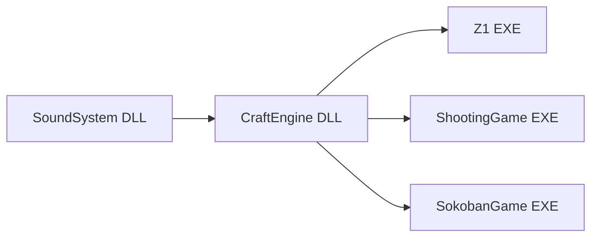
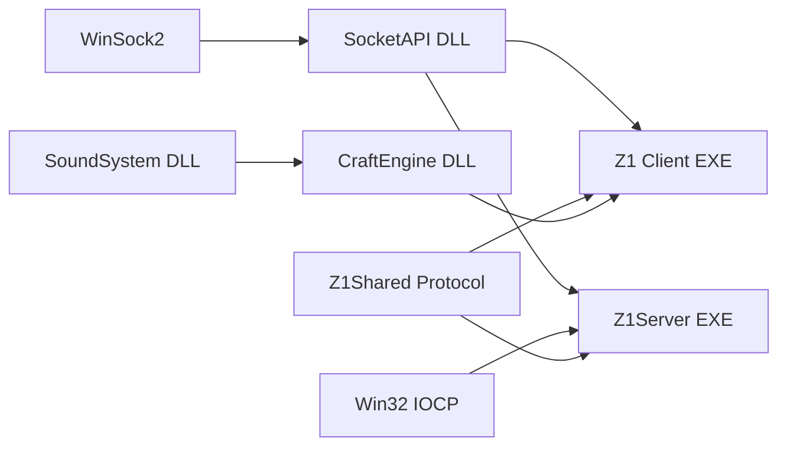
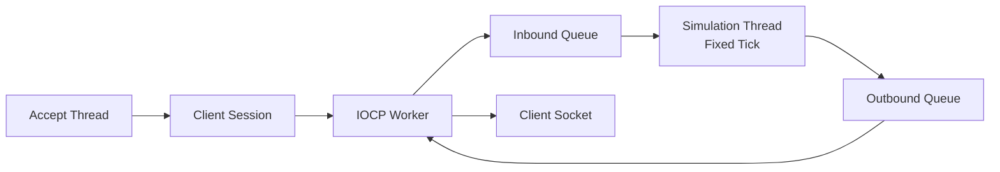

# Z1 멀티플레이와 미니 IOCP 서버 확장 계획

## 문서 목적과 상태

이 문서는 현재 싱글플레이 Z1을 Windows Socket 기반 멀티플레이로 확장하기 위한 설계 기준과 단계별 구현 계획을 기록한다. 저장소를 처음 보는 개발자가 다음 내용을 한 문서에서 파악하는 것을 목표로 한다.

- 현재 CraftEngine과 Z1의 실행·데이터 구조
- 새 `SocketAPI` DLL과 `Z1Server` EXE의 책임
- 클라이언트와 서버가 공유할 프로토콜 경계
- IOCP 비동기 작업과 객체 수명 규칙
- 서버 권위형 시뮬레이션으로 옮기는 순서
- 첫 구현에서 의도적으로 제외할 기능과 확장 조건

이 문서는 목표 설계와 실제 진행 상태를 함께 기록한다. 설계상 `SocketAPI` 경계의 실제 프로젝트 이름은 현재 `Sockets`이며, `Z1Server`의 초기 골격은 구현 중이다. 네트워크 클라이언트와 Z1 프로토콜은 아직 연결하지 않았다. 구현 도중 계약이 달라지면 코드와 이 문서를 같은 변경에서 갱신한다.

## 현재 구현 진행 상황 (2026-08-26)

이 절은 목표 구조가 아니라 현재 작업 트리와 실제 확인 결과를 기준으로 한다. 다음 에이전트나 모델은 이 절과 코드의 차이가 있으면 코드를 우선 확인하고, 작업을 이어갈 때 이 절을 갱신한다.

### 완료·확인된 범위

- Z1, SokobanGame, ShootingGame의 기존 싱글플레이 상태는 유지되고, 사용자가 Debug|x64 빌드·실행 정상임을 확인했다.
- 설계상 `SocketAPI` 역할을 담당하는 실제 Visual Studio 프로젝트 `Sockets`를 추가했다. `Sockets.dll`/`Sockets.lib`를 만들고 공개 헤더와 DLL·import library를 `Includes/Sockets`, `Libraries/Sockets/<Configuration>`으로 staging하는 빌드 이벤트를 설정했다.
- `Sockets`에는 `Net::Runtime`, `Net::Endpoint`, 이동 전용 `Net::Socket`이 있다.
  - `Runtime`: 프로세스의 `WSAStartup`/`WSACleanup` 수명 관리
  - `Endpoint`: 공개 API에서 `SOCKADDR_IN`을 숨기고 `Any`, `Loopback`, IPv4 파싱 제공
  - `Socket`: `CreateTcp`, `Bind`, `Listen`, `Accept`, `Connect`, `SetNonBlocking`, `Close`, `Release`와 유효성·이동 의미 제공
- 현재 `Sockets`는 필요한 WinSock 링크(`Ws2_32.lib`)를 갖는다. 추가 `getsockopt`/`setsockopt` 추상화는 아직 넣지 않았고, 실제 요구가 생길 때 추가한다.
- `Z1Server` 콘솔 프로젝트를 추가하고 `Sockets`와 WinSock에 링크했다. `Server`가 listen socket과 raw IOCP `HANDLE`을 직접 소유하는 최소 구조이며, IOCP를 `SocketAPI` 공개 API로 올리지는 않았다.
- `Server::Start`는 TCP socket 생성 → `Bind` → `Listen` → completion port 생성 순으로 동작하고, blocking `AcceptLoop`와 IOCP `IOLoop`을 각각 스레드로 시작한다.
- 서버를 실행해 `Bind`/`Listen` 후 대기하는 상태를 확인했고, 별도 PowerShell에서 다음 명령으로 접속 경로를 검증했다.

  ```powershell
  Test-NetConnection 127.0.0.1 -Port 7777
  ```

  결과는 `TcpTestSucceeded : True`였고 서버에 `Client Connected!`가 출력됐다. 이는 TCP handshake와 `accept`까지의 확인이며, 애플리케이션 payload나 `WSARecv`/`WSASend` 왕복을 검증한 것은 아니다.

### 현재 구현 중인 범위

- `Session`은 accepted `Net::Socket`, recv용 `OVERLAPPED`, `WSABUF`, 4096바이트 수신 버퍼, 누적 수신 벡터를 보유한다. `PostRecv`와 `HandleRecv`가 작성되어 있고, `AcceptLoop`에서 Session을 IOCP에 연결한 뒤 `WSARecv`를 등록하는 경로까지 있다.
- IOCP 완료 루프는 disconnect/실패/recv operation 식별을 확인하고 다음 recv를 재등록하는 골격까지 작성되어 있다. 아직 완료된 byte를 `HandleRecv`에 넘겨 framing하거나 응답을 보내지 않으므로 payload 경로는 미완성이다.
- `CompletionPort.h/.cpp`는 현재 stub 상태이고 사용하지 않는다. 초기 범위에서는 `Server`가 raw completion-port handle을 직접 소유한다. 반복 사용이 확인된 뒤에도 필요하면 `Z1Server` 내부 RAII 타입으로만 추출한다.

### 다음 코드 작업 전에 확인할 항목

1. `Session`의 복사 금지 선언이 현재 `Net::Socket` 매개변수 형태로 되어 있으므로, 의도대로라면 `Session(const Session&) = delete`와 `Session& operator=(const Session&) = delete`로 정정한다.
2. IOCP recv completion에서 `transferredBytes`를 `Session::HandleRecv`에 전달하고, 누적 buffer에서 고정 길이 ping packet을 파싱하는 최소 경로를 연결한다.
3. 작은 dummy TCP client로 `ping` payload를 전송해 `WSARecv` completion을 실제로 확인한다. `Test-NetConnection`은 이 검증을 대신하지 않는다.
4. 그 다음 `WSASend`를 한 번에 완료된다고 가정하지 않는 최소 echo/pong 경로를 추가한다. partial send와 Session당 동시 send 하나의 규칙을 지킨다.
5. 종료 시 pending overlapped completion이 남은 상태에서 Session이 파괴되지 않도록, closing → socket close/cancel → completion drain → outstanding operation 0 확인 순서를 구현하기 전까지는 서버 종료 수명을 완료로 간주하지 않는다.

### 현재 중단 지점

다음 재개 지점은 **dummy client를 이용한 ping 데이터 전송과 IOCP recv completion 처리**다. 그 전까지는 SocketAPI 저수준 API와 localhost listen/accept smoke check만 끝난 상태로 기록한다. Z1 클라이언트, `Z1Shared` protocol, 서버 권위형 게임 시뮬레이션은 아직 시작하지 않는다.

## 현재 저장소 구조

현재 의존 방향은 다음과 같다.



### CraftEngine

CraftEngine은 Windows 콘솔 게임 실행에 필요한 다음 기능을 제공한다.

- 게임 루프와 Level 전환
- Level이 소유하는 Actor와 Component 생명주기
- Transform 기반 로컬·월드 좌표와 Scene Graph
- Sprite 기반 콘솔 렌더링과 Renderer View
- `Box2D`·`BoxComponent`·CollisionSystem
- Sprite와 blocked 상태를 함께 보관하는 최소 `Tilemap`
- 입력과 SoundSystem 파사드

CraftEngine의 `Engine`은 Input, Renderer, CollisionSystem, Sound를 초기화하는 클라이언트 런타임이다. 따라서 서버가 단순히 CraftEngine을 링크해 `Engine`을 실행하는 방식은 headless 서버 구조와 맞지 않는다.

### Z1

Z1의 `Game`은 Title, Overworld, SwordCave, Dungeon1, Clear, GameOver, Development Level을 전환한다. 구체적인 게임 상태와 행동은 Level과 Actor에 분산되어 있다.

- Player·Enemy·Projectile·SwordAttack은 Actor다.
- 이동, 공격, 피격, 사망, Room 전환은 Level과 Actor가 처리한다.
- `OverworldMap`, `DungeonMap`, `CaveMap`은 콘텐츠 원본을 파싱한다.
- 각 Map은 Engine `Tilemap`을 합성으로 소유한다.
- Map은 Tile Sprite와 blocked 상태를 Tilemap에 설정한다.
- Level은 현재 Room 배경을 요청하고 동적 Actor와 아이템을 렌더링한다.

현재 구조는 한 프로세스 안에서 입력, 시뮬레이션, 렌더링이 이어지는 싱글플레이 구조다.

```text
Input
  → Z1 Level/Actor가 즉시 게임 상태 변경
  → CollisionSystem과 콘텐츠 판정
  → SpriteRenderer/Renderer로 출력
```

멀티플레이에서는 클라이언트 입력이 곧바로 확정 상태가 되어서는 안 된다. 서버가 입력을 검증하고 시뮬레이션한 결과를 확정 상태로 내려줘야 한다.

## 목표 구조

첫 목표는 localhost에서 실행한 Z1 클라이언트 두 개가 같은 서버에 접속해, 서버가 결정한 위치로 서로의 움직임을 보는 것이다.



초기 프로젝트와 디렉터리는 다음 정도로 제한한다.

```text
SocketAPI/                 공용 WinSock 자원 관리 DLL
Z1Server/                  IOCP와 Z1 서버 시뮬레이션 EXE
Z1Shared/
  Protocol.h               패킷 타입과 wire format
  Serialization.h          고정 폭 정수 직렬화
Z1/
  Network/NetworkClient.*  클라이언트 연결과 수신 큐
```

문서의 `SocketAPI`는 공용 DLL의 설계상 역할 이름이고, 현재 저장소에서 그 역할을 수행하는 실제 프로젝트·산출물 이름은 `Sockets`다. 이름을 통일하는 작업은 기능 검증 이후 별도 결정한다.

`Z1Shared`는 처음에는 헤더 디렉터리로 둔다. 여러 cpp를 실제로 공유하게 될 때만 static library 프로젝트로 승격한다.

## 프로젝트별 책임

| 영역 | 담당 | 담당하지 않는 것 |
| --- | --- | --- |
| `SocketAPI` | WinSock 초기화, `SOCKET` RAII, 주소와 오류, 기본 소켓 연산 | IOCP, Z1 패킷, Session 정책, Actor, Room, 게임 규칙 |
| `Z1Shared` | 패킷 ID, wire format, 직렬화, 공유 가능한 순수 데이터 | WinSock 핸들, Sprite, Actor, Renderer |
| `Z1Server` | 연결 Session, IOCP 작업, 입력 큐, 고정 Tick, 권위형 월드 상태, snapshot 송신 | 콘솔 렌더링, 키 입력, BGM |
| Z1 `NetworkClient` | 연결, `select` 기반 네트워크 스레드, 송수신 큐, 연결 상태 | Actor를 네트워크 스레드에서 직접 변경하는 것 |
| Z1 `Game`/`Level` | 수신 snapshot을 메인 스레드에서 Actor 표현으로 반영 | 클라이언트가 보낸 위치를 확정 상태로 취급하는 것 |
| CraftEngine | 기존 클라이언트 루프·Actor·렌더·충돌·Tilemap | 서버 세션과 Z1 전용 네트워크 정책 |

CraftEngine 자체는 `SocketAPI`에 의존하지 않는다. Z1 외의 콘텐츠도 같은 네트워크 계약을 실제로 요구하게 될 때 Engine Component나 공용 네트워크 계층 승격을 검토한다.

## SocketAPI DLL

### 이름과 빌드 경계

- 설계상 경계: `SocketAPI`; 현재 프로젝트/산출물: `Sockets`, `Sockets.dll`, `Sockets.lib`
- DLL 매크로: `SOCKET_API`
- C++ namespace: `Net`
- 플랫폼: Windows x64, C++20, MSVC v145
- 기본 링크: `Ws2_32.lib`
- `AcceptEx`를 도입할 때: `Mswsock.lib`

공개 헤더와 import library/DLL 복사는 기존 SoundSystem과 CraftEngine의 staging 패턴을 따른다. `SocketAPI`는 CraftEngine이나 SoundSystem을 링크하지 않는다.

### 최소 공개 API

구현을 시작할 때 필요한 타입은 다음 범위면 충분하다.

```cpp
namespace Net
{
    class SOCKET_API Runtime
    {
    public:
        Runtime();
        ~Runtime();

        bool IsValid() const;
    };

    class SOCKET_API Socket
    {
    public:
        Socket();
        explicit Socket(SOCKET handle);
        ~Socket();

        Socket(const Socket&) = delete;
        Socket& operator=(const Socket&) = delete;
        Socket(Socket&& other) noexcept;
        Socket& operator=(Socket&& other) noexcept;

        bool IsValid() const;
        SOCKET GetNativeHandle() const;
        SOCKET Release();
        void Close();

    private:
        SOCKET _handle = INVALID_SOCKET;
    };

}
```

실제 메서드 형태는 구현하면서 조정할 수 있지만 책임 경계는 유지한다.

`SocketAPI`는 Windows 전용인 현재 저장소에서 불필요한 플랫폼 인터페이스 계층을 만들지 않는다. `Bind`, `Listen`, `Accept`, `Connect`, `Send`, `Receive`, non-blocking 설정과 주소 변환은 실제 사용 단계에서 필요한 것만 추가한다. IOCP completion port와 `OVERLAPPED` 작업은 이를 사용하는 `Z1Server` 내부에 둔다.

### DLL 경계 주의점

- `WSAStartup`/`WSACleanup`은 `DllMain`에서 호출하지 않는다. 각 프로세스가 명시적으로 `Net::Runtime`을 소유한다.
- 소켓 소유 타입은 복사를 금지하고 이동만 허용한다.
- 자원을 생성한 DLL에서 파괴되도록 공개 소멸자를 유지한다.
- DLL 공개 API에서 소유권이 불분명한 raw buffer나 STL 컨테이너를 주고받지 않는다.
- IOCP, Session, 패킷 큐, 콜백 인터페이스는 SocketAPI에 미리 일반화하지 않는다.
- WinSock 헤더는 `Windows.h`보다 `WinSock2.h`가 먼저 포함되도록 PCH와 include 순서를 고정한다.
- 필요하면 `WIN32_LEAN_AND_MEAN`, `NOMINMAX`를 프로젝트 전처리 정의로 사용한다.

## Z1 프로토콜

### 전송 방식

첫 버전은 TCP만 사용한다. TCP가 패킷 경계를 보존하지 않는다는 점은 별도 framing으로 처리한다. UDP, 자체 신뢰성 계층, 패킷 압축은 초기 범위에서 제외한다.

모든 패킷은 고정 크기 헤더로 시작한다.

```cpp
enum class PacketType : std::uint16_t
{
    C2S_Hello,
    C2S_Input,
    S2C_Welcome,
    S2C_WorldSnapshot,
    S2C_Disconnect
};

struct PacketHeader
{
    std::uint16_t size;
    PacketType type;
    std::uint32_t sequence;
};
```

위 선언은 개념 예시다. 구조체 메모리를 그대로 `send`하지 않고 각 필드를 명시적으로 직렬화한다.

### wire format 규칙

- `std::uint16_t`, `std::uint32_t`, `std::int32_t`처럼 크기가 고정된 정수만 사용한다.
- byte order를 하나로 정하고 직렬화 함수에서 변환한다.
- `Craft::Vector2`, enum의 암묵적 크기, 포인터, `std::string`, `std::vector` 내부 메모리를 그대로 전송하지 않는다.
- Header의 `size`는 Header를 포함한 전체 패킷 크기로 통일한다.
- `size >= HeaderSize`이고 `size <= MaxPacketSize`인지 payload를 읽기 전에 검사한다.
- 클라이언트와 서버가 지원하는 protocol version을 `Hello`에서 확인한다.
- 알 수 없는 type, 잘못된 길이, 범위를 벗어난 enum은 연결 종료 사유로 취급한다.

### 초기 패킷

| 패킷 | 방향 | 목적 |
| --- | --- | --- |
| `C2S_Hello` | Client → Server | protocol version과 접속 요청 |
| `S2C_Welcome` | Server → Client | 서버가 발급한 playerId와 초기 tick |
| `C2S_Input` | Client → Server | 방향·공격 등 입력과 input sequence |
| `S2C_WorldSnapshot` | Server → Client | 서버 tick과 플레이어 상태 목록 |
| `S2C_Disconnect` | Server → Client | 종료 사유 전달이 가능한 정상 종료 |

초기 플레이어 상태는 다음 정도면 충분하다.

```cpp
struct NetworkPlayerState
{
    std::uint32_t playerId;
    std::int32_t x;
    std::int32_t y;
    std::int32_t facingX;
    std::int32_t facingY;
    std::int32_t hp;
};
```

첫 버전은 매 snapshot에 현재 플레이어 전체 목록을 보낸다. 접속자 수가 작을 때는 별도 spawn/despawn delta 프로토콜보다 단순하고, 누락된 playerId를 제거하는 것으로 퇴장을 표현할 수 있다.

## IOCP 서버 구조

### 스레드와 데이터 흐름

게임 상태는 Simulation Thread 하나만 변경한다.



초기 스레드 구성:

- blocking `accept` 전용 스레드 1개
- `GetQueuedCompletionStatus`를 기다리는 IOCP worker 1개
- 20~30Hz 고정 Tick을 실행하는 Simulation Thread 1개
- 큐는 `std::mutex`와 `std::deque`로 구현

접속자 수나 프로파일링 결과가 요구하기 전에는 `AcceptEx`, worker pool, lock-free queue를 추가하지 않는다.

### Session 책임

각 연결의 Session은 다음을 소유한다.

- 서버가 발급한 sessionId/playerId
- 연결 소켓
- 수신 누적 buffer와 현재 파싱 위치
- 전송 대기 queue와 현재 send offset
- recv/send `OVERLAPPED` 작업
- closing 상태와 outstanding operation 수

Session은 게임 월드 객체를 직접 수정하지 않는다. 완성된 입력 패킷을 Inbound Queue에 넣고, Simulation Thread가 playerId의 소유권과 현재 상태를 다시 검증한다.

### OVERLAPPED 수명 규칙

IOCP에서 가장 중요한 규칙은 비동기 요청이 완료될 때까지 다음 메모리가 안정적으로 살아 있어야 한다는 점이다.

- `OVERLAPPED`
- `WSABUF`
- `WSABUF.buf`가 가리키는 실제 byte buffer
- completion key로 접근하는 Session

`WSARecv`나 `WSASend`가 `WSA_IO_PENDING`을 반환하면 실패가 아니라 정상적인 비동기 대기다. 요청 직후 stack buffer나 operation 객체를 파괴하면 안 된다.

연결 종료는 다음 순서를 기준으로 한다.

1. Session을 closing 상태로 바꿔 새 요청을 막는다.
2. socket을 shutdown/close해 진행 중 작업을 취소한다.
3. 실패 completion을 포함해 이미 등록된 완료 통지를 회수한다.
4. outstanding operation이 0이 된 뒤 Session을 제거한다.

`GetQueuedCompletionStatus`가 `FALSE`를 반환해도 `overlapped`가 null이 아닐 수 있으므로 해당 operation의 정리는 수행해야 한다. 수신 완료 byte 수가 0이면 정상적인 peer disconnect로 처리한다.

### 수신과 framing

TCP `recv` 결과는 다음 세 경우를 모두 처리해야 한다.

- Header 일부만 도착
- Header와 payload 일부만 도착
- 여러 패킷이 한 번에 도착

수신 byte를 Session 누적 buffer 뒤에 추가한 다음 다음 과정을 반복한다.

```text
HeaderSize보다 적음
  → 다음 recv 대기

Header 확인 가능
  → size 범위 검증
  → 누적 byte가 size보다 적으면 다음 recv 대기
  → 완성된 packet 하나 파싱
  → 소비한 byte를 제외하고 다음 packet 반복
```

첫 구현은 Session당 outstanding recv 하나만 유지한다.

### 전송

`WSASend`도 요청한 전체 byte를 한 번에 전송한다고 가정하면 안 된다.

- Session당 동시에 진행하는 send는 하나로 제한한다.
- 나머지 패킷은 send queue에 보관한다.
- completion의 transferredBytes만큼 offset을 이동한다.
- 일부만 전송됐다면 남은 구간으로 `WSASend`를 다시 요청한다.
- 현재 패킷을 모두 보낸 뒤 다음 queue 항목을 시작한다.

이 방식은 전송 순서를 보존하면서 Session 내부 동기화를 단순하게 유지한다.

## 서버 권위형 시뮬레이션

### 클라이언트가 보내는 것

클라이언트는 최종 위치가 아니라 입력 의도만 보낸다.

```cpp
struct InputCommand
{
    std::uint32_t inputSequence;
    Direction direction;
};
```

하나의 connection은 하나의 Session과 playerId에 대응한다. 서버는 패킷을 받은 Session의 playerId를 입력에 붙여 Simulation Thread로 넘기므로 `C2S_Input`에 playerId를 싣지 않는다. sequence는 중복·역순 입력을 거르는 데 사용하며, TCP 이동 vertical slice에서 실제 용도가 없다면 첫 구현에서는 생략할 수 있다. 공격 입력은 이동 동기화가 완료된 뒤 별도 계약으로 추가한다.

### 서버가 결정하는 것

- 이동 속도와 이동 가능 여부
- 맵 경계와 blocked 타일 충돌
- Room 위치와 전환 가능 여부
- 공격 시작과 적중
- 투사체 생성·이동·소멸
- HP, 사망, 보스, 아이템 상태

첫 vertical slice에서는 이동과 접속 상태만 구현한다. 전투는 이동 동기화와 disconnect 수명이 안정된 뒤 추가한다.

입력 패킷 하나를 이동 한 번으로 처리하지 않는다. 수신 입력은 Session 플레이어의 최신 방향을 갱신하고, Simulation Thread가 고정 Tick마다 서버가 정한 속도로 이동을 계산한다. 키를 놓은 클라이언트는 정지 방향을 보내야 한다. 이 계약은 패킷을 더 자주 보내는 클라이언트가 더 빠르게 움직이는 것을 막는다.

### Simulation Tick

서버는 클라이언트 CraftEngine의 프레임 속도와 독립된 고정 Tick을 사용한다.

```text
steady_clock
  → 20~30Hz tick 누적
  → 입력 queue 소비
  → 월드 상태 한 번 갱신
  → tick 번호가 포함된 snapshot 생성
```

처리가 늦어졌을 때 무제한 catch-up으로 빠지는 것을 막기 위해 한 loop에서 처리할 최대 tick 수를 제한한다. 실제 Tick rate는 움직임 품질과 CPU 사용량을 확인한 뒤 결정한다.

## 현재 Map과 headless 서버의 경계

현재 CraftEngine `Tilemap`의 `Tile`은 Sprite와 blocked 상태를 함께 가진다. 이는 클라이언트의 작은 콘솔 게임 엔진에는 적합하지만, 서버가 사용하면 Render 타입과 CraftEngine/SoundSystem 의존성까지 따라올 수 있다.

따라서 `Z1Server`가 CraftEngine을 링크해 Tilemap이나 Level/Actor를 그대로 실행하는 방식은 목표 구조로 삼지 않는다.

네트워크 연결을 먼저 검증한 뒤 실제 Overworld를 서버로 옮길 때 다음 headless 데이터를 분리한다.

```text
Z1 공용 MapData
  ├─ 전체 논리 타일 크기
  ├─ TileId 또는 문자 원본
  └─ 셀별 blocked

Z1 Client Map
  └─ MapData + Sprite 팔레트 → Craft::Tilemap

Z1 Server World
  └─ MapData의 blocked → 권위형 이동 판정
```

`MapData`에는 Sprite, Color, Renderer, Actor가 들어가지 않는다. 현재 `OverworldMap`의 두 파일 파싱과 blocked 원본이 공유 경계의 첫 후보지만, 연결·IOCP·패킷 왕복을 만들기 전에 이 리팩터링부터 시작하지 않는다.

공유 cpp가 실제로 생기면 다음 구조를 검토한다.

```text
Z1Shared static library
  ├─ Protocol
  ├─ Serialization
  ├─ MapData
  └─ Sprite와 무관한 공용 상태 타입
```

서버 전용 월드 Tick과 Session은 계속 `Z1Server`에 둔다. 클라이언트 예측이 필요해져 동일 이동 규칙을 양쪽에서 실행할 때만 순수 Simulation 코드의 추가 공유를 검토한다.

## Z1 클라이언트 연결

### 소유권

네트워크 연결은 개별 Level보다 오래 살아야 하므로 Z1의 `Game`이 `NetworkClient`를 소유한다.

```text
Z1 Game
  └─ NetworkClient
       ├─ Net::Runtime 참조 또는 프로세스 수명 Runtime
       ├─ Net::Socket
       ├─ select 기반 network thread
       ├─ incoming packet queue
       └─ outgoing packet queue
```

첫 클라이언트는 IOCP를 사용하지 않는다. 하나의 network thread가 non-blocking socket과 `select`를 사용해 수신 가능 여부와 송신 가능 여부를 함께 확인한다. `select`의 짧은 timeout으로 outgoing queue를 주기적으로 확인하고, 실제 지연이나 CPU 사용이 문제가 될 때만 별도 wake-up 방식을 검토한다.

outgoing queue는 일반적인 게임 엔진의 스레드 간 메시지 큐와 같은 역할이지만 방향과 데이터가 제한되어 있다. 게임 메인 thread가 만든 직렬화된 패킷을 socket을 소유한 network thread에 넘긴다. 임의 함수를 실행하는 범용 Job Queue나 `send` 이후 운영체제가 관리하는 socket send buffer와는 다르다. network thread는 queue가 비어 있지 않을 때 socket을 write set에 넣고, partial send가 발생하면 현재 패킷의 offset을 보존해 나머지를 이어서 보낸다. 메인 thread에서는 직접 `send`하지 않는다.

### 메인 스레드 경계

네트워크 thread에서는 다음 작업을 하지 않는다.

- `SpawnActor` 또는 `Destroy`
- Actor Transform 변경
- Level 전환
- Renderer Submit
- Sound 재생

network thread는 역직렬화한 snapshot을 incoming queue에 넣는다. Z1 메인 thread가 `Game` 또는 현재 Level의 Tick에서 queue를 비우고 상태를 반영한다.

```text
Network Thread
  → S2C_WorldSnapshot 역직렬화
  → incoming queue

Main Game Thread
  → queue 소비
  → playerId별 Actor 생성/제거
  → Transform과 표현 상태 갱신
  → 기존 Renderer 경로로 Draw
```

원격 플레이어 Actor는 네트워크 ID와 표현용 Player/Pawn 참조를 연결하는 map으로 관리한다. 서버 snapshot에 더 이상 존재하지 않는 ID의 Actor는 `Destroy()`하고 Level의 지연 제거 규칙을 따른다.

### 초기 표시 정책

- 서버 위치를 수신하면 Actor 위치를 즉시 적용한다.
- 로컬 Player도 서버 상태를 진실로 취급한다.
- 입력 예측, reconciliation, snapshot interpolation은 구현하지 않는다.
- 끊김이 실제 플레이를 방해할 때 snapshot 보간부터 추가한다.

### 이동 좌표 계약

현재 Z1은 논리 Tile 좌표와 콘솔 문자 셀 단위의 월드 좌표를 구분한다. Tile 크기 `10 x 5`는 blocked Tile을 찾고 Room을 구성하는 데 사용하며, Player는 월드 좌표에서 문자 셀 단위로 이동한다. 서버 권위형 이동도 논리 Tile 한 칸 이동으로 바꾸지 않고 현재 월드 좌표 단위를 사용한다.

```text
논리 Tile 좌표
  → 맵 데이터와 blocked Tile 조회

서버 월드 좌표
  → Player 위치, Box2D, 이동·충돌 판정

클라이언트 표시 좌표
  → 초기에는 서버 월드 좌표를 즉시 적용
  → 끊김이 확인되면 별도로 보간
```

향후 WinAPI 이미지나 다른 그래픽 클라이언트는 서버 월드 좌표를 화면 픽셀로 변환하고 표시 좌표만 부드럽게 보간할 수 있다. 원격 플레이어 보간과 로컬 입력 예측/reconciliation은 별개 기능이며, 첫 이동 vertical slice에는 넣지 않는다.

## 참고 강의의 적용 범위

[Rookiss 게임 프로그래머 입문 올인원 강의](https://www.inflearn.com/course/%EA%B2%8C%EC%9E%84-%ED%94%84%EB%A1%9C%EA%B7%B8%EB%9E%98%EB%A8%B8-%EC%9E%85%EB%AC%B8-%EC%98%AC%EC%9D%B8%EC%9B%90-rookiss?cid=329593)의 공개 커리큘럼은 멀티스레드 프로그래밍, 네트워크 프로그래밍, 게임 서버 엔진, 싱글 게임 제작, 온라인 게임 제작 순서로 구성되며 2D 온라인 게임 연동을 목표로 한다. Z1도 다음 학습·구현 순서를 참고한다.

1. 멀티스레드와 동기화 수명 확인
2. TCP framing과 송수신 확인
3. IOCP Session과 비동기 작업 수명 확인
4. 싱글플레이 Z1 규칙에서 서버 권위로 옮길 최소 상태 선정
5. 클라이언트와 서버를 연결해 이동부터 검증

강의 내부 구현의 구체 타입과 계약은 공개 페이지에서 확인되지 않으므로 이 문서에서 추정하지 않는다. 강의 코드를 실제로 따라갈 때도 범용 서버 엔진 전체를 복제하지 않고, 현재 단계의 완료 기준에 필요한 부분만 Z1Server에 적용한다.

강의에서 다음과 유사한 개념이 등장하면 이름보다 현재 프로젝트의 책임 경계에 맞춰 적용한다.

| 강의에서 접할 수 있는 개념 | 현재 프로젝트의 적용 위치 |
| --- | --- |
| WinSock 초기화·Socket·주소 보조 | `SocketAPI` |
| IOCP core·비동기 event·Session | `Z1Server` 내부 |
| Packet framing·직렬화 계약 | `Z1Shared`와 양쪽 parser |
| Session send queue | `Z1Server` Session의 순서·partial send 관리 |
| 클라이언트 send queue | Z1 `NetworkClient`의 outgoing queue |
| 범용 Job Queue | 처음에는 도입하지 않고 Inbound Queue와 단일 Simulation Thread로 대체 |
| 게임 Room·Object·상태 갱신 | `Z1Server` 권위형 월드 |

강의 구조가 더 일반적이더라도 Z1 외의 실제 사용처가 생기기 전에는 `Service`, 범용 `Session` 계층, 범용 Job System으로 확장하지 않는다.

## 빌드와 실행 구조

목표 의존성은 다음과 같다.

```text
SocketAPI
  └─ WinSock2

Z1Server
  ├─ SocketAPI
  └─ Z1Shared headers

Z1
  ├─ CraftEngine
  ├─ SocketAPI
  └─ Z1Shared headers

CraftEngine
  └─ SoundSystem
```

솔루션에 프로젝트를 추가할 때:

- `Z1`과 `Z1Server`에서 `SocketAPI` BuildDependency를 추가한다.
- `SocketAPI`는 CraftEngine/SoundSystem에 의존하지 않는다.
- 서버가 MapData를 읽기 시작하면 필요한 Z1 Map Content만 서버 출력 경로에 복사한다.
- `SocketAPI.dll`을 Z1과 Z1Server 실행 파일 옆에 복사한다.
- 새 `.h`/`.cpp`는 각 `.vcxproj`와 `.vcxproj.filters`에 등록한다.
- Debug/Release, x64, C++20, v145 구성을 기존 프로젝트와 맞춘다.

개발 중 기본 실행 순서:

1. `SocketAPI` 빌드
2. `Z1Server` 빌드 및 실행
3. Z1 클라이언트 두 개 실행
4. localhost 주소와 개발용 고정 port로 접속

주소와 port는 첫 단계에서는 코드 상수나 단순 Config 키로 시작한다. 서버 목록이나 동적 설정 시스템은 만들지 않는다.

## 단계별 구현 계획

### 단계 0: 싱글플레이 기준선 보존

- 현재 Z1과 기존 두 게임을 Debug x64로 빌드한다.
- Z1 Overworld 이동, Room 전환, Cave, Dungeon 클리어를 확인한다.
- 네트워크 기능이 비활성화됐을 때 기존 싱글플레이가 그대로 동작하는 진입점을 정한다.

완료 기준: 이후 네트워크 변경과 비교할 수 있는 빌드·실행 기준이 있다.

### 단계 1: SocketAPI DLL

현재 상태: `Sockets` 프로젝트, `Runtime`/`Endpoint`/`Socket`의 기본 API, staging과 WinSock 링크, localhost listener에 필요한 연산까지 구현했다. ping/pong 왕복과 반복 연결·해제 검증은 남아 있다.

- `Runtime`과 이동 전용 `Socket` 구현
- 주소 생성, connect/listen/accept와 클라이언트 `select`에 필요한 최소 함수 구현
- 로컬 ping/pong smoke program 또는 서버 모드로 왕복 확인
- 정상 종료와 연결 실패 오류 확인

완료 기준: 반복 연결/해제에서 socket 누수나 double close가 없다.

### 단계 2: 미니 IOCP echo 서버

현재 상태: `Z1Server`의 blocking accept, accepted socket의 completion-port 연결, Session과 단일 recv 등록 골격까지 구현했다. framing, `HandleRecv` 연결, send queue, echo/pong, 안전한 종료 drain은 아직 구현하지 않았다.

- blocking accept thread
- accepted socket을 completion port에 연결
- Session, recv operation, send queue 구현
- 길이 prefix framing과 echo 응답
- 강제 종료, partial packet, 연속 packet 처리

완료 기준: 여러 로컬 연결이 동시에 서로 독립적으로 송수신하고 종료된다.

### 단계 3: Z1 프로토콜과 클라이언트 연결

- `Hello`/`Welcome`과 protocol version
- Z1 `Game`이 소유하는 `NetworkClient`
- `select` 기반 network thread와 incoming/outgoing queue
- HUD 또는 로그에 연결 상태와 playerId 표시

완료 기준: Z1을 종료하거나 Level을 전환해도 네트워크 thread와 socket 수명이 안전하다.

### 단계 4: 두 플레이어 이동 vertical slice

- 서버 PlayerState와 고정 Tick
- 클라이언트 방향 입력 전송
- 서버의 단순 사각형 경계 이동 판정
- 전체 플레이어 snapshot 전송
- 클라이언트의 원격 Player 표현 Actor 생성·갱신·제거

완료 기준: Z1 클라이언트 두 개에서 서로의 서버 확정 위치가 보인다.

### 단계 5: Overworld Map과 Room

- Sprite 없는 공용 MapData 경계 추출
- 서버 blocked와 Map 바깥 이동 검증
- 현재 Room과 Room 전환을 서버 상태로 관리
- 같은 Room에 필요한 상태만 전송하는 최소 관심 영역 적용

완료 기준: 두 플레이어가 동일 Overworld 지형 판정을 받고 Room을 왕복한다.

### 단계 6: 전투

- 공격 입력과 서버 cooldown
- Enemy와 Projectile의 서버 ID
- 서버의 피해·HP·사망 판정
- 클라이언트는 snapshot/event를 Sprite와 Sound로 표현
- 보스와 아이템 상태 동기화

완료 기준: 클라이언트가 임의의 위치·피해·아이템 획득 결과를 확정할 수 없다.

### 단계 7: 운영 안정성

- malformed packet과 packet flood 제한
- idle timeout과 heartbeat 필요성 검토
- 서버 종료 시 worker 깨우기와 thread join
- 접속·해제·프로토콜 오류 로그
- 로컬 다중 클라이언트 반복 테스트

완료 기준: 비정상 종료와 재접속이 다른 Session이나 서버 월드에 영향을 주지 않는다.

## 검증 항목

### SocketAPI

- `WSAStartup` 실패와 정상 cleanup
- move 이후 원본 Socket이 `INVALID_SOCKET`인가
- 연결 실패와 이미 닫힌 socket 종료가 안전한가
- DLL 로드/언로드 시 WinSock 호출이 `DllMain`에 없는가

### 패킷

- Header가 여러 recv로 나뉘어도 파싱되는가
- payload가 여러 recv로 나뉘어도 파싱되는가
- 여러 packet이 한 recv에 들어와도 모두 처리되는가
- 0, Header보다 작은 크기, 최대값 초과를 거부하는가
- 알 수 없는 PacketType과 protocol version을 거부하는가
- 직렬화 round trip 결과가 원본 값과 같은가

### IOCP와 종료

- `WSA_IO_PENDING`을 오류로 처리하지 않는가
- completion 전 operation buffer가 파괴되지 않는가
- 실패 completion에서도 operation을 정리하는가
- peer disconnect의 0-byte completion을 처리하는가
- 진행 중 recv/send가 있는 Session을 안전하게 닫는가
- 서버 종료 시 accept/worker/simulation thread가 모두 join되는가

### 게임

- 네트워크 thread가 Actor/Level을 직접 변경하지 않는가
- 서버가 입력 순서와 이동 속도를 검증하는가
- 맵 밖과 blocked 타일로 이동할 수 없는가
- 퇴장한 playerId의 표현 Actor가 지연 파괴되는가
- Level/Room 전환 뒤 중복 Actor가 남지 않는가
- 네트워크 비활성 싱글플레이가 기존대로 동작하는가

## 안전성과 신뢰 경계

서버는 모든 수신 byte를 신뢰할 수 없는 입력으로 취급한다.

- Packet 크기를 buffer 접근 전에 검증한다.
- 수신된 enum, 좌표, 입력 값의 범위를 검증한다.
- connection에 할당된 playerId 외의 객체를 조작하지 못하게 한다.
- 클라이언트가 보낸 위치, HP, 아이템 보유 상태를 사용하지 않는다.
- 처리 가능한 패킷 빈도와 queue 크기에 상한을 둔다.
- queue 상한을 넘기거나 계속 잘못된 패킷을 보내는 Session은 종료한다.
- 로그에 raw 인증 정보나 불필요한 packet payload를 기록하지 않는다.

인터넷 공개가 실제 목표가 되는 시점에는 인증, 암호화, 서비스 공격 대응을 별도 설계해야 한다. localhost 학습 서버를 그대로 공용 인터넷에 노출하지 않는다.

## 초기 범위에서 제외하는 것

다음 기능은 첫 두 클라이언트 이동이 완료되기 전에는 구현하지 않는다.

| 보류 기능 | 추가 시점 |
| --- | --- |
| UDP 또는 TCP/UDP 혼합 | TCP 지연이나 head-of-line blocking이 실제 문제가 될 때 |
| `AcceptEx` | blocking accept가 접속 처리 병목일 때 |
| IOCP worker pool | 단일 worker의 처리량이 부족할 때 |
| lock-free queue | mutex queue 경합이 측정될 때 |
| 클라이언트 예측/reconciliation | 서버 위치 적용만으로 조작감이 부족할 때 |
| snapshot interpolation | 원격 Player 움직임의 끊김이 눈에 띌 때 |
| delta snapshot/압축 | 전체 snapshot 대역폭이 문제가 될 때 |
| 로그인, DB, 계정, 로비 | 단일 월드 접속 이후 제품 요구가 생길 때 |
| TLS 또는 별도 암호화 | localhost를 넘어 신뢰할 수 없는 네트워크에 공개할 때 |
| 범용 NetworkComponent | Z1 외 콘텐츠도 같은 복제 계약을 사용할 때 |
| 다중 서버·월드 분산 | 단일 프로세스 월드가 실제 한계에 도달할 때 |

## 첫 구현 단위

첫 코드 변경은 다음 범위로 제한하는 것이 좋다.

1. `SocketAPI` DLL 프로젝트와 빌드 산출물 경계 추가
2. `Net::Runtime`, 이동 전용 `Net::Socket` 구현
3. `Z1Server` 콘솔 EXE에서 localhost listen/accept
4. 작은 고정 패킷 ping/pong
5. 반복 연결/해제 smoke check

이 단계에서는 CraftEngine, Z1 Level, Tilemap, Actor를 수정하지 않는다. IOCP echo가 안정된 다음 단계에서만 Z1Protocol과 NetworkClient를 연결한다.
