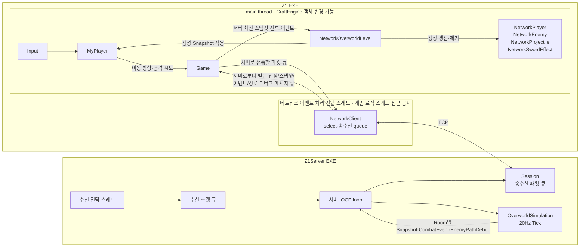
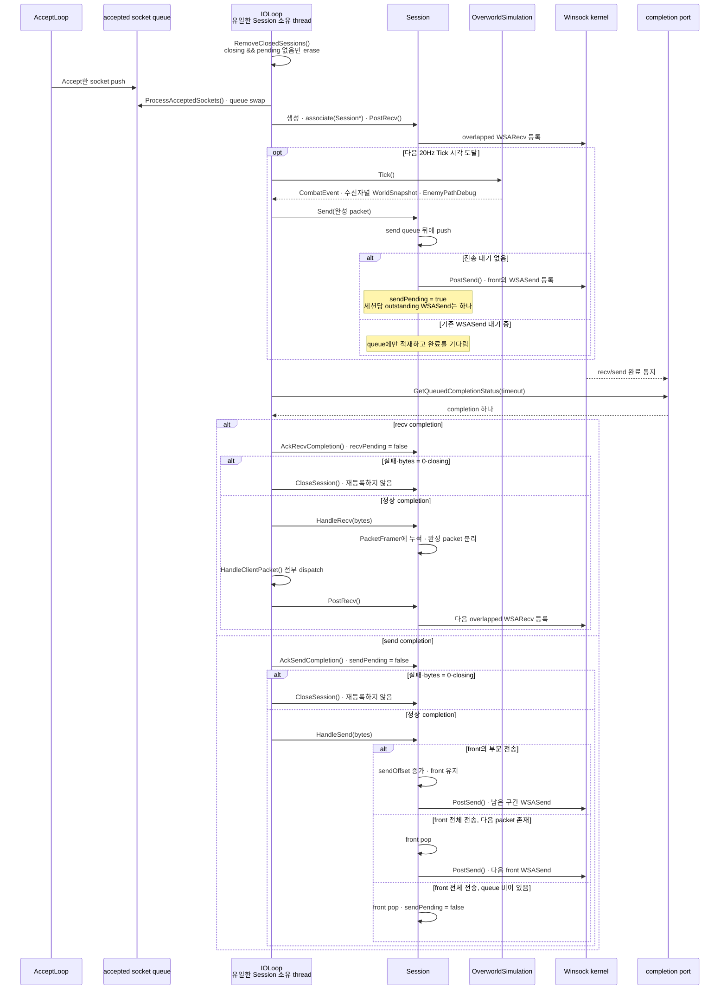
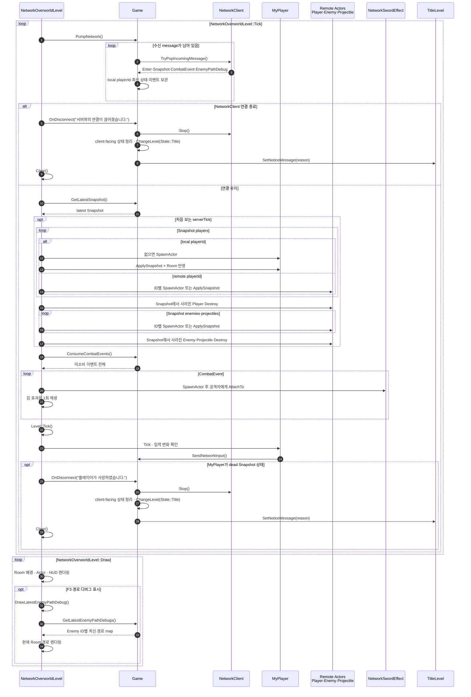

# Z1 아키텍처

## 문서 범위

Z1 프로젝트의 로컬/멀티 플레이 콘텐츠에 현재 적용된 Level, Actor와 실행 흐름을 설명합니다.

## 게임 상태와 Level

`Z1::Game`은 다음 상태에 대응하는 Level을 소유합니다.

```text
Title
  ├─ Local Play → Overworld
  │                 ├─ SwordCave ↔ Overworld
  │                 ├─ Dungeon1 ↔ Overworld
  │                 ├─ HP 0 → GameOver → Title
  │                 └─ 보스·트라이포스 → Clear → Title
  └─ Multiplayer → NetworkOverworld
                    └─ 연결 종료 / 사망 → Title
```

새 게임을 시작하면 모드에 따라 Level을 생성합니다. Local Play는 Overworld, SwordCave, Dungeon1 Level을 만들고 Player 상태를 최대 HP 20, 검 미소지로 초기화합니다. 이 세 Local Play Level 사이를 전환할 때 `Game`이 HP와 검 보유 상태를 보관하고 새 Level의 Player에 복원합니다. Multiplayer는 서버 연결과 `S2C_Enter` 수신을 마친 뒤 전용 `NetworkOverworldLevel`로 진입하며, `MyPlayer`를 포함한 게임 상태에 서버 Snapshot을 적용합니다.

## 좌표와 Room

- Player와 Enemy Transform은 전체 맵 기준, 콘솔 셀 좌표를 사용합니다.
- Overworld는 256×88 논리 타일로 구성되며, Room 하나 당 16×11 타일로 구성됩니다.
- 논리 타일 하나는 현재 10×5 크기만큼 콘솔 픽셀 좌표로 표현합니다.
- Room은 전체 맵에서 현재 화면에 표시할 논리적인 영역입니다.
- Level은 Room의 월드 원점을 Renderer View에 설정하고, Map 타입에 배경 Sprite 합성을 요청합니다.
- Room 경계를 넘을 때 Player Box 전체가 새 Room 안에 들어오도록 위치를 보정합니다.

맵 원본 데이터와 타일 해석은 [맵 데이터](MAP_DATA.md) 문서에 기반합니다.

## Map과 Level의 책임

| 타입 | 책임 |
| --- | --- |
| `OverworldMap` | TileMap/BlockingMap 파싱·검증, TileId 보관, Engine Tilemap 구성과 Room Sprite 합성 |
| `CaveMap` | 동굴 문자 맵 파싱, 검과 출구 표식 위치 제공, Tilemap 구성 |
| `DungeonMap` | Dungeon 1 문자 맵 파싱, 보스·하트·트라이포스 표식 제공, Tilemap 구성 |
| `OverworldLevel` | 싱글플레이 전용 오버월드. 현재 Room과 View, Player·Enemy·Projectile 수명, 이동·전투·입구 전환 |
| `NetworkOverworldLevel` | 멀티플레이 전용 오버월드. 서버 Snapshot 수신·적용, MyPlayer/원격 Actor 관리, CombatEvent 표현, 경로 디버그 렌더링, 연결 끊김 및 사망 시 Title 복귀 |
| `CaveLevel` | 검 획득, Player 상태와 오버월드 복귀 |
| `DungeonLevel` | Room 전환, 일반 적과 Aquamentus, 보상·클리어·출구 처리 |

정적 지형은 Actor로 만들지 않고 하나의 Room 배경 Sprite와 Tilemap의 이동 가능 유무 데이터로 처리합니다. Player, Enemy, Projectile, 공격 영역과 이펙트는 Actor로 생성합니다.

## Actor와 전투

`Pawn`은 Player와 Enemy가 공유하는 HP, facing, 이동 처리, 피해·사망·넉백과 피격 무적 상태를 담당합니다.
- Player는 방향키로 이동하고 바라보는 방향(마지막으로 입력한 방향키의 방향)을 유지합니다.
- 검 보유 상태에서 `A`를 누르면 Player에 붙는 `SwordAttack`을 만들고, 최대 HP에서는 `SwordBeam`을 발사합니다.
- Octorok은 방향을 바꾸며 투사체(돌)를 발사합니다.
- Moblin은 Player와 가까워지도록 이동하며 투사체(창)를 발사합니다.
- Tektite는 대각선 도약을 반복하며 이동합니다. 지형의 이동 가능 판정을 무시하며, Player에게 접촉 피해를 입힙니다.
- Aquamentus는 수평 이동과 세 갈래 화염구 공격을 사용합니다.
- 적들의 투사체는 Player가 바라보는 방향과 방패 방향이 맞으면 차단됩니다.

## 수명과 Room 전환

처음 플레이어가 스폰되는 Overworld의 시작의 방에는 적이 없습니다. 넘어갈 수 있는 다른 Room들은 해당 Room 좌표와 시드값을 통해 적들의 생성 위치를 결정하며, Room을 나가면 생성된 Enemy와 Projectile을 파괴하고 새 Room의 Actor를 생성합니다.

동굴과 던전은 별도 Level로 구성됩니다. Player의 Box 콜라이더가 지정된 영역에 닿았을 때 해당 레벨로 전환됩니다. Dungeon 1은 검을 가진 상태에서만 진입할 수 있습니다. 보스 처치 뒤 하트 아이템이 표시되며 접촉 시 HP를 전부 회복합니다. 트라이포스 획득 시 BGM이 재생되며 Clear Level로 전환됩니다.

## 네트워크 연결 지점

`Game`은 `NetworkClient`를 소유하고 TitleLevel에서 Multiplayer 모드를 선택하면 localhost Loopback(`127.0.0.1:7777`) 연결을 시도합니다. network thread는 TCP 송수신과 패킷 파싱을 수행하고, 받은 메시지는 queue를 통해 게임 로직이 실행되는 main thread에 넘깁니다. `NetworkOverworldLevel`이 queue에서 메시지를 꺼내 서버의 최신 Snapshot을 적용합니다.

네트워크 처리 전담 스레드는 서버 연결 이후 소켓 입출력과 패킷 조립을 담당합니다. 컨텐츠 단 로직은 메인 스레드가 담당합니다. 세부적인 내용은 [Z1 네트워크 아키텍처](NETWORK_ARCHITECTURE.md) 문서를 확인해주세요.



## Z1Server IOCP Session 송수신 흐름

현재 서버는 2개의 `std::thread`를 사용합니다. `AcceptLoop`는 blocking `Accept()`로 새 socket을 받아 `_acceptedSockets`에 밀어넣는 처리를 수행합니다. `IOLoop`는 `_sessions`와 `OverworldSimulation`을 단독으로 소유하고, 새 Session 등록/시뮬레이션/IOCP completion 소비/packet dispatch를 수행한다. overlapped I/O의 완료 통지가 completion port에 들어가고, `IOLoop`가 `GetQueuedCompletionStatus`로 꺼내 처리하는 구조를 갖습니다.

`IOLoop`는 매 반복마다 아래 로직을 수행합니다.

1. Close한 세션들 중 Pending된 I/O가 없는 세션들을 `RemoveClosedSessions()`를 통해 세션 목록에서 제거합니다.
2. 연결된 클라이언트 소켓 수신 큐를 지역 변수로 Swap해 목록을 꺼낸 뒤, 각 socket을 `Session`으로 만들어 completion port가 관찰하도록 한 뒤 `WSARecv()`를 시도합니다.
3. 만약 시뮬레이션 Tick을 할 때가 되었다면(현재는 초당 20번) `Tick()`을 호출해 시뮬레이션 월드 상태를 갱신하고 그 정보를 담아 모든 세션에게 Broadcast합니다.
4. 다음 Tick까지 남은 시간을 timeout으로 `GetQueuedCompletionStatus`를 호출해 완료 통지 하나를 꺼내옵니다. 송수신 `OVERLAPPED`를 식별해 해당 pending을 해제한 뒤, 수신 완료 통지는 수신받은 패킷을 꺼내 클라이언트가 보낸 패킷 타입 별로 핸들링 한 뒤 다시 `WSARecv()`를, 전송 완료 통지는 전송 큐에서 전송한 패킷 바이트만큼 pop하고 필요한 경우 다시 `WSASend()`를 시도합니다. 실패나 취소 완료 통지가 왔을 경우 새 I/O를 등록하지 않고 종료 루틴을 실행합니다.



### Session 종료와 registry 수명

클라이언트 연결이 끊어졌거나 입출력을 실패하면 `CloseSession()`을 통해 Closing 플래그를 세팅하고 시뮬레이션 월드에서 해당 세션의 PlayerId를 제거하며 소켓을 닫습니다. 단 소켓을 닫았더라도 취소된 overlapped I/O 완료 통지가 아직 남아있을 수 있기 때문에 Session을 즉시 제거하지 않습니다.

`PostRecv()`와 `PostSend()`가 성공 또는 `WSA_IO_PENDING`을 반환하면 pending 상태로 세팅합니다. IOLoop은 완료 통지의 `OVERLAPPED` 주소를 Recv/Send와 비교해 결과에 상관없이 Pending 상태 플래그를 해제합니다. 만약 Closing 플래그 상태의 세션이 송수신 pending 상태가 아니라면 다음 IOLoop 루프에서 `RemoveClosedSessions()`를 통해 `_sessions`에서 제거됩니다. closing Session은 이후 Broadcast와 새 I/O 등록에서 제외됩니다.

## 클라이언트 프레임 적용 순서

`Game`이 들고 있는 최신 네트워크 상태를 `NetworkOverworldLevel`이 소유하는 클라이언트 표현 Actor에 어떻게 적용하는지, 연결 종료나 local Player 사망 시 Title로 어떻게 복귀하는 지를 보여줍니다. `NetworkPlayer`, `NetworkEnemy`, `NetworkProjectile`을 `Remote Actors`로 묶어 표현합니다.



ID별 생성·갱신·제거는 `UpdateSnapshot`, 단발 효과 표현은 `ApplyCombatEvent`, A* 경로 디버그 표현은 `DrawLatestEnemyPathDebug`가 담당하며 모두 메인 스레드에서 실행됩니다. 이때 새로 `SpawnActor`한 Actor는 엔진의 지연 추가 규칙에 따라 다음 프레임부터 Tick에 참여하고, `Destroy`한 Actor는 즉시 비활성화된 뒤 프레임 끝에 목록에서 제거됩니다.

원격 playerId는 `NetworkPlayer` Actor로, 로컬 playerId는 `MyPlayer` Actor로 생성·갱신·제거하며, 위치·HP·사망 판정은 서버에서 시뮬레이션한 결과 Snapshot을 따르게 되어있습니다. [Z1 네트워크 아키텍처](NETWORK_ARCHITECTURE.md)에서 추가로 확인하실 수 있습니다.
