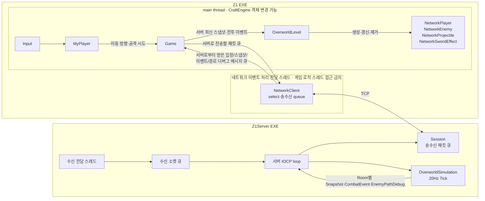
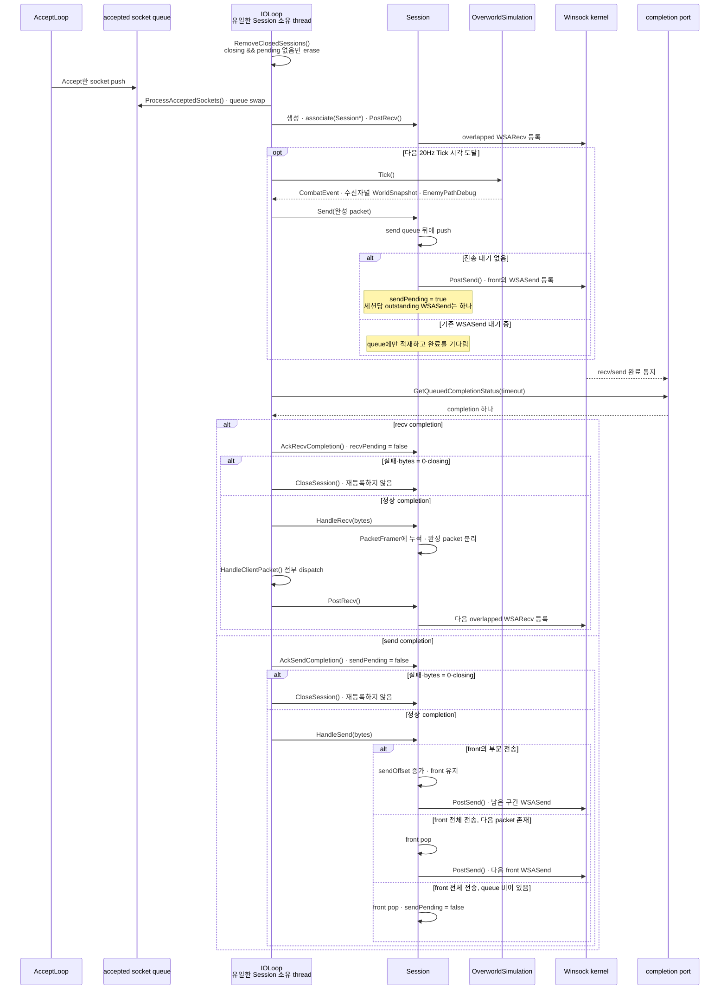
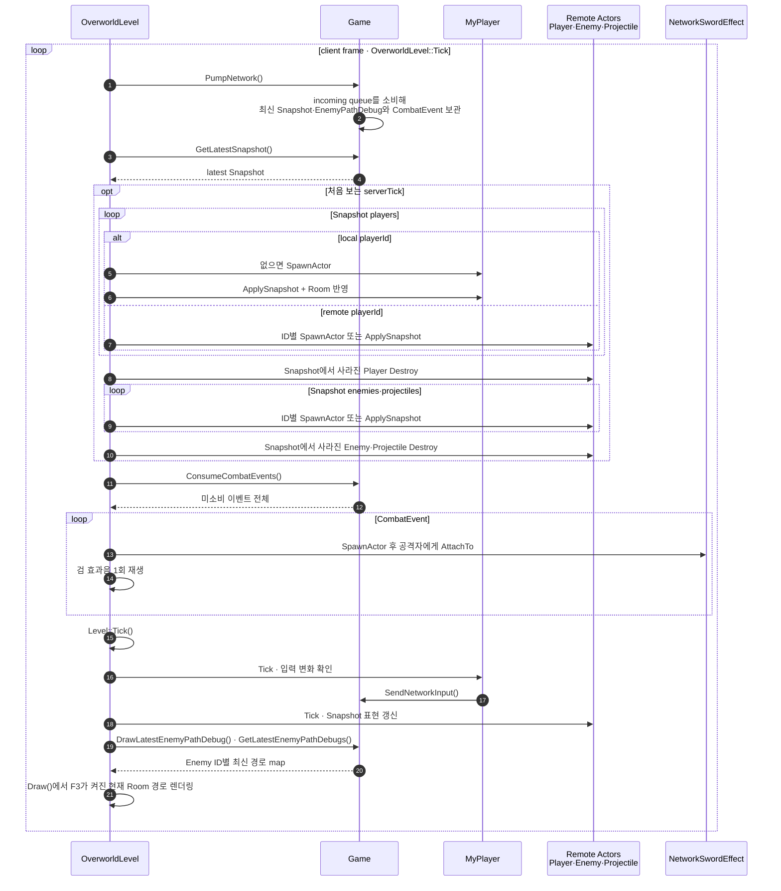

# Z1 아키텍처

## 문서 범위

이 문서는 Z1 싱글플레이 콘텐츠의 현재 실행 구조와 데이터 책임을 설명한다. 공용 엔진 계약은 [솔루션 아키텍처](../ARCHITECTURE.md), 네트워크 목표 구조는 [멀티플레이 설계](MULTIPLAYER_DESIGN.md), 구현 진척은 [멀티플레이 현황](MULTIPLAYER_STATUS.md)에서 관리한다.

## 게임 상태와 Level

`Z1::Game`은 다음 상태에 대응하는 Level을 보유한다.

```text
Title
  └─ 새 게임 → Overworld
                  ├─ SwordCave ↔ Overworld
                  ├─ Dungeon1 ↔ Overworld
                  ├─ HP 0 → GameOver → Title
                  └─ 보스·트라이포스 → Clear → Title

Development                  수동 엔진 기능 확인 장면
```

새 게임을 시작하면 Overworld, SwordCave, Dungeon1 Level을 다시 만들고 Player 상태를 최대 HP 20, 검 미소지로 초기화한다. Level 전환 시 `Game`이 HP와 검 보유 상태를 보관하고 새 Level의 Player에 복원한다.

## 좌표와 Room

- Player와 Enemy Transform은 전체 맵 기준 월드 콘솔 셀 좌표를 사용한다.
- 오버월드는 256×88 논리 타일이며 한 Room은 16×11 타일이다.
- 논리 타일 하나는 현재 10×5 콘솔 셀 Sprite로 표현한다.
- Room은 별도 소유 객체가 아니라 전체 맵에서 현재 화면에 표시할 논리 구간이다.
- Level은 Room의 월드 원점을 Renderer View에 설정하고 Map 타입에 배경 Sprite 합성을 요청한다.
- Room 경계를 넘을 때 Player Box 전체가 새 Room 안에 들어오도록 위치를 보정한다.

맵 원본과 타일 해석은 [맵 데이터](MAP_DATA.md)를 따른다.

## Map과 Level의 책임

| 타입 | 책임 |
| --- | --- |
| `OverworldMap` | TileMap/BlockingMap 파싱·검증, TileId 보관, Engine Tilemap 구성과 Room Sprite 합성 |
| `CaveMap` | 동굴 문자 맵 파싱, 검과 출구 표식 위치 제공, Tilemap 구성 |
| `DungeonMap` | Dungeon 1 문자 맵 파싱, 보스·하트·트라이포스 표식 제공, Tilemap 구성 |
| `OverworldLevel` | 현재 Room과 View, Player·Enemy·Projectile 수명, 이동·전투·입구 전환 |
| `CaveLevel` | 검 획득, Player 상태와 오버월드 복귀 |
| `DungeonLevel` | Room 전환, 일반 적과 Aquamentus, 보상·클리어·출구 처리 |

정적 지형은 타일마다 Actor를 만들지 않고 하나의 Room 배경 Sprite와 Tilemap의 blocked 데이터로 처리한다. 동적 행동이나 수명이 필요한 Player, Enemy, Projectile, 공격과 효과만 Actor로 생성한다.

## Actor와 전투

`Pawn`은 Player와 Enemy가 공유하는 HP, facing, 정수 Transform에 반영하기 전의 이동 누산, 피해·사망·넉백과 피격 무적 상태를 담당한다.

- Player는 방향키로 이동하고 마지막 facing을 유지한다.
- 검 보유 상태에서 `A`를 누르면 Player에 붙는 `SwordAttack`을 만들고, 최대 HP에서는 검기를 발사한다.
- Octorok은 방향을 바꾸며 돌을 발사한다.
- Moblin은 Player를 추적하고 창을 발사한다.
- Tektite는 대기와 대각선 도약을 반복하며 지형 blocked 판정은 무시하지만 Player 접촉 피해는 적용한다.
- Aquamentus는 수평 이동과 세 갈래 화염구 공격을 사용한다.
- 적 투사체는 Player의 facing과 방패 방향이 맞으면 차단된다.

충돌 콜백은 피해 후보를 알리고, 실제 이동 가능 여부와 Room·지형 정책은 Level이 판정한다. 공격 하나가 같은 대상에 중복 피해를 주지 않도록 공격자와 피해 원인을 함께 전달한다.

## 수명과 Room 전환

Overworld의 시작 Room에는 적이 없다. 다른 접근 가능 Room은 Room 좌표와 월드 시드로 결정적인 스폰 계획을 만들며, Room을 나가면 이전 Enemy와 Projectile을 파괴하고 새 Room의 Actor를 생성한다.

동굴과 던전은 별도 Level이다. 입구 전환은 Player Box가 지정 영역에 닿았을 때 수행한다. Dungeon 1은 검을 가진 상태에서만 진입할 수 있고, 보스 처치 뒤 하트는 HP를 전부 회복하며 트라이포스는 팬파레 후 Clear Level로 전환한다.

## 네트워크 연결 지점

`Game`은 `NetworkClient`를 소유하고 localhost Loopback(`127.0.0.1:7777`) 연결을 시도한다. network thread는 TCP 송수신과 패킷 파싱만 수행하고, 받은 메시지는 queue를 통해 main thread에 넘긴다. `OverworldLevel`이 queue를 소비해 Snapshot을 적용한다.



그림은 실행 중인 thread와 데이터 흐름만 나타낸다. `NetworkClient`와 `Session`은 각자 컴파일된 `Z1Shared`의 packet codec과 framer를 내부에서 사용하며, `Z1Shared` 자체는 실행 주체나 중계 계층이 아니다.

## Z1Server IOCP Session 송수신 흐름

현재 서버는 별도 `std::thread` 두 개를 만든다. `AcceptLoop`는 blocking `Accept()`로 새 socket을 받아 `_acceptedSockets`에만 넣는다. `IOLoop`는 `_sessions`와 `OverworldSimulation`을 단독으로 소유하며, 새 Session 등록, fixed-step simulation, IOCP completion 소비와 packet dispatch를 모두 수행한다. IOCP 자체가 packet을 처리하는 별도 worker가 아니라, overlapped I/O의 완료 통지를 completion port에 넣고 `IOLoop`가 `GetQueuedCompletionStatus`로 꺼내 처리한다.

`IOLoop`의 한 반복은 다음 순서를 따른다.

1. `RemoveClosedSessions()`가 이전 반복에서 closing으로 표시됐고 pending I/O가 모두 끝난 Session만 registry에서 제거한다.
2. `ProcessAcceptedSockets()`가 accept queue를 swap하고, 각 socket을 `Session`으로 만들어 completion port에 associate한 뒤 `PostRecv()`를 호출한다.
3. 다음 20Hz Tick 시각에 도달했을 때만 `Tick()`을 호출한다. 지연된 경우 최대 5회 catch-up하며, 매 반복에 반드시 Tick하는 것은 아니다.
4. 다음 Tick까지 남은 시간을 timeout으로 `GetQueuedCompletionStatus`를 호출해 completion 하나를 소비한다. recv/send `OVERLAPPED`를 먼저 식별해 해당 pending을 해제한 뒤, recv completion은 framing·packet dispatch·다음 `PostRecv()`로, send completion은 `HandleSend()`로 이어진다. 실패·취소 completion도 새 I/O를 등록하지 않고 종료 경로로 들어간다.



`Session::Send()`는 `C2S_Enter` 처리, `BroadcastCombatEvents()`, `BroadcastWorldSnapshot()`에서 호출된다. 모든 호출은 현재 `IOLoop` 안에서 일어난다. `Send()`는 항상 packet을 queue에 넣고, `_sendPending`이 false일 때만 `PostSend()`로 front packet의 overlapped `WSASend`를 시작한다.

send completion을 받은 뒤 `HandleSend()`는 전송 바이트 수를 반영한다. IOLoop이 먼저 completion을 acknowledge해 `_sendPending`을 해제하고, 부분 전송이면 같은 front packet의 남은 바이트를 다시 등록하고, 전체 전송이면 front를 pop한 뒤 대기 packet이 있을 때 다음 `WSASend`를 같은 호출 흐름에서 시작한다. 따라서 다음 송신 등록은 별도 Tick이나 새 `Send()` 호출을 기다리지 않지만, 실제 전송 완료는 다시 비동기로 IOCP completion을 통해 알려진다.

### Session 종료와 registry 수명

`Session::IsClosing()`은 socket의 유효성(`IsValid()`)과 별개의 수명 상태다. peer disconnect, protocol 오류와 I/O 실패가 발생하면 `CloseSession()`이 closing을 한 번만 표시하고 `OverworldSimulation::RemovePlayer()`와 `socket.Close()`를 한 번씩 실행한다. socket close 뒤에도 취소된 overlapped I/O completion이 도착할 수 있으므로 Session은 즉시 파괴하지 않는다.

`PostRecv()`와 `PostSend()`가 성공 또는 `WSA_IO_PENDING`을 반환하면 각각 pending을 세팅한다. IOLoop은 completion의 `OVERLAPPED` 주소를 Recv/Send와 비교해 성공·실패·취소 여부와 관계없이 pending을 해제한다. `closing && !_recvPending && !_sendPending`인 Session만 다음 IOLoop 반복 시작의 `RemoveClosedSessions()`에서 `_sessions`에서 제거한다. closing Session은 이후 Broadcast와 새 I/O 등록에서 제외한다.

이 설명은 현재의 단일 `IOLoop` 소유권을 전제로 한다. 런타임 중 Session closing·outstanding I/O completion drain·registry 제거는 구현됐지만, `Server::Stop()`에서 모든 Session을 닫고 IOCP를 drain하는 전체 프로세스 종료 안정화는 별도 후속 작업이다.

## 클라이언트 프레임 적용 순서

다음 그림은 `OverworldLevel::Tick`이 `Game`에 보관된 최신 네트워크 상태를 클라이언트 표현 Actor에 적용하는 과정을 확대해서 보여준다. `Remote Actors`는 `NetworkPlayer`, `NetworkEnemy`, `NetworkProjectile`을 묶어 표현한다.



`Game`은 수신 상태를 보관할 뿐 Network Actor를 직접 변경하지 않는다. ID별 생성·갱신·제거는 `ApplyLatestNetworkSnapshot`, 단발 효과 표현은 `ApplyCombatEvent`, A* 경로 디버그 표현은 `DrawLatestEnemyPathDebug`가 담당하며 모두 main thread에서 실행된다. 이때 새로 `SpawnActor`한 Actor는 엔진의 지연 추가 규칙에 따라 다음 프레임부터 Tick에 참여하고, `Destroy`한 Actor는 즉시 비활성화된 뒤 프레임 끝에 목록에서 제거된다.

현재 원격 playerId는 `NetworkPlayer` Actor로 생성·갱신·제거한다. 로컬 Player는 아직 기존 싱글플레이 Actor와 판정을 사용하므로 서버 권위형 전환이 완료된 상태가 아니다. 정확한 완료 범위와 다음 작업은 [멀티플레이 현황](MULTIPLAYER_STATUS.md)을 따른다.
