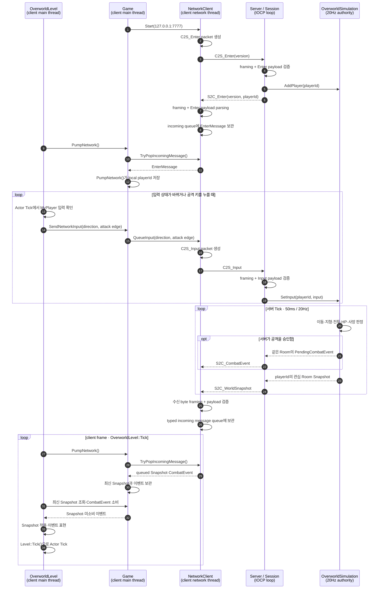

# Z1 멀티플레이 설계

## 문서 역할

이 문서는 Z1 서버 권위형 멀티플레이의 확정 경계와 완료 조건을 정의한다. 구현 여부, 검증 결과와 다음 작업은 [멀티플레이 현황](MULTIPLAYER_STATUS.md)에만 기록한다. 전체 솔루션의 프로젝트 관계는 [솔루션 아키텍처](../ARCHITECTURE.md)를 따른다.

## MVP 범위

- 두 개 이상의 Z1 클라이언트가 하나의 localhost Z1Server에 접속한다.
- 서버가 Player 이동, 공격, 피격, HP와 사망을 결정한다.
- 서버가 Overworld의 Enemy와 Projectile 상태를 결정한다.
- 클라이언트는 Snapshot으로 Player·Enemy·Projectile 표현을 생성·갱신·제거한다.
- Room 전환은 서버가 확정한 전체 맵 월드 좌표를 기준으로 한다.
- Title에서 Local Play와 Multiplayer를 명시적으로 선택한다.
- Local Play는 NetworkClient를 시작하지 않고 기존 싱글플레이 규칙만 실행한다.
- Multiplayer의 연결 실패 또는 플레이 중 연결 종료는 싱글플레이로 전환하지 않고 사유를 표시한 뒤 Title로 복귀한다.

이번 범위에는 Dungeon/Cave/보스·아이템 동기화, 로그인·DB·로비, 자동 재접속, 클라이언트 예측·보간, UDP와 범용 Engine NetworkComponent를 포함하지 않는다.

## MVP 최소 구현 원칙

Z1 멀티플레이는 이미 구현한 서버 권위 경계를 유지하되, 완성 속도를 우선해 각 기능을 동작에 필요한 최소 vertical slice로 구현한다. 서버 권위라는 이유만으로 상용 서비스 수준의 일반화·최적화·부정행위 대응을 미리 추가하지 않는다.

- 한 번의 작업에서는 Packet 상태, 서버 판정, 클라이언트 표현과 검증까지 이어지는 가장 작은 기능 하나만 완성한다.
- 현재 한 곳에서만 쓰는 규칙은 해당 객체나 simulation의 단순 함수로 둔다. 두 개 이상의 실제 사용처가 생기기 전에는 범용 `GameObject` 계층, 행동 트리, 공통 전투 프레임워크나 별도 시스템 클래스를 만들지 않는다.
- 이동과 전투는 고정 server tick, 정수 좌표, 단순 방향 이동과 AABB Box 교차 판정으로 구현한다. 물리 엔진, 연속 충돌 검출과 복잡한 판정 우선순위는 MVP에 포함하지 않는다.
- cooldown·이동 속도·수명·피해량은 우선 명명된 상수 또는 객체의 최소 상태로 표현한다. 데이터 주도 설정과 범용 능력치 시스템은 종류별 차이가 실제로 필요할 때 도입한다.
- Enemy 목표와 A* 경로 cache, client prediction/interpolation, delta Snapshot, Room별 구독 컨테이너, worker/shard와 send scatter-gather는 측정된 정확성·지연·처리량 문제가 생기기 전에는 추가하지 않는다.
- 싱글플레이 `Pawn`·`Projectile`·전투 계층을 서버로 그대로 이식하지 않는다. 서버는 권위 판정에 필요한 값만 소유하고, 클라이언트 네트워크 Actor는 Snapshot 표현만 담당한다.
- 이미 동작하는 구조의 선행 리팩터링은 다음 기능을 안전하게 구현하는 데 직접 필요할 때만 수행한다. 개선 후보는 구현하지 않고 별도 검토 문서에 기록할 수 있다.

최소 구현이 갖춰야 할 서버 권위는 포기하지 않는다. 클라이언트가 보낸 위치·HP·피격·사망 결과를 그대로 수락하지 않고, 모든 클라이언트에 공유되는 최종 위치와 전투 결과는 서버가 결정한다.

## 플레이 모드와 연결 종료 정책

Local Play와 Multiplayer는 게임 도중 자동으로 오가는 상태가 아니라 새 게임을 시작할 때 선택하는 별도 세션 모드다. `Game`이 선택된 모드를 소유하고 해당 게임 세션 동안 바꾸지 않는다. `OverworldLevel`은 단순한 `IsServerConnected()` 결과만으로 로컬 Actor를 생성하거나 네트워크 Actor를 로컬 Actor로 교체하지 않는다.

```text
Title
├─ Local Play ───────────────> Local Overworld
└─ Multiplayer
   ├─ 연결 성공 + Enter 완료 -> Network Overworld
   └─ 연결 실패 ─────────────> Title + 오류 표시

Network Overworld
└─ 연결 종료/프로토콜 오류 ──> 네트워크 정리 -> Title + 종료 사유 표시
```

최소 정책은 다음과 같다.

- Title은 Sokoban의 메뉴와 같은 위/아래 선택과 Enter 확정 방식을 사용한다. 메뉴는 `Local Play`, `Multiplayer` 두 항목이며 기본 선택은 `Local Play`다.
- Local Play를 선택하면 서버 실행 여부와 관계없이 연결을 시도하지 않는다.
- Multiplayer를 선택하면 Overworld 진입 전에 서버 연결과 `S2C_Enter` 수신이 필요하다. 대기 중에는 별도 Loading Level을 만들지 않고 Title에 `Connecting...`을 표시하며 게임 월드를 시작하지 않는다.
- Multiplayer 중 transport 종료, 서버 종료, protocol 오류가 발생하면 자동 재접속하거나 현재 위치에서 Local Play로 이어가지 않는다.
- Multiplayer의 local Player가 사망하면 같은 네트워크 정리 경로로 Title에 바로 복귀하고 약 3초간 사망 메시지를 표시한다. 다른 Player의 세션과 서버 월드는 계속 유지하며, 다시 입장하면 새 playerId와 초기 상태로 시작한다.
- 연결 종료 처리는 `Game`의 한 경로에서 수행한다. `NetworkClient` thread를 정지·join하고 queue, framer, partial send, input sequence, local playerId와 마지막 Snapshot을 초기화한 뒤 Title로 전환한다. 떠나는 Network Overworld의 Actor는 Level 종료 과정에서 제거한다.
- Title에는 메뉴 아래 영역에 연결 실패와 플레이 중 연결 종료를 구분하는 짧은 메시지를 약 3초간 표시한다. 상세 WinSock 오류나 protocol 진단은 로그에만 남기고, 메시지가 표시되는 동안에도 메뉴 입력과 Multiplayer 재시도를 허용한다.
- Local Play의 Player 상태와 Multiplayer Snapshot 상태 사이에는 HP·위치·아이템을 승계하지 않는다.
- Multiplayer MVP는 Overworld로 제한한다. Cave와 Dungeon 입구는 진입시키지 않고 현재 화면에 짧은 미지원 안내를 표시한다. Local Play의 입구 동작은 바꾸지 않는다.

이 정책은 향후 모드 선택 작업의 목표이며 현재 코드에는 아직 적용되지 않았다. 기존 연결 종료 후 offline fallback 코드는 새 정책을 구현할 때 제거한다.

현재 localhost 범위에서는 동기 connect가 빠르게 끝나므로 별도 연결 Level, 비동기 connect, 취소 입력과 자체 timeout을 추가하지 않는다. 외부 endpoint를 지원하거나 실제 접속 대기가 사용자 경험 문제가 될 때 다시 검토한다.

자동 재접속, 서버 목록, 로비, 진행 중 세션 복구와 Cave·Dungeon 멀티플레이 입장 처리는 MVP 이후 항목으로 유지한다.

## 책임 경계

```text
Sockets DLL
  WinSock runtime, Endpoint, 이동 전용 Socket, 기본 socket 연산

Z1Shared headers
  PacketHeader, PacketType, 직렬화, packet codec, TCP framing

Z1Server EXE
  accept, IOCP Session, send queue, packet dispatch
  20Hz OverworldSimulation, 권위형 객체 상태, Snapshot broadcast

Z1 EXE
  NetworkClient의 select thread와 송수신 queue
  main thread의 Snapshot 소비와 표현 Actor 관리
```

`Sockets`는 IOCP, Session, Z1 packet 또는 게임 규칙을 알지 않는다. `Z1Server`는 CraftEngine, Renderer, Input, Sound와 Z1 Actor를 링크하지 않는다. `Z1Shared`에는 Sprite, Actor, Level이나 서버 Session 타입을 넣지 않는다.

## 네트워크 시퀀스

다음 그림은 현재 구현된 입장, 입력 전송, 서버 판정과 클라이언트 표현 경로를 함께 보여준다. packet 생성·framing·payload parsing은 `NetworkClient`와 `Server`/`Session` 내부 처리로 나타낸다. 이때 양쪽은 각각 컴파일된 `Z1Shared`의 같은 구현을 사용한다.



이 그림은 프로세스와 thread 사이의 경계를 중심으로 표현한다. 지속 상태인 `S2C_WorldSnapshot`은 `Game`이 최신 값을 보관하고, 단발 사건인 `S2C_CombatEvent`는 순서를 유지한 채 모두 보관한다. `OverworldLevel` 내부의 Actor별 적용 과정은 [Z1 아키텍처의 클라이언트 프레임 적용 순서](ARCHITECTURE.md#클라이언트-프레임-적용-순서)를 따른다.

## 서버와 클라이언트 상태

목표로 하는 서버의 최소 권위 상태는 다음과 같다.

```text
Player: playerId, position, facing, hp, dead, input sequence, action state
Enemy:  networkId, kind, homeRoom, spawn position, position, facing, hp, dead, action state
Projectile: networkId, kind, ownerId, position, direction, lifetime
```

클라이언트의 네트워크 표현은 로컬 판정을 실행하지 않는다.

```text
NetworkPlayer       서버 Snapshot의 Player 표현
└─ MyPlayer         local playerId 표현과 입력 전송 책임

NetworkEnemy        서버 Enemy 표현
NetworkProjectile   서버 Projectile 표현
NetworkSwordEffect  승인된 일반 검 공격의 일시적 시각 표현
```

기존 `Player`, `Enemy`, `Projectile`, `SwordAttack`은 싱글플레이 AI·충돌·피해 판정을 포함하므로 네트워크 표현 타입으로 재사용하지 않는다.

## Wire protocol

TCP 위에 고정 4바이트 header를 사용한다.

```text
[size:uint16][type:uint16][payload...]
```

- 모든 다중 byte 정수는 network byte order다.
- `size`는 header를 포함하며 허용 범위는 4~4096 byte다.
- protocol version은 현재 `4`다. v4의 현재 구현에는 일반 검 단발 사건을 위한 `S2C_CombatEvent`와 서버 A* 경로 디버그용 `S2C_EnemyPathDebug`가 포함된다.
- 수신 byte는 `PacketFramer`에 누적하고 완성된 packet만 handler에 전달한다.
- header/payload 분할 수신과 한 번에 여러 packet을 받은 경우를 모두 처리한다.
- 잘못된 size, version, enum, flag 또는 payload 길이는 연결 오류로 처리한다.

현재 protocol에 선언된 packet 종류는 다음과 같다. 선언 여부와 실제 payload 구현 범위는 다를 수 있으며, 구현 완료 범위는 [멀티플레이 현황](MULTIPLAYER_STATUS.md)을 따른다.

| 방향 | Packet | 역할 |
| --- | --- | --- |
| C→S | `C2S_Enter` | protocol version 제시와 입장 요청 |
| S→C | `S2C_Enter` | protocol version과 local playerId 할당 |
| C→S | `C2S_Input` | sequence, 이동 방향과 공격 edge |
| S→C | `S2C_WorldSnapshot` | server tick, 관심 Room의 Player·Enemy·Projectile 상태 배열 |
| S→C | `S2C_CombatEvent` | 서버가 승인한 단발 전투 사건 |
| S→C | `S2C_EnemyPathDebug` | 관심 Room Moblin 하나의 최신 A* 경로와 Room 내 tile index 배열 |
| S→C | `S2C_Disconnect` | 서버 주도 연결 종료 통지용 예약 packet |

Player, Enemy, Projectile은 별도 packet 종류가 아니라 하나의 전체 상태 Snapshot에 포함한다. WorldSnapshot payload는 `serverTick`, Player count와 18-byte Player 상태 배열, Enemy count와 19-byte Enemy 상태 배열, Projectile count와 14-byte Projectile 상태 배열 순서다.

`SnapshotEnemyState`는 `networkId`, `kind`, 위치, facing, HP, flags를 가진다. `homeRoom`, 최초 spawn 위치와 AI 타이머는 서버 내부 상태이며 wire에 넣지 않는다. dead Enemy는 일반 Snapshot에서 제외하므로 현재 Enemy flags에는 attacking bit만 예약한다. codec은 count 기반 배열을 읽기 전에 남은 길이를 검증하고, enum·flag·Enemy ID와 전체 4096-byte packet 상한을 검증한다.

`SnapshotProjectileState`는 `networkId`, `kind`, 위치와 이동 방향만 가진다. owner Enemy id, `homeRoom`, 피해량과 남은 수명은 서버 내부 상태다. 만료되거나 충돌한 Projectile은 다음 Snapshot 배열에서 빠지며 클라이언트는 대응하는 `NetworkProjectile`을 제거한다.

`EnemyPathDebug`는 Snapshot과 분리된 최신 상태 메시지다. payload는 `[tick:uint32][enemyId:uint32][roomX:int32][roomY:int32][count:uint8][tileIndex:uint8 × count]` 순서이며, tile index는 `tileY * 16 + tileX`다. 서버가 Moblin별로 최신 경로를 기록해 관심 Room의 Session에 전송하고, 경로가 비어 있으면 클라이언트는 해당 Enemy의 표시를 지운다. 클라이언트는 수신한 값을 Enemy ID별로 덮어쓰며 `F3` 디버그 토글이 켜진 동안 현재 Room의 경로만 렌더링한다.

Snapshot은 최신 지속 상태를 덮어써도 되지만 공격 효과처럼 한 번 발생한 사건은 중간 값을 버리면 안 된다. 서버는 `C2S_Input`의 공격 의도를 Tick에서 승인한 뒤 `S2C_CombatEvent`를 생성하고, 같은 관심 Room의 모든 entered Session에 공격한 Session을 포함해 전송한다. 클라이언트는 받은 이벤트를 순서대로 모두 보관하고 main thread에서 한 번씩 소비한다.

현재 CombatEvent payload는 6 byte다.

```text
[eventType:uint8][actorId:uint32][direction:uint8]
```

현재 event type은 `PlayerSwordAttack` 하나다. `actorId`는 표현을 붙일 `MyPlayer` 또는 `NetworkPlayer`를 식별하고, `direction`은 서버가 승인한 공격 방향을 고정한다. Room은 서버의 수신 대상 선택에만 사용하므로 wire에 넣지 않는다. 이벤트 ID, 대상 ID, 피해량, 좌표, 표현 시간, Sprite나 sound 이름은 현재 계약에 포함하지 않는다. 일반 검의 충돌·피해는 이미 서버에서 판정한다. `NetworkSwordEffect`는 로컬 0.5초 수명의 Sprite만 담당하고, 같은 클라이언트 이벤트 처리 경로가 효과음을 한 번 재생한다.

## 동시성과 소유권

### Z1 클라이언트

- `Game`이 `NetworkClient`를 값으로 소유한다.
- network thread는 socket, framing과 송수신 queue만 다룬다.
- main thread는 incoming message를 소비하고 Level/Actor를 변경한다.
- outgoing queue와 incoming queue에는 상한을 둔다.
- 연결 종료 시 thread를 깨우고 join한 뒤 socket과 표현 Actor를 정리한다.

### Z1Server

- accept thread는 accepted socket을 queue에 넣을 뿐 Session registry나 simulation을 변경하지 않는다.
- Server loop가 accepted socket을 Session으로 만들고 completion port에 연결한다.
- 비동기 operation은 completion이 처리될 때까지 `OVERLAPPED`와 buffer 수명을 유지한다.
- Session별 send queue는 packet 순서와 partial send를 보존한다.
- 닫힌 Session은 outstanding I/O가 정리된 뒤 registry와 simulation에서 한 번만 제거한다.
- 서버 종료 시 accept와 server thread를 join하고 pending completion을 정리한 뒤 completion port를 닫는다.

초기 구현은 IOCP completion과 20Hz simulation을 한 Server loop가 처리한다. 측정된 지연이나 처리량 문제가 생기기 전에는 worker pool, simulation thread 분리, lock-free queue나 shard를 도입하지 않는다.

## 권위형 Overworld

클라이언트는 방향과 공격 의도만 보내고 위치·HP·아이템 상태를 보내지 않는다. 서버는 sequence와 입력 범위를 검증하고 고정 Tick에서 다음을 결정한다.

1. Player 이동과 맵·blocked 충돌
2. 전체 맵 좌표에서 필요한 Room 소속 계산
3. active Room의 Enemy Tick
4. 공격·Projectile·피격·HP·사망
5. 수신 Session의 관심 Room에 맞는 Snapshot

### Enemy 수명과 Room 관심 영역 정책

Overworld의 Enemy는 서버가 시작할 때 한 번 결정적으로 생성하고, 서버가 실행되는 동안 전역 레지스트리에 유지한다. Room을 떠났다는 이유만으로 Enemy를 제거하거나 재생성하지 않는다.

- `ServerEnemy`는 안정적인 `networkId`, 종류, `homeRoom`, 최초 `spawnPosition`과 현재 전투 상태를 가진다. `homeRoom`은 생성 뒤 바뀌지 않는다.
- 초기 스폰은 월드 seed와 `homeRoom`으로 결정한다. 같은 seed로 시작한 서버는 같은 초기 Enemy 배치를 만든다. 이후 처치 여부와 위치는 seed가 아니라 서버의 실제 상태가 원본이다.
- Enemy는 `homeRoom` 밖으로 이동하지 않는다. Projectile은 명시한 수명 또는 Room 경계에서 제거하며, 마지막 Player가 Room을 떠날 때도 제거한다.
- Enemy가 사망하면 `dead` 상태로 남고 일반 Snapshot에는 포함하지 않는다. 죽은 Enemy에는 20Hz 기준 140 Tick 뒤의 `respawnAtTick`을 기록한다.
- 약 7초가 지나면 같은 `networkId`와 `spawnPosition`으로 상태를 초기화한다. 살아 있는 Player가 spawn Box를 점유 중이면 비워질 때까지 리스폰을 연기하며 다른 임의 위치는 찾지 않는다. Room이 비어 있어도 리스폰 시간은 흐른다.

Room은 전역 월드 상태의 소유자가 아니라 simulation과 복제의 관심 영역이다. Player의 관심 Room은 서버가 수락한 월드 좌표에서 필요할 때 계산하며, 별도 `currentRoom` 필드로 영구 저장하지 않는다. `homeRoom`에 Player가 한 명 이상 있을 때만 그 Room의 Enemy와 Projectile을 Tick한다. 마지막 Player가 떠난 Room의 Enemy 상태는 전역 레지스트리에 그대로 보존하지만, 일시 객체인 Projectile은 제거한다.

어떤 Room의 객체 상태가 바뀌면 그 Room을 관심 영역으로 가진 모든 Player에게 같은 결과가 전파되어야 한다. 첫 구현의 Snapshot은 수신 Player의 관심 Room에 속한 동적 객체만 담는다. 수신자 자신의 Player 상태는 항상 포함한다. 이 규칙은 별도의 Add/Remove packet 없이도 Snapshot 배열의 객체 존재 여부로 표현 Actor를 생성·갱신·제거할 수 있게 한다.

한 Room에 Player가 많이 모이면 전송량은 `snapshot bytes × tick rate × 수신 Player 수`로 증가하고, Enemy의 대상 탐색도 Enemy 수와 Player 수에 비례해 늘어난다. 현재 규모에서는 Room별 구독 컨테이너, delta packet, worker/shard를 추가하지 않는다. 실제 다중 클라이언트 측정에서 send queue, Tick 지연 또는 packet 크기 상한이 문제가 될 때 그 순서로 확장한다.

서버에 맵 충돌을 구현할 때는 `Content/Z1/Maps/Overworld/BlockingMap.txt`의 통행 데이터만 읽도록 한다. TileId, Sprite와 Color는 읽지 않으며 CraftEngine Tilemap을 링크하지 않는다. 클라이언트와 서버의 중복 parser가 실제 유지보수 문제가 될 때만 렌더링 독립적인 MapData 공유를 검토한다. 현재 구현 여부는 [멀티플레이 현황](MULTIPLAYER_STATUS.md)을 기준으로 판단한다.

## 신뢰 경계

- packet 크기와 count를 buffer 접근 전에 검증한다.
- enum, flag, 좌표와 sequence 범위를 검증한다.
- 연결에 할당된 playerId 외의 객체를 조작하지 못하게 한다.
- packet 빈도와 queue 크기에 상한을 둔다.
- malformed packet을 반복하거나 상한을 넘긴 Session은 종료한다.
- localhost 학습 서버를 인증·암호화·서비스 거부 대응 없이 공용 인터넷에 노출하지 않는다.

## 완료 기준

MVP는 실제 Z1 클라이언트 두 개에서 이동·Room·전투·HP·사망과 Enemy/Projectile 결과가 서버 기준으로 같고, 한 클라이언트의 종료와 재접속이 다른 Session이나 서버 월드에 영향을 주지 않을 때 완료다. 같은 PC의 독립 키 입력 문제는 [콘솔 입력 설계](CONSOLE_INPUT_DESIGN.md)의 별도 완료 조건을 따른다.
