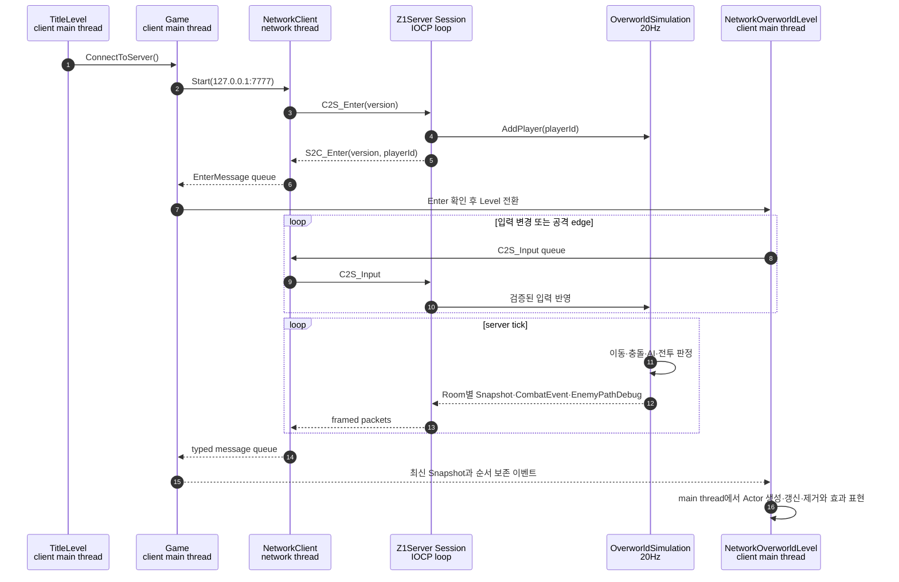

# Z1 네트워크 아키텍처

## 문서 범위

이 문서는 현재 구현된 Z1 멀티플레이의 책임 경계, 실행 흐름, wire protocol과 서버 권위 규칙을 설명한다. Z1의 Level과 Actor 구성은 [Z1 아키텍처](ARCHITECTURE.md), 빌드와 실행 검증은 [Z1 검증](TESTING.md)을 따른다. 향후 작업 순서나 구현 후보는 이 문서의 범위가 아니다.

## 지원 범위

Z1은 Title에서 `LocalPlay`와 `MultiPlay`를 선택하는 별도 세션 모드를 제공한다. Local Play는 네트워크를 시작하지 않고 기존 `OverworldLevel`, `CaveLevel`, `DungeonLevel`을 사용한다. MultiPlay는 localhost의 Z1Server에 접속하고 `S2C_Enter`를 받은 뒤 `NetworkOverworldLevel`로 진입한다.

현재 멀티플레이는 Overworld에서 다음 동작을 지원한다.

- 서로 다른 playerId를 가진 여러 클라이언트의 입장과 Room별 상태 공유
- 서버가 승인하는 Player 이동과 BlockingMap 충돌
- Moblin의 A* 추적 이동과 Spear Projectile 공격
- Player HP·사망과 일반 검의 Enemy 피격·사망
- 서버가 계산한 Moblin 경로의 클라이언트 디버그 표시
- 연결 종료 또는 local Player 사망 시 네트워크 정리 후 Title 복귀

Cave와 Dungeon 멀티플레이, 자동 재접속과 진행 중 Session 복구는 지원하지 않는다. 최대 HP SwordBeam, 방패, 피격 무적·넉백과 Octorok·Tektite의 고유 서버 AI도 현재 네트워크 전투 범위에 포함되지 않는다.

## 책임 경계

| 구성 요소 | 책임 |
| --- | --- |
| `Sockets` DLL | WinSock runtime, Endpoint, 이동 전용 Socket과 기본 socket 연산 |
| `Z1Shared` headers | PacketHeader, PacketType, 직렬화, packet codec과 TCP framing |
| `Z1Server` EXE | accept, IOCP Session, send queue, packet dispatch와 20Hz 권위형 simulation |
| `Z1` EXE | select 기반 NetworkClient, 송수신 queue와 main-thread 표현 Actor 관리 |

`Sockets`는 IOCP, Session, Z1 packet이나 게임 규칙을 알지 않는다. `Z1Shared`에는 Sprite, Actor, Level과 서버 Session 타입을 넣지 않는다. `Z1Server`는 CraftEngine의 Actor, Renderer, Input과 Sound를 링크하지 않는다.

클라이언트 network thread는 socket I/O, framing, payload 검증과 typed message 생성을 담당한다. `Game`과 `NetworkOverworldLevel`은 main thread에서 message를 소비하고 Actor와 Level을 변경한다. 서버에서는 accept thread가 socket만 queue에 넣고, `IOLoop`가 Session registry와 `OverworldSimulation`을 단독으로 소유한다.

## 플레이 모드와 연결 종료

```text
Title
├─ LocalPlay ─────────────────> OverworldLevel
└─ MultiPlay
   ├─ TCP 연결 + Enter 완료 ──> NetworkOverworldLevel
   └─ 연결 실패 ──────────────> Title + 오류 메시지

NetworkOverworldLevel
└─ 연결 종료 / protocol 오류 / local Player 사망
   └─ 네트워크 정리 ──────────> Title + 사유 메시지
```

- Local Play는 서버 실행 여부와 관계없이 연결을 시도하지 않는다.
- Multiplayer는 `S2C_Enter`로 local playerId를 받은 뒤에만 게임 월드를 시작한다.
- 연결이 끝나면 현재 위치에서 Local Play로 전환하거나 자동 재접속하지 않는다.
- local Player가 사망해도 다른 Player의 Session과 서버 월드는 유지된다. 다시 접속하면 새 playerId와 초기 Player 상태를 받는다.
- Local Play와 Multiplayer 사이에는 위치, HP와 아이템 상태를 승계하지 않는다.
- `NetworkClient::Stop()`은 network thread를 join한 뒤 socket, 양방향 queue, pending packet, framer, partial-send offset과 input sequence를 초기화한다. `Game::Disconnect()`는 local playerId, Snapshot, CombatEvent와 EnemyPathDebug 상태를 초기화한다.

현재 `NetworkClient::Start()`는 main thread에서 blocking `connect()`를 호출하고 연결 성공 뒤 socket을 nonblocking으로 전환한다. 따라서 서버가 응답하지 않는 환경에서는 연결 시도가 반환될 때까지 Title 입력과 렌더링이 정지할 수 있다. 논블로킹 연결 전환은 [Issue #5](https://github.com/9kyo-hwang/ConsoleGameProject/issues/5)에서 관리한다.

## 네트워크 시퀀스



지속 상태인 `S2C_WorldSnapshot`은 최신 서버 상태의 원본으로 사용한다. 한 번 발생한 공격 표현은 중간 값을 버리지 않도록 `S2C_CombatEvent`로 분리해 순서대로 소비한다. `S2C_EnemyPathDebug`는 게임 판정이 아니라 서버가 실제 사용한 A* 경로를 표시하기 위한 디버그 상태다.

## 서버와 클라이언트 상태

서버는 다음 권위 상태를 소유한다.

```text
Player: playerId, position, facing, hp, dead, input sequence, attack request
Enemy:  networkId, kind, homeRoom, spawn/current position, facing, hp, dead, AI cooldown
Projectile: networkId, kind, ownerId, homeRoom, position, direction, damage, lifetime
```

클라이언트의 네트워크 Actor는 서버 상태를 표현하며 로컬 충돌·피해 판정을 실행하지 않는다.

```text
NetworkPlayer       원격 Player Snapshot 표현
MyPlayer            local playerId 표현과 입력 전송
NetworkEnemy        Enemy Snapshot 표현
NetworkProjectile   Projectile Snapshot 표현
NetworkSwordEffect  승인된 일반 검 CombatEvent의 일시적 표현
```

싱글플레이의 `Player`, `Enemy`, `Projectile`, `SwordAttack`은 AI·충돌·피해 판정을 포함하므로 네트워크 표현 타입으로 재사용하지 않는다.

## Wire protocol

TCP packet은 다음 4바이트 header를 사용한다.

```text
[size:uint16][type:uint16][payload...]
```

- 다중 byte 정수는 network byte order다.
- `size`는 header를 포함하며 4~4096 byte만 허용한다.
- protocol version은 `4`다.
- `PacketFramer`가 TCP byte를 누적하고 완성된 packet만 handler에 전달한다.
- header와 payload의 분할 수신 및 여러 packet의 연속 수신을 처리한다.
- 잘못된 size, version, enum, flag, ID 또는 payload 길이는 연결 오류로 처리한다.

현재 codec과 handler가 구현된 packet은 다음과 같다.

| 방향 | Packet | 역할 |
| --- | --- | --- |
| C→S | `C2S_Enter` | protocol version 제시와 입장 요청 |
| S→C | `S2C_Enter` | protocol version과 local playerId 할당 |
| C→S | `C2S_Input` | sequence, 이동 방향과 공격 edge |
| S→C | `S2C_WorldSnapshot` | server tick과 관심 Room의 Player·Enemy·Projectile 배열 |
| S→C | `S2C_CombatEvent` | 서버가 승인한 단발 전투 사건 |
| S→C | `S2C_EnemyPathDebug` | Moblin의 최신 A* 경로와 Room 내부 tile index 배열 |

`S2C_Disconnect`는 enum에 예약되어 있지만 codec과 client handler는 구현되어 있지 않다. 미사용 packet과 공격 상태 flag의 정리는 [Issue #8](https://github.com/9kyo-hwang/ConsoleGameProject/issues/8)에서 관리한다.

WorldSnapshot은 Player 18-byte, Enemy 19-byte, Projectile 14-byte 상태 배열을 포함한다. `homeRoom`, spawn 위치, AI timer, Projectile owner·damage·lifetime은 서버 내부 상태이며 wire로 보내지 않는다. 죽거나 제거된 Enemy와 Projectile은 다음 Snapshot 배열에서 빠지고 클라이언트는 대응 Actor를 제거한다.

CombatEvent payload는 다음 6 byte다.

```text
[eventType:uint8][actorId:uint32][direction:uint8]
```

현재 event type은 `PlayerSwordAttack` 하나다. `actorId`와 `direction`은 클라이언트가 공격한 Player에 검 Sprite를 붙이는 데 사용한다. 충돌, 대상과 피해는 이미 서버가 판정하므로 Sprite, sound, 피해량과 대상 ID는 현재 payload에 포함하지 않는다.

EnemyPathDebug payload는 다음과 같다.

```text
[tick:uint32][enemyId:uint32][roomX:int32][roomY:int32]
[count:uint8][tileIndex:uint8 × count]
```

tile index는 `tileY * 16 + tileX`이고 범위는 0~175다. 빈 경로는 이전 표시를 제거한다.

## 동시성과 소유권

### Z1 클라이언트

- `Game`이 `NetworkClient`를 값으로 소유한다.
- network thread는 socket, framing과 송수신 queue만 다룬다.
- main thread만 Level과 Actor를 생성·갱신·제거한다.
- outgoing packet과 incoming message queue는 각각 최대 64개다.
- 부분 송신은 network thread가 packet과 offset을 보관한 채 다음 `select()`에서 이어서 처리한다.

### Z1Server

- accept thread는 accepted socket queue만 변경한다.
- `IOLoop`가 accepted socket을 Session으로 만들고 completion port에 연결한다.
- Session별 outstanding recv와 send는 각각 하나이며 `OVERLAPPED`와 buffer는 completion까지 유지한다.
- send queue는 packet 순서와 부분 송신 offset을 보존하며 최대 64개다. 상한을 넘긴 Session은 종료한다.
- peer close, protocol 오류와 I/O 실패는 `CloseSession()`의 한 closing 전이로 수렴한다.
- socket을 닫은 뒤에도 취소 completion이 도착할 수 있으므로 pending recv/send가 모두 해제된 Session만 registry에서 제거한다.
- closing Session은 새로운 I/O와 Snapshot·CombatEvent·EnemyPathDebug 전송 대상에서 제외한다.

현재 IOCP completion과 20Hz simulation은 하나의 `IOLoop`에서 처리한다. 측정된 병목이 생기기 전에는 worker pool, lock-free queue, Room shard, Scatter-Gather나 packet pool을 추가하지 않는다.

## 서버 권위형 Overworld

클라이언트는 이동 방향과 공격 edge만 보낸다. 서버는 입력 sequence와 범위를 검증하고 고정 Tick에서 다음 결과를 결정한다.

1. Player 이동과 BlockingMap·전체 맵 경계 충돌
2. Player 좌표를 기준으로 한 관심 Room
3. Player가 있는 active Room의 Enemy AI
4. Projectile 이동·충돌·수명
5. 일반 검 공격, HP와 사망
6. Session별 관심 Room Snapshot과 사건 전파

Enemy는 서버 시작 시 월드 seed와 Room 좌표로 결정적으로 생성되고 전역 registry에 유지된다. `homeRoom`에 살아 있는 Player가 있을 때만 AI를 갱신하며, 사망한 Enemy는 Tick과 일반 Snapshot에서 제외한다. 현재 사망한 Enemy는 서버를 재시작하기 전까지 다시 나타나지 않는다.

Moblin은 같은 Room의 가장 가까운 살아 있는 Player를 A*로 추적하고 Spear를 발사한다. Projectile은 blocked tile, Room 경계, 수명 만료 또는 Player 충돌에서 제거된다. 일반 검은 정지 상태의 공격 요청을 Tick에서 한 번 소비하고, facing 방향 AABB와 겹친 같은 Room의 Enemy 한 명에게 피해를 적용한다.

관심 Room은 상태 소유 단위가 아니라 simulation과 복제 범위다. Player의 Room은 서버 좌표에서 계산하며, 각 Session의 Snapshot에는 해당 관심 Room의 Player·Enemy·Projectile을 담는다. 서버는 렌더링 데이터 대신 `Content/Z1/Maps/Overworld/BlockingMap.txt`의 통행 정보만 읽는다.

## 신뢰 경계

- 클라이언트가 보낸 위치, HP, 피격과 사망 결과를 수락하지 않는다.
- packet 크기와 배열 count를 buffer 접근 전에 검증한다.
- enum, flag, 객체 ID, 좌표와 sequence 범위를 검증한다.
- Session에 할당된 playerId 외의 객체를 입력으로 조작할 수 없게 한다.
- queue 상한을 넘기거나 malformed packet을 보낸 Session은 종료한다.
- network thread와 IOCP 처리에서 Actor와 Level을 직접 변경하지 않는다.
- localhost 학습 서버를 인증·암호화·서비스 거부 대응 없이 공용 인터넷에 노출하지 않는다.

## 현재 제약

- 최초 TCP `connect()`는 main thread에서 blocking으로 실행된다. ([Issue #5](https://github.com/9kyo-hwang/ConsoleGameProject/issues/5))
- 서버 전체 종료는 모든 Session의 pending completion을 drain한 뒤 닫는 절차를 아직 제공하지 않는다. ([Issue #4](https://github.com/9kyo-hwang/ConsoleGameProject/issues/4))
- Enemy는 사망 뒤 리스폰하지 않는다. ([Issue #3](https://github.com/9kyo-hwang/ConsoleGameProject/issues/3))
- Enemy 이동의 Room 경계 검사는 후보 위치의 좌상단 좌표를 기준으로 한다. ([Issue #6](https://github.com/9kyo-hwang/ConsoleGameProject/issues/6))
- accepted socket queue와 동시 Session 수에는 별도 상한이 없다. ([Issue #9](https://github.com/9kyo-hwang/ConsoleGameProject/issues/9))
- 서버는 Cave와 Dungeon을 지원하지 않으며 입구 처리 정책은 확정되지 않았다. ([Issue #7](https://github.com/9kyo-hwang/ConsoleGameProject/issues/7))
- 자동 재접속과 진행 중 Session 복구는 지원하지 않는다.
