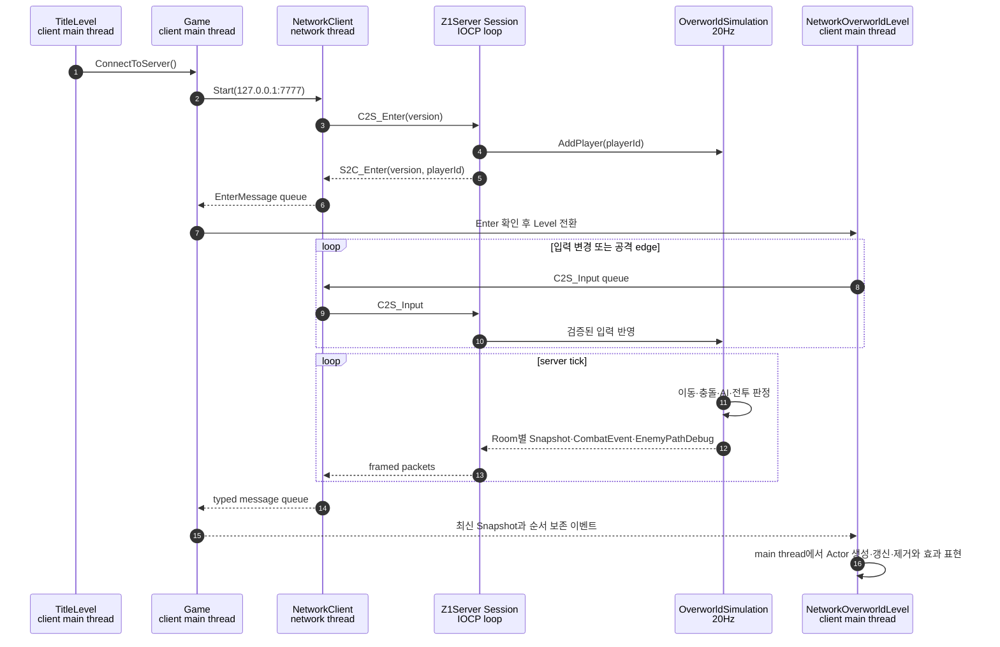

# Z1 네트워크 아키텍처

## 문서 범위

현재까지 구현된 Z1 멀티플레이의 책임 경계, 실행 흐름, 패킷 프로토콜 규약과 서버 시뮬레이션 규칙을 기록합니다.

## 지원 범위

Z1은 Title에서 `LocalPlay`와 `MultiPlay`를 선택할 수 있도록 제공합니다. Local Play는 기존 `OverworldLevel`, `CaveLevel`, `DungeonLevel`을 사용하며, MultiPlay는 localhost의 Z1Server에 접속해 `S2C_Enter` 패킷을 수신한 뒤 `NetworkOverworldLevel`로 진입합니다.

현재 멀티플레이는 Overworld에서 다음 동작을 지원합니다.
- 서로 다른 playerId를 가진 여러 클라이언트의 입장과 Room별 상태 공유
- 서버가 승인하는 Player 이동과 BlockingMap 충돌
- Moblin의 A* 기반 플레이어 추적 및 투사체 공격
- Player 체력 표현 및 사망, 검 공격을 통한 Enemy 피격·사망
- 서버가 계산한 Moblin 경로를 클라이언트에서 표시
- 연결 종료 또는 local Player 사망 시 네트워크 정리 후 Title 복귀

## 플레이 모드와 연결 종료

```text
Title
├─ LocalPlay ─────────────────> OverworldLevel
└─ MultiPlay
   ├─ TCP 연결 + Enter 완료 ──> NetworkOverworldLevel
   └─ 연결 실패 ──────────────> Title + 오류 메시지

NetworkOverworldLevel
└─ 연결 종료 / protocol 오류 / local Player 사망
   └─ 네트워크 정리 ──────────> Title + 사유 메시지
```

## 네트워크 시퀀스



`S2C_WorldSnapshot` 패킷에 담긴 스냅샷 정보가 서버 시뮬레이션 결과 원본으로 사용됩니다. 스냅샷 정보는 가장 최신 정보 1개만 가지도록 설계되어 있어, 플레이어 공격같은 단발성 이벤트는 중간 값을 버리지 않도록 별도의 `S2C_CombatEvent` 패킷으로 관리되며 순서대로 처리합니다. `S2C_EnemyPathDebug`는 서버가 계산한 A* 경로 정보를 담고 있으며, 클라이언트에서 표시하기 위한 용도로만 사용됩니다.

## 서버와 클라이언트 상태

서버는 아래 정보들을 소유합니다(권위).

```text
Player: playerId, position, facing, hp, dead, input sequence, attack request
Enemy:  networkId, kind, homeRoom, spawn/current position, facing, hp, dead, AI cooldown
Projectile: networkId, kind, ownerId, homeRoom, position, direction, damage, lifetime
```

클라이언트의 네트워크 액터들은 로컬에서 충돌/피해 등등의 처리를 수행하지 않고 서버의 상태를 표현합니다.

```text
NetworkPlayer       원격 Player Snapshot 표현
MyPlayer            local playerId 표현과 입력 전송
NetworkEnemy        Enemy Snapshot 표현
NetworkProjectile   Projectile Snapshot 표현
NetworkSwordEffect  승인된 일반 검 CombatEvent의 일시적 표현
```

싱글플레이에서 사용되는 `Player`, `Enemy`, `Projectile`, `SwordAttack` 등은 클라이언트 단에서 실제 판정을 수행하므로 사용되지 않습니다.

## Wire protocol

패킷 헤더는 패킷 전체 크기와 패킷 타입 정보로 구성됩니다.

```text
[size:uint16][type:uint16][payload...]
```

- 크기 정보는 header를 포함한 패킷 전체 크기이며 최대 4096byte 크기를 갖습니다.
- `PacketFramer` 클래스를 통해 TCP 통신으로 주고받은 byte를 누적하고, 완성된 packet을 handler에 전달한다.
- header와 payload의 분할 수신 및 여러 packet의 연속 수신을 처리합니다.
- 잘못된 정보(크기, 타입, ID, 페이로드 길이 등)는 연결 오류로 처리합니다.

| 방향 | Packet | 역할 |
| --- | --- | --- |
| C→S | `C2S_Enter` | protocol version 제시와 입장 요청 |
| S→C | `S2C_Enter` | protocol version과 local playerId 할당 |
| C→S | `C2S_Input` | sequence, 이동 방향과 공격 유무 플래그 |
| S→C | `S2C_WorldSnapshot` | server tick과 관심 Room의 Player·Enemy·Projectile 배열 |
| S→C | `S2C_CombatEvent` | 서버가 승인한 단발 전투 사건 |
| S→C | `S2C_EnemyPathDebug` | Moblin의 최신 A* 경로와 Room 내부 tile index 배열 |

WorldSnapshot은 Player 18-byte, Enemy 19-byte, Projectile 14-byte 상태 배열을 가집니다. 죽거나 제거된 Enemy와 Projectile은 다음 Snapshot 배열에서 빠지게 되고, 클라이언트는 해당 정보를 보고 빠진 액터를 제거한다.

CombatEvent payload는 아래와 같이 6 byte로 표현합니다.

```text
[eventType:uint8][actorId:uint32][direction:uint8]
```

현재는 `PlayerSwordAttack` 하나만 존재합니다. `actorId`와 `direction`은 클라이언트가 공격한 Player에 검 이미지를 붙이기 위해 사용됩니다.

EnemyPathDebug payload는 다음과 같습니다.

```text
[tick:uint32][enemyId:uint32][roomX:int32][roomY:int32]
[count:uint8][tileIndex:uint8 × count]
```

Room은 16 x 11 크기의 논리적 타일로 구성되어, `y * 16 + x`로 인덱스화하여 전송합니다(범위: 0 ~ 175). 만약 경로 배열이 비어있다면 이전 표시를 제거합니다.

## 서버 권위형 Overworld

클라이언트는 이동 방향과 공격 유무만 전송합니다. 서버는 입력 시퀀스와 범위를 검증하고 Tick마다 다음 결과를 결정.

1. Player 이동과 BlockingMap·전체 맵 경계 충돌
2. Player 좌표를 기준으로 한 관심 Room
3. Player가 속한 Room의 Enemy 이동/공격 처리
4. Projectile 이동·충돌·수명
5. 일반 검 공격 처리, HP와 사망
6. Session별 관심 Room Snapshot과 사건 전파

Enemy는 서버 시작 시 시드값과 Room 좌표를 기반으로 생성된 뒤 전역 배열에서 관리됩니다. `homeRoom`에 살아 있는 Player가 있을 때만 업데이트되며, 사망한 Enemy는 Tick과 일반 Snapshot에서 제외되빈다. 현재 사망한 Enemy는 서버를 재시작하기 전까지 다시 나타나지 않습니다.

Moblin은 같은 Room에 있는 인접 Player를 A*로 추적하고 공격을 시도합니다. 투사체는 이동 불가 타일이거나, Room 경계를 벗어나거나, 지속 시간(2초)을 경과하거나, Player와 충돌하면 제거됩니다. 플레이어의 검 공격은 이동 중이 아닐 때, 바라보는 방향 기준으로 AABB를 수행해 겹친 적 하나에게 피해를 적용합니다.

관심 Room은 시뮬레이션 결과를 복제할 범위를 지칭합니다. 서버 좌표를 기준으로 계산해, 각 Session의 Snapshot에 해당 관심 Room의 Player·Enemy·Projectile 정보를 담습니다. 참고로 타일의 통행 가능 정보는 `Content/Z1/Maps/Overworld/BlockingMap.txt` 데이터를 가지고 수행합니다.

## 신뢰 경계

- 클라이언트가 보낸 위치, HP, 피격과 사망 결과를 수락하지 않는다.
- packet 크기와 배열 count를 buffer 접근 전에 검증한다.
- enum, flag, 객체 ID, 좌표와 sequence 범위를 검증한다.
- Session에 할당된 playerId 외의 객체를 입력으로 조작할 수 없게 한다.
- queue 상한을 넘기거나 잘못된 형식의 packet을 보낸 Session은 종료한다.
- network thread와 IOCP 처리에서 Actor와 Level을 직접 변경하지 않는다.
